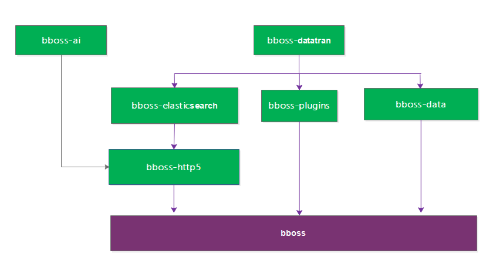
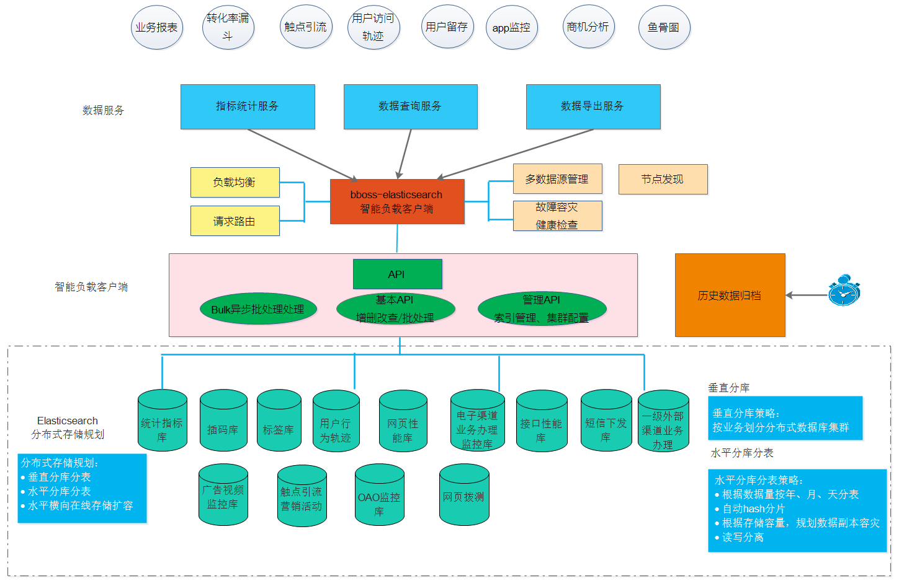
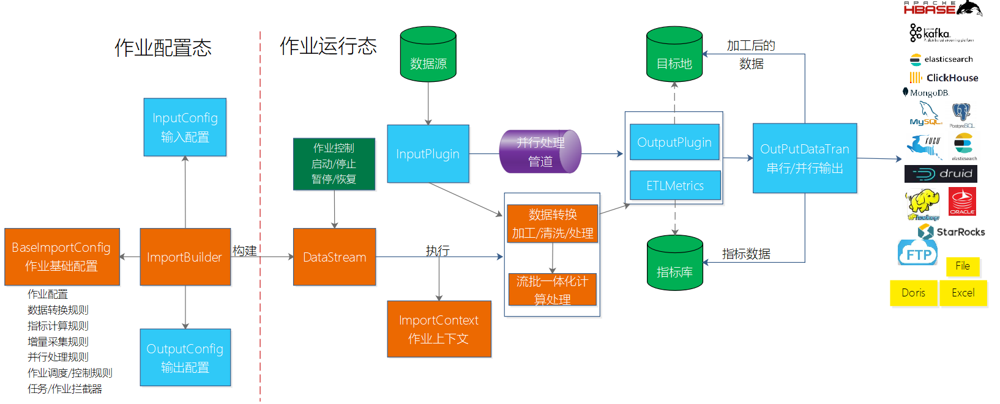
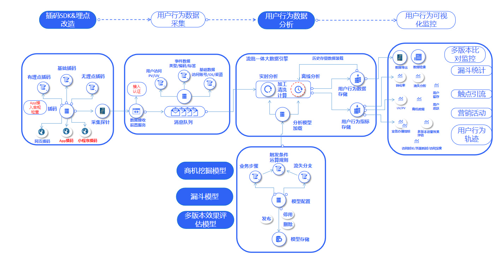

# 1. BBoss是什么

[bboss](https://esdoc.bbossgroups.com/#/README)基于Apache License开源协议，由开源社区bboss发起和维护，主要由以下三部分构成：

- **Elasticsearch Highlevel Java Restclient** ， 一个高性能高兼容性的Elasticsearch/Opensearch java客户端框架
- **数据采集同步ETL** ，一个基于java语言实现数据采集作业的强大ETL工具，提供丰富的输入插件和输出插件，可以基于插件规范轻松扩展新的输入插件和输出插件；支持数据向量化处理
- **流批一体化计算框架**，提供灵活的数据指标统计计算流批一体化处理功能的简易框架，可以结合数据采集同步ETL工具，实现数据流处理和批处理计算，亦可以独立使用；计算结果可以保存到各种关系数据库、分布式数据仓库Elasticsearch、Clickhouse等，特别适用于数据体量和规模不大的企业级数据分析计算场景，具有成本低、见效快、易运维等特点，助力企业降本增效。

bboss采用模块化管理以上三部分，模块之间依赖关系如下：



模块源码工程源码地址和功能说明如下：

| 源码地址                                   | 说明                                                         |
| ------------------------------------------ | ------------------------------------------------------------ |
| https://gitee.com/bboss/bboss              | [基础框架](https://doc.bbossgroups.com/#/)：包含ioc、持久层、mvc、任务调度管理、序列化/反序列化以及[配置管理](https://doc.bbossgroups.com/#/aop/IntroduceIoc)等功能 |
| https://gitee.com/bboss/bboss-data         | [Redis](https://doc.bbossgroups.com/#/redis)、MongoDB、Milvus、Minio客户端封装 |
| https://gitee.com/bboss/bboss-http         | 轻量级[http](https://esdoc.bbossgroups.com/#/httpproxy)微服务框架 |
| https://gitee.com/bboss/bboss-plugins      | [kafka](https://doc.bbossgroups.com/#/kafka)、apollo、nacos对接框架 |
| https://gitee.com/bboss/bboss-elastic      | Elasticsearch Java [RestClient](https://esdoc.bbossgroups.com/#/quickstart) |
| https://gitee.com/bboss/bboss-elastic-tran | [数据采集](https://esdoc.bbossgroups.com/#/db-es-tool)ETL、[流批一体化](https://esdoc.bbossgroups.com/#/etl-metrics)计算框架 |

项目源码构建：[源码下载和构建](https://esdoc.bbossgroups.com/#/README?id=_3-源码下载和构建)，下面详细介绍各部分特色。

## 1.1 高性能 Elasticsearch Highlevel Java Restclient

[bboss Elasticsearch Highlevel Java Restclient](https://esdoc.bbossgroups.com/#/quickstart)是一套基于query dsl语法操作和访问分布式搜索引擎Elasticsearch/Opensearch的o/r mapping高性能开发库


### 1.1.1 主要功能特色

**学习成本低，上手快，代码简洁，安全高效，客户端负载容灾，兼容性好，易于集成**

1. ORM和DSL二者兼顾，类mybatis方式操作ElasticSearch,提供丰富的开发[API](https://esdoc.bbossgroups.com/#/document-crud)和[开发Demo](https://esdoc.bbossgroups.com/#/Elasticsearch-demo)

2. 采用[XML文件配置和管理检索dsl脚本](https://esdoc.bbossgroups.com/#/development?id=_53-dsl%e9%85%8d%e7%bd%ae%e8%a7%84%e8%8c%83)，简洁而直观；提供丰富的逻辑判断语法,在dsl脚本中可以使用变量、脚本片段、foreach循环、逻辑判断、注释；基于[可扩展DSL配置管理机制](https://esdoc.bbossgroups.com/#/db-dsl)可以非常方便地实现数据库、redis等方式管理dsl;配置管理的dsl语句支持在线修改、自动热加载，开发和调试非常方便

3. 提供Elasticsearch集群节点自动负载均衡和容灾恢复机制，Elasticsearch节点断连恢复后可自动重连，高效可靠

4. 提供Elasticsearch集群节点[自动发现机制](https://esdoc.bbossgroups.com/#/development?id=_23-%e9%9b%86%e7%be%a4%e8%8a%82%e7%82%b9%e8%87%aa%e5%8a%a8%e5%8f%91%e7%8e%b0discover%e6%8e%a7%e5%88%b6%e5%bc%80%e5%85%b3)：自动发现Elasticsearch服务端节点增加和下线操作并变更客户端集群可用节点地址清单

5. 提供[http 连接池管理](https://esdoc.bbossgroups.com/#/development?id=_26-http%e5%8d%8f%e8%ae%ae%e9%85%8d%e7%bd%ae)功能，提供精细化的http连接池参数配置管理

6. 支持在应用中[访问和操作多个Elasticsearch集群](https://esdoc.bbossgroups.com/#/development?id=_52-%e5%a4%9aelasticsearch%e6%9c%8d%e5%8a%a1%e5%99%a8%e9%9b%86%e7%be%a4%e6%94%af%e6%8c%81)，每个Elasticsearch集群的版本可以不同

7. 支持基于[X-Pack](https://www.elastic.co/cn/products/x-pack)和searchguard两种[安全认证机制](https://esdoc.bbossgroups.com/#/development?id=_21-es%e6%9c%8d%e5%8a%a1%e5%99%a8%e8%b4%a6%e5%8f%b7%e5%92%8c%e5%8f%a3%e4%bb%a4%e9%85%8d%e7%bd%ae)

8. 支持[Elasticsearch-SQL-ORM](https://esdoc.bbossgroups.com/#/Elasticsearch-SQL-ORM)和[Elasticsearch-JDBC](https://esdoc.bbossgroups.com/#/Elasticsearch-JDBC)

9. 提供高效的[BulkProcessor处理机制](https://esdoc.bbossgroups.com/#/bulkProcessor)

10. 提供按时间日期[ES历史数据清理工具](https://esdoc.bbossgroups.com/#/elasticsearch-indexclean-task)

### 1.1.2 典型应用场景



## 1.2 数据采集同步ETL以及流批一体化计算框架

[数据采集同步ETL](https://esdoc.bbossgroups.com/#/db-es-tool)以及[流批一体化计算](https://esdoc.bbossgroups.com/#/etl-metrics)框架，基于灵活的插件体系结构，提供数据采集、数据清洗转换处理和数据入库以及数据指标统计计算流批一体化处理功能，提供丰富的输入插件和输出插件，可以基于插件规范轻松扩展新的输入插件和输出插件：


### 1.2.1 数据采集ETL

[数据采集同步ETL](https://esdoc.bbossgroups.com/#/db-es-tool)以及[流批一体化计算](https://esdoc.bbossgroups.com/#/etl-metrics)作业分为作业配置态和运行态，作业可以独立调度运行，亦可以嵌入到应用中运行，同时也可以和各种主流的调度引擎（quartz、xxl-job等）结合运行：



通过bboss可以灵活定制具备各种功能的数据采集统计作业

1) 只采集和处理数据作业

2) 采集和处理数据、指标统计计算混合作业--通过ImportBuilder注册ETLMetrics+其他数据源Output插件结合实现

```java
importBuilder.setDataTimeField("logOpertime");
importBuilder.addMetrics(keyMetrics);//通过importBuilder注册指标计算器，对采集数据进行指标计算并保存指标计算结果到各种数据库
ElasticsearchOutputConfig elasticsearchOutputConfig = new ElasticsearchOutputConfig();
      elasticsearchOutputConfig
                .setTargetElasticsearch("default")
            .setIndex("dbdemo")
            .setEsIdField("log_id")//设置文档主键，不设置，则自动产生文档id
            .setDebugResponse(false)//设置是否将每次处理的reponse打印到日志文件中，默认false
            .setDiscardBulkResponse(false);//设置是否需要批量处理的响应报文，不需要设置为false，true为需要，默认false    

      importBuilder.setOutputConfig(elasticsearchOutputConfig);//设置Elasticsearch输出插件，保存加工后的原始数据
```

3) 采集数据只做指标统计计算作业--通过指标插件MetricsOutputConfig实现

```java
 MetricsOutputConfig metricsOutputConfig = new MetricsOutputConfig();

        metricsOutputConfig.setDataTimeField("logOpertime");
        metricsOutputConfig.addMetrics(keyMetrics);//通过Metrics输出插件注册指标计算器，对采集数据进行指标计算并保存指标计算结果到各种数据库

      importBuilder.setOutputConfig(metricsOutputConfig);//设置Metrics输出插件
```

4）可以在应用中单独集成和使用指标统计功能

### 1.2.2 数据采集特点

bboss支持全量和增量数据采集，增量数据采集默认基于sqlite数据库管理增量采集状态，可以配置到其他关系数据库管理增量采集状态，提供对多种不同数据来源增量采集机制：

1) 基于数字字段增量采集：各种关系数据库、Elasticsearch、MongoDB、Clickhouse等

2) 基于时间字段增量采集：各种关系数据库、Elasticsearch、MongoDB、Clickhouse、HBase等，基于时间增量还可以设置一个截止时间偏移量，比如采集到当前时间前十秒的增量数据，避免漏数据

3) 基于文件内容位置偏移量：文本文件、日志文件基于采集位置偏移量做增量

4) 基于ftp文件增量采集：基于文件级别，下载采集完的文件就不会再采集

5) 支持[mysql binlog](https://esdoc.bbossgroups.com/#/datatran-plugins?id=_13-mysql-binlog输入插件)，实现mysql增删改实时增量数据采集

### 1.2.3 流批一体化计算特点

1) 支持时间维度和非时间维度指标计算

2) 时间维度指标计算：支持指定统计滑动时间窗口，支持设定时间统计窗口类型，在流处理或者离线处理过程中，对于数据到来的先后顺序没有严格要求，乱序数据不影响最终指标计算结果

3) 一个指标支持多个维度和多个度量字段计算，多个维度字段值构造成指标的唯一指标key，支持有限基数key和无限基数key指标计算（维度字段组合形成的唯一指标key的个数是有限的就是有限基数，个数是无限的就是无限基数）

4) 一个作业可以支持多种类型的指标，每种类型指标支持多个指标计算

5）支持准实时指标统计计算和离线指标统计计算

6）可以从不同的数据输入来源获取需要统计的指标数据，亦可以将指标计算结果保存到各种不同的目标数据源

### 1.2.4 典型应用案例---互联网用户行为分析监控




# 2. 快速开始bboss

## 2.1 Elasticsearch Highlevel Java Restclient

https://esdoc.bbossgroups.com/#/quickstart

https://esdoc.bbossgroups.com/#/document-crud

## 2.2 数据采集同步ETL以及流批一体化计算框架

https://esdoc.bbossgroups.com/#/db-es-tool

https://esdoc.bbossgroups.com/#/etl-metrics

[bboss插件使用指南](https://esdoc.bbossgroups.com/#/datatran-plugins)

[数据采集&流批一体化计算案例大全](https://esdoc.bbossgroups.com/#/bboss-datasyn-demo)
# 3. 源码下载和构建

源码工程地址，欢迎大家star和支持我们：

https://gitee.com/bboss/bboss-elastic

https://gitee.com/bboss/bboss-elastic-tran

从源码构建

https://esdoc.bbossgroups.com/#/bboss-build

# 4.官网和文档地址

官网：https://www.bbossgroups.com/

文档：

https://esdoc.bbossgroups.com/

https://doc.bbossgroups.com/

# 5. BBoss Demo

https://www.bbossgroups.com/sources-demos.html

# 6. 视频教程

[Bboss介绍](https://www.bilibili.com/video/BV1Rs4y1i7EK)

[Bboss之ETL培训](https://www.bilibili.com/video/BV1hc411M7DX)

[bboss cdc之实时采集Mysql binlog增删改数据教程](https://www.bilibili.com/video/BV1ko4y1M7My)

# 7. bboss兼容性

作为Elasticsearch兼容性最好的java客户端和数据采集&流批一体化计算工具，bboss各版本对Elasticsearch、Spring boot兼容性说明如下：

| bboss | Elasticsearch | spring boot |
| ----- | ------------- | ----------- |
| all   | 1.x           | 1.x,2.x,3.x |
| all   | 2.x           | 1.x,2.x,3.x |
| all   | 5.x           | 1.x,2.x,3.x |
| all   | 6.x           | 1.x,2.x,3.x |
| all   | 7.x           | 1.x,2.x,3.x |
| all   | 8.x           | 1.x,2.x,3.x |

jdk兼容性：jdk 1.8+

# 8. 开发交流

QQ交流群：21220580,166471282,3625720,154752521,166471103,166470856

微信交流群：


交流社区：


# 9.支持我们

如果您正在使用bboss，或是想支持我们继续开发，您可以通过如下方式支持我们：

1.Star并向您的朋友推荐或分享

[bboss elasticsearch client](https://gitee.com/bboss/bboss-elastic)🚀

[数据采集&流批一体化处理](https://gitee.com/bboss/bboss-elastic-tran)🚀

2.通过[爱发电 ](https://afdian.net/a/bbossgroups)直接捐赠，或者扫描下面二维码进行一次性捐款赞助，请作者喝一杯咖啡☕️


非常感谢您对开源精神的支持！❤您的捐赠将用于bboss社区建设、QQ群年费、网站云服务器租赁费用。


