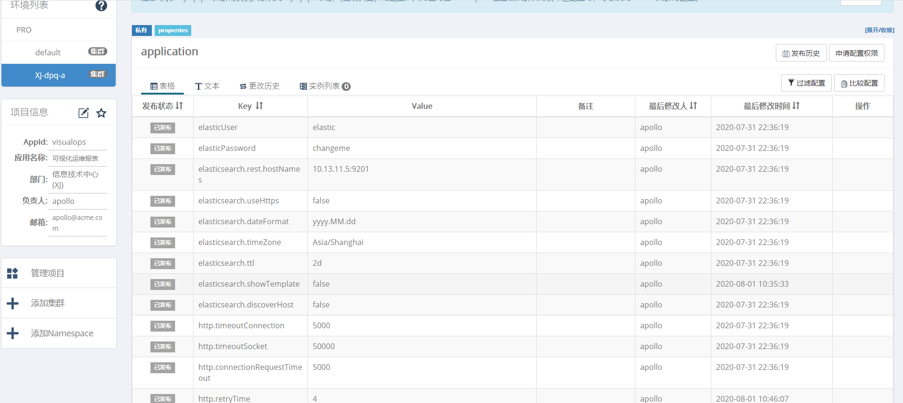

# Apollo对接与配置 (非spring boot项目)
本文介绍在非spring boot项目中，bboss与Apollo对接与配置方法。

# 1.elasticsearch客户端与Apollo对接

## 1.1 添加Apollo和bbossEs相关依赖

maven项目pom.xml添加Apollo和bbossEs相关依赖
```xml
<dependency>
    <groupId>com.bbossgroups.plugins</groupId>
    <artifactId>bboss-datatran-jdbc</artifactId>
    <version>7.3.2</version>
     <!--排除bboss-elasticsearch-rest-booter包-->
    <exclusions>
        <exclusion>
            <artifactId>bboss-elasticsearch-rest-booter</artifactId>
            <groupId>com.bbossgroups.plugins</groupId>
        </exclusion>
    </exclusions>
</dependency>
<dependency>
    <groupId>com.bbossgroups.plugins</groupId>
    <artifactId>bboss-plugin-apollo</artifactId>
    <version>6.3.7</version>
</dependency>
```

 注意：一定要排除bboss-elasticsearch-rest-booter包

## 1.2 增加app.properties文件 
在应用resources/META-INF目录下面增加app.properties文件，内容如下：

```properties
# apollo应用id
app.id=visualops
# apollo应用地址
apollo.meta=http://127.0.0.1:8080
```

## 1.3 增加elasticsearch-boot-config.xml
在resources/conf下新增文件elasticsearch-boot-config.xml，内容如下：

```xml
<properties>
    <!--
       指定apolloNamespace属性配置namespace
       指定configChangeListener属性，设置elasticsearch节点（elasticsearch.rest.hostNames）自动发现和动态切换Dsl日志打印开关（elasticsearch.showTemplate）监听器
    -->

    <config apolloNamespace="application" 
            configChangeListener="org.frameworkset.apollo.ESNodeChangeListener"/>
 </properties>
```

## 1.4 增加server.properties文件
在C:\opt\settings（windows）或者/opt/settings(linux)新增文件server.properties，内容如下：

```properties
# 环境配置
env=PRO
#集群编号
idc=XJ-dpq-a
```


## 1.5 Apollo中创建项目和namespace
应用名称：visualops

es服务器的相关信息，那么就可以创建一个名为application的namespace，其中主要配置信息如下：
```properties
elasticsearch.rest.hostNames = ip:9200

## 自动按日期时间分表时指定日期格式，例如 按照下面格式生成的索引名称示例：indexname-2000.03.05
elasticsearch.dateFormat = yyyy.MM.dd
## 自动按日期时间分表时指定日期格式时区
elasticsearch.timeZone = Asia/Shanghai


#在控制台输出脚本调试开关showTemplate,false关闭，true打开，同时log4j至少是info级别

elasticsearch.showTemplate = true

elasticsearch.discoverHost = false

# dsl配置文件热加载扫描时间间隔，毫秒为单位，默认5秒扫描一次，<= 0时关闭扫描机制

dslfile.refreshInterval = -1

##es client http连接池配置

http.timeoutConnection = 50000
http.timeoutSocket = 50000
http.connectionRequestTimeout=50000
http.retryTime = 3
http.automaticRetriesDisabled= false
#http.staleConnectionCheckEnabled=true
http.validateAfterInactivity=2000
http.evictExpiredConnections=false
http.timeToLive = 3600000
http.maxHeaderCount = 200
http.maxTotal = 600
http.defaultMaxPerRoute = 200

http.soReuseAddress = false

http.soKeepAlive = false


http.keepAlive = 3600000
```



## 1.6 完成上述操作之后，就可以正常使用bbosses的api了

# 2.bboss中使用apollo管理属性的其他作用
##  2.1 IOC与apollo集成并管理属性案例
```xml
<properties>
    <config apolloNamespace="application" changeReload="false"/>
    <property name="default" class="org.frameworkset.nosql.redis.RedisDB">
        <!-- redis.servers为apollo中配置的属性 -->
        <property name="servers">
            ${redis.servers}
        </property>
        <!-- single|cluster -->
        <property name="mode" value="cluster" />
        <property name="auth" value="${redis.auth:}" />
        <property name="poolMaxTotal" value="${redis.poolMaxTotal:10}"/>
        <property name="poolMaxWaitMillis" value="${redis.poolMaxWaitMillis:2000}"/>
    </property>
</properties>
```
config元素支持的属性说明

apolloNamespace 指定apollo namespace，多个用逗号分隔

changeReload   指定是否热加载修改后的属性，true 加载， false不加载，热加载时IOC中的属性和组件都会重新初始化

configChangeListener 指定自己的apollo值变化监听器，可以实现下述接口

```java
com.ctrip.framework.apollo.ConfigChangeListener;
```

或者继承父类：

org.frameworkset.apollo.PropertiesChangeListener


## 2.2 在代码中直接加载apollo中的配置

```java
public class ApolloPropertiesFilePluginTest{
   private static Logger logger = LoggerFactory.getLogger(ApolloPropertiesFilePlugin.class);
   PropertiesContainer propertiesContainer ;
   @Before
   public void init(){
      propertiesContainer = new PropertiesContainer();
      propertiesContainer.addConfigPropertiesFromApollo("application",//apollo namespace
                                                        true); //true标识热加载修改后的属性，否则不热加载
   }
   @Test
   public void test(){
      // 打印从apollo获取的配置信息
      dbinfo("");
      //每隔两秒获取最新的配置信息，可以验证热加载apollo中发生改变的配置
      while(true){
         try {
            synchronized (this) {
               Thread.currentThread().wait(2000l);
            }
            dbinfo("");
         }
         catch (Exception e){

         }
      }

   }

   private void dbinfo(String dbname){
      String dbName  = propertiesContainer.getProperty(dbname+"db.name");
      String dbUser  = propertiesContainer.getProperty(dbname+"db.user");
      String dbPassword  = propertiesContainer.getProperty(dbname+"db.password");
      String dbDriver  = propertiesContainer.getProperty(dbname+"db.driver");
      String dbUrl  = propertiesContainer.getProperty(dbname+"db.url");

      String showsql  = propertiesContainer.getProperty(dbname+"db.showsql");
      String validateSQL  = propertiesContainer.getProperty(dbname+"db.validateSQL");
      String dbInfoEncryptClass = propertiesContainer.getProperty(dbname+"db.dbInfoEncryptClass");
      System.out.println("dbName:"+dbName);
      System.out.println("dbUser:"+dbUser);
      System.out.println("dbPassword:"+dbPassword);
      System.out.println("dbDriver:"+dbDriver);
      System.out.println("dbUrl:"+dbUrl);
      System.out.println("showsql:"+showsql);
      System.out.println("validateSQL:"+validateSQL);
      System.out.println("dbInfoEncryptClass:"+dbInfoEncryptClass);
   }
}
```
## 2.3 http proxy中加载apollo中配置案例
bboss http proxy是一个轻量级的java http客户端负载均衡器，对应的配置可以通过apollo进行配置管理，同时亦可以通过apollo实现服务节点自动发现功能，
这里介绍具体的使用方法。

### 2.3.1 自定义监听器

首先定义一个apollo 监听器，用于实现服务节点自动发现功能
```java
package org.frameworkset.http.client;


import com.ctrip.framework.apollo.ConfigChangeListener;
import com.ctrip.framework.apollo.enums.PropertyChangeType;
import com.ctrip.framework.apollo.model.ConfigChange;
import com.ctrip.framework.apollo.model.ConfigChangeEvent;
import org.frameworkset.spi.remote.http.HttpHost;
import org.frameworkset.spi.remote.http.proxy.HttpProxyUtil;
import org.slf4j.Logger;
import org.slf4j.LoggerFactory;

import java.util.ArrayList;
import java.util.List;

/**
 * <p>Description: </p>
 * <p></p>
 * <p>Copyright (c) 2020</p>
 * @Date 2020/8/2 20:07
 * @author biaoping.yin
 * @version 1.0
 */
public class AddressConfigChangeListener implements ConfigChangeListener {
	private static Logger logger = LoggerFactory.getLogger(AddressConfigChangeListener.class);
	private void handleDiscoverHosts(String _hosts,String poolName){
		if(_hosts != null && !_hosts.equals("")){
			String[] hosts = _hosts.split(",");
			List<HttpHost> httpHosts = new ArrayList<HttpHost>();
			HttpHost host = null;
			for(int i = 0; i < hosts.length; i ++){
				host = new HttpHost(hosts[i]);
				httpHosts.add(host);
			}
			//将被动获取到的地址清单加入poolName对应的服务地址组中
			HttpProxyUtil.handleDiscoverHosts(poolName,httpHosts);
		}
	}
	/**
	 * //模拟被动获取监听地址清单
	 * List<HttpHost> hosts = new ArrayList<HttpHost>();
	 * // https服务必须带https://协议头,例如https://192.168.137.1:808
	 * HttpHost host = new HttpHost("192.168.137.1:808");
	 * hosts.add(host);
	 *
	 *    host = new HttpHost("192.168.137.1:809");
	 *    hosts.add(host);
	 *
	 * host = new HttpHost("192.168.137.1:810");
	 * hosts.add(host);
	 * //将被动获取到的地址清单加入服务地址组report中
	 * HttpProxyUtil.handleDiscoverHosts("schedule",hosts);
	 */
	public void onChange(ConfigChangeEvent changeEvent) {
		logger.info("Changes for namespace {}", changeEvent.getNamespace());
		ConfigChange change = null;
		for (String key : changeEvent.changedKeys()) {
			if(key.equals("schedule.http.hosts")){//schedule集群
				change = changeEvent.getChange(key);
				logger.info("Found change - key: {}, oldValue: {}, newValue: {}, changeType: {}", change.getPropertyName(), change.getOldValue(), change.getNewValue(), change.getChangeType());
				if(change.getChangeType() == PropertyChangeType.MODIFIED) {
					String _hosts = change.getNewValue();
					handleDiscoverHosts(_hosts, "schedule");
				}

			}
			else if(key.equals("http.hosts")){//default集群
				change = changeEvent.getChange(key);
				logger.info("Found change - key: {}, oldValue: {}, newValue: {}, changeType: {}", change.getPropertyName(), change.getOldValue(), change.getNewValue(), change.getChangeType());
				if(change.getChangeType() == PropertyChangeType.MODIFIED) {
					String _hosts = change.getNewValue();
					handleDiscoverHosts(_hosts, "default");
				}


			}

		}
	}
}
```
从apollo加载配置启动http proxy：
```java
    @Before
	public void startPool(){
//		HttpRequestProxy.startHttpPools("application.properties");
		/**
         * 从apollo加载配置启动http proxy：
		 * 配置了两个连接池：default,schedule
         * apollo namespace:  application
         * 服务地址变化发现监听器： org.frameworkset.http.client.AddressConfigChangeListener
		 */

		HttpRequestProxy.startHttpPoolsFromApollo("application","org.frameworkset.http.client.AddressConfigChangeListener");
	}
	@Test
	public void testGet(){
		String data = null;
		try {
            //服务调用
			data = HttpRequestProxy.httpGetforString("schedule", "/testBBossIndexCrud");
		}
		catch (Exception e){
			e.printStackTrace();
		}
		System.out.println(data);
		do {
			try {
				data = HttpRequestProxy.httpGetforString("schedule","/testBBossIndexCrud");
			} catch (Exception e) {
				e.printStackTrace();
			}
			try {
				Thread.sleep(3000l);
			} catch (Exception e) {
				break;
			}

		}
		while(true);
	}
```
### 2.3.2 直接调用http proxy api监听路由变化和节点变化

```java
       /**
       * 启动http proxy并监听路由变化和节点变化
       * 1.服务健康检查
       * 2.服务负载均衡
       * 3.服务容灾故障恢复
       * 4.服务自动发现（apollo，zk，etcd，consul，eureka，db，其他第三方注册中心）
       * 配置了两个连接池：default,report
       * 本示例演示基于apollo提供配置管理、服务自动发现以及灰度/生产，主备切换功能
       */


      HttpRequestProxy.startHttpPoolsFromApolloAwaredChange("application");
```

# 3.基于apollo配置中心案例工程

maven工程-elasticsearch java client案例

https://github.com/bbossgroups/elasticsearch-example-apollo 

gradle工程-数据同步案例

https://github.com/bbossgroups/db-elasticsearch-tool-apollo 

maven工程-http proxy案例

https://github.com/bbossgroups/httpproxy-apollo 

gradle工程-基于xxl-job调度的数据同步案例

https://github.com/bbossgroups/db-elasticsearch-xxjob-apollo 

# 4.参考文档

[Spring boot整合Elasticsearch](https://esdoc.bbossgroups.com/#/spring-booter-with-bboss?id=spring-boot整合elasticsearch案例分享)

[Apollo Java客户端使用指南](https://github.com/ctripcorp/apollo/wiki/Java客户端使用指南)

[httpproxy使用文档](https://esdoc.bbossgroups.com/#/httpproxy)