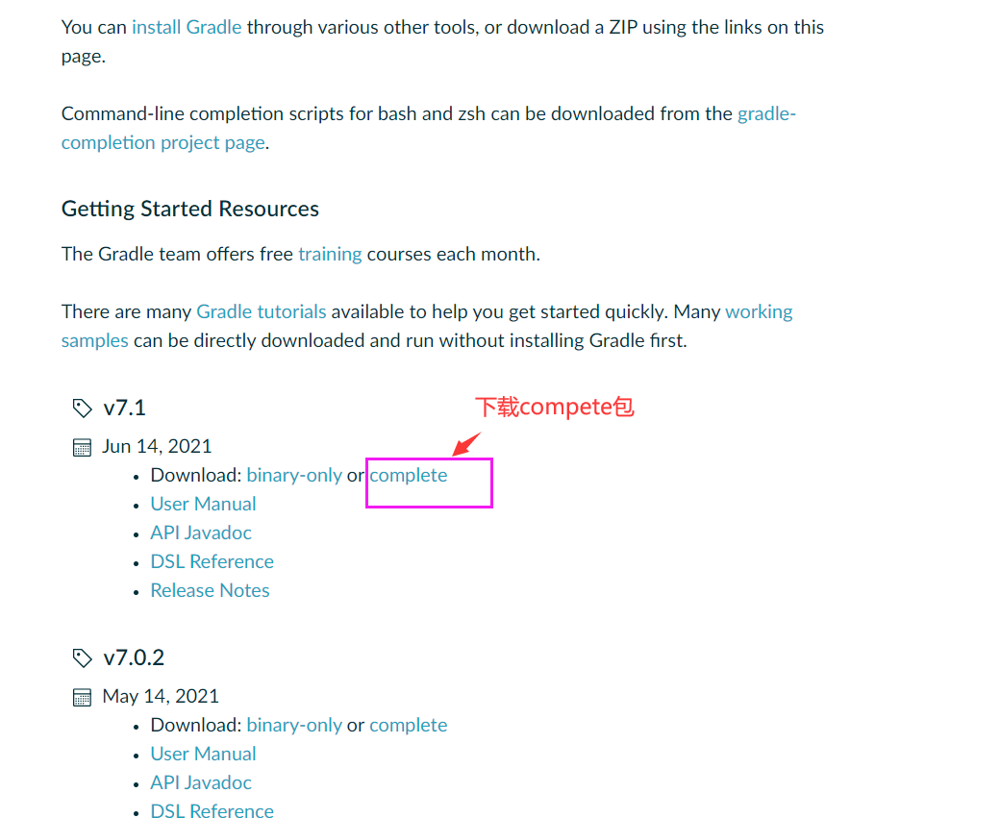

# Elasticsearch Bboss源码构建

# Gradle安装和配置

在自己的电脑上装好gradle运行环境,下载**最新**的gradle版本：

[下载gradle](https://gradle.org/releases) 



下载完毕后解压，然后配置好gradle环境变量： 

GRADLE_HOME:  指定gradle安装目录

GRADLE_USER_HOME: 指定gradle从maven中央库下载依赖包本地存放目录 


一般还需要指定maven的本地库，这样gradle 构建的本地包才能被maven项目引用到，gradle 通过M2_HOME环境变量查找maven安装环境即可，配置M2_HOME环境变量如下图： 


# 构建Elasticsearch bboss源码

安装后gradle后，我们就可以利用gradle来构建Elasticsearch Bboss的源码了。

首先从github下载Elasticsearch bboss源码工程： https://github.com/bbossgroups/bboss-elasticsearch

然后在源码根目录下面执行gradle指令即可构建bboss 源码：

```
gradle install
```

# 开发交流


bboss elasticsearch交流：166471282

**bboss elasticsearch微信公众号：**


# 支持我们

<div align="left"></div>


