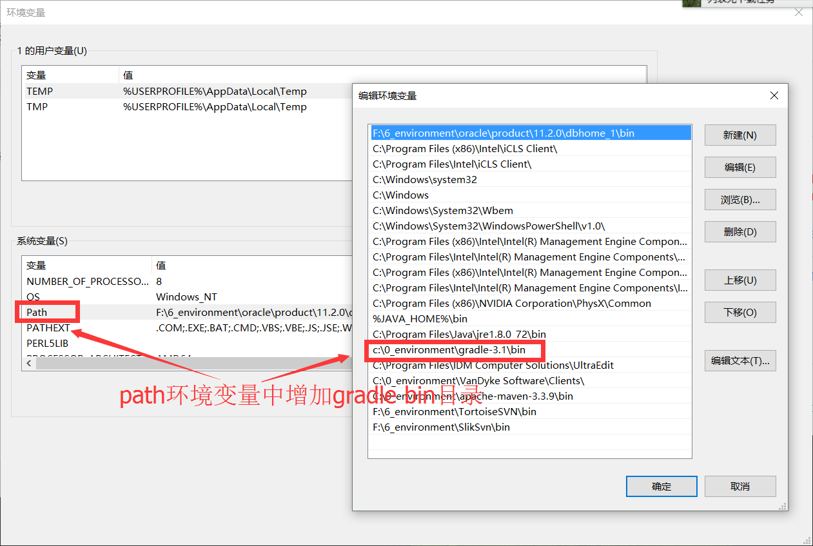
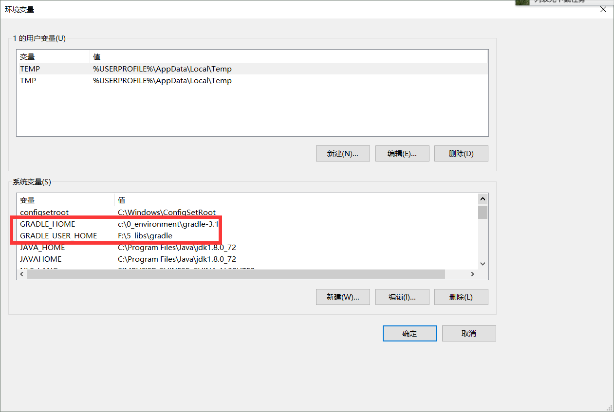
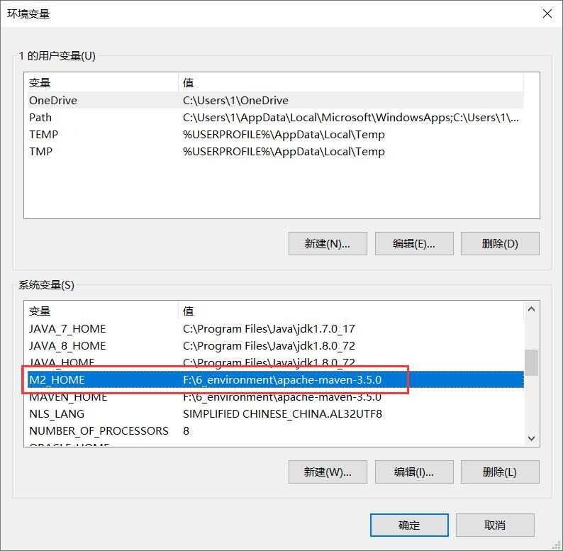
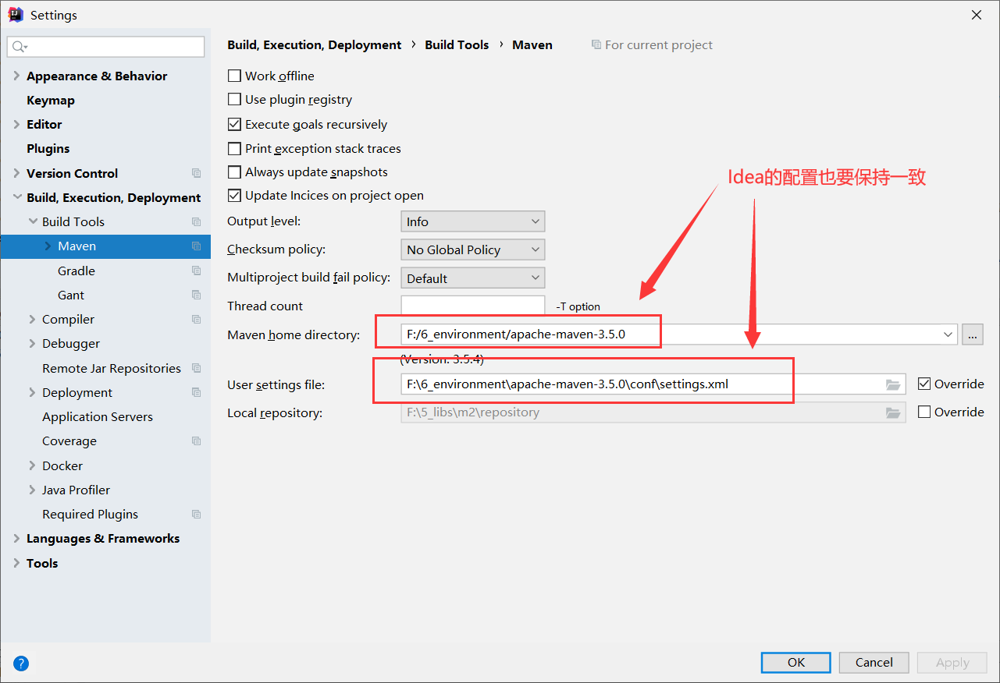

# Bboss源码构建指南
bboss采用gradle管理源码工程，本文介绍bboss模块构成，以及如何从源码构建[bboss](https://esdoc.bbossgroups.com/#/README)。

bboss环境搭建视频教程：https://www.bilibili.com/video/BV1KYNaeuEGm
# 1.bboss模块及构建说明

bboss采用模块化管理，模块之间依赖关系如下：


模块源码工程地址和功能说明如下：建议优先从Github下载bboss最新代码

| 码云源码地址                               | Github源码地址                                     | 说明                                                         |
| ------------------------------------------ | -------------------------------------------------- | ------------------------------------------------------------ |
| https://gitee.com/bboss/bboss              | https://github.com/bbossgroups/bboss               | [基础框架](https://doc.bbossgroups.com/#/)：包含ioc、持久层、mvc、任务调度管理、序列化/反序列化以及[配置管理](https://doc.bbossgroups.com/#/aop/IntroduceIoc)等功能 |
| https://gitee.com/bboss/bboss-data         | https://github.com/bbossgroups/bboss-data          | [Redis](https://doc.bbossgroups.com/#/redis)、[MongoDB](https://doc.bbossgroups.com/#/MongoDB)、[Milvus](https://doc.bbossgroups.com/#/Milvus)、[Minio](https://doc.bbossgroups.com/#/Minio)、S3 OSS协议客户端封装 |
| https://gitee.com/bboss/bboss-http5        | https://github.com/bbossgroups/bboss-http5         | 轻量级[http](https://esdoc.bbossgroups.com/#/httpproxy5)微服务框架 |
| https://gitee.com/bboss/bboss-ai           | https://github.com/bbossgroups/bboss-ai            | ai java 智能体及大模型对接客户端，支持同步调用和流式调用两种模式；集成业界主流模型平台模型，包括Deepseek，通义千问，智谱，字节豆包，大语言模型、多模态模型（计算视觉，音频/视频模型），快速实现智能问答、图片识别/生成、语音识别/生成以及视频识别/生成功能 |
| https://gitee.com/bboss/bboss-plugins      | https://github.com/bbossgroups/bboss-plugins       | [kafka](https://doc.bbossgroups.com/#/kafka)、apollo、nacos、Rocketmq对接框架 |
| https://gitee.com/bboss/bboss-elastic      | https://github.com/bbossgroups/bboss-elasticsearch | 高性能、高兼容性Elasticsearch Java [RestClient](https://esdoc.bbossgroups.com/#/quickstart) |
| https://gitee.com/bboss/bboss-elastic-tran | https://github.com/bbossgroups/bboss-elastic-tran  | [数据采集](https://esdoc.bbossgroups.com/#/db-es-tool)ETL、[流批一体化](https://esdoc.bbossgroups.com/#/etl-metrics)计算框架、[通用作业调度工作流](https://esdoc.bbossgroups.com/#/jobworkflow) |

可以从以上地址下载各模块源码工程，然后按表格顺序，依次在命令行源码根目录下，执行gradle publishToMavenLocal指令，构建模块版本：

```shell
cd bboss
gradle publishToMavenLocal

cd bboss-data
gradle publishToMavenLocal

cd bboss-http5
gradle publishToMavenLocal

cd bboss-ai
gradle publishToMavenLocal

cd bboss-plugins
gradle publishToMavenLocal


cd bboss-elastic
gradle publishToMavenLocal

cd bboss-elastic-tran
gradle publishToMavenLocal
```

其他辅助模块下载和构建：如果在运行bboss案例的过程中，报其他组件依赖问题，可以继续按序下载构建以下模块即可

https://gitee.com/bboss/bboss-rpc

https://gitee.com/bboss/security

https://gitee.com/bboss/bboot

整体构建顺序如下：

bboss-》bboss-data-》bboss-http5-》bboss-ai-》bboss-plugins-》bboss-elastic-》bboss-elastic-tran-》bboss-rpc-》security-》bboot

下面分别介绍：

1. 如何安装和配置gradle环境
2. 源码工程导入idea及工程在idea中gradle相关配置


# 2.Gradle安装和配置

参考以下步骤配置和安装gradle运行环境,首先下载**最新**（与开发工具Idea或者Eclipse兼容即可）的gradle版本：

[下载gradle](https://gradle.org/releases) 


下载完毕后解压，然后配置好gradle环境变量： 

GRADLE_HOME:  指定gradle安装目录

GRADLE_USER_HOME: 指定gradle从maven中央库下载依赖包本地存放目录 

M2_HOME: 一般还需要通过M2_HOME指定maven安装地址，这样gradle 构建的本地包才能被maven项目引用到，gradle 通过M2_HOME环境变量查找maven安装目录，一定要与idea或者eclipse中配置的maven安装目录一致

在系统环境变量Path添加gradle bin目录



添加GRADLE_HOME和GRADLE_USER_HOME环境变量：



配置M2_HOME环境变量： 



M2_HOME变量中的maven安装路径要与idea中maven配置保持一致,进入setting，配置maven：



# 3.源码工程在idea中的配置

可以将bboss的源码工程导入idea，工程导入新版本idea后，必须调整导入工程的gradle配置，进入setting，设置工程的gradle配置：


bboss-elasticsearch源码工程jdk配置（可选，因bboss Elasticsearch包含了对spring boot 3的支持，而spring boot 3要求至少jdk 17版本，所以需要额外进行jdk的配置，语言级别设置为8即可，非bboss Elasticsearch源码工程可以不用额外配置jdk版本）


# 4.快速开始bboss
https://esdoc.bbossgroups.com/#/quickstart

# 5.开发交流

QQ交流群：21220580,166471282,3625720,154752521,166471103,166470856

微信交流群：


交流社区：


# 6.支持我们

如果您正在使用bboss，或是想支持我们继续开发，您可以通过如下方式支持我们：

1.Star并向您的朋友推荐或分享

[bboss elasticsearch client](https://gitee.com/bboss/bboss-elastic)🚀

[数据采集&流批一体化处理](https://gitee.com/bboss/bboss-elastic-tran)🚀

2.通过[爱发电 ](https://afdian.net/a/bbossgroups)直接捐赠，或者扫描下面二维码进行一次性捐款赞助，请作者喝一杯咖啡☕️


非常感谢您对开源精神的支持！❤您的捐赠将用于bboss社区建设、QQ群年费、网站云服务器租赁费用。