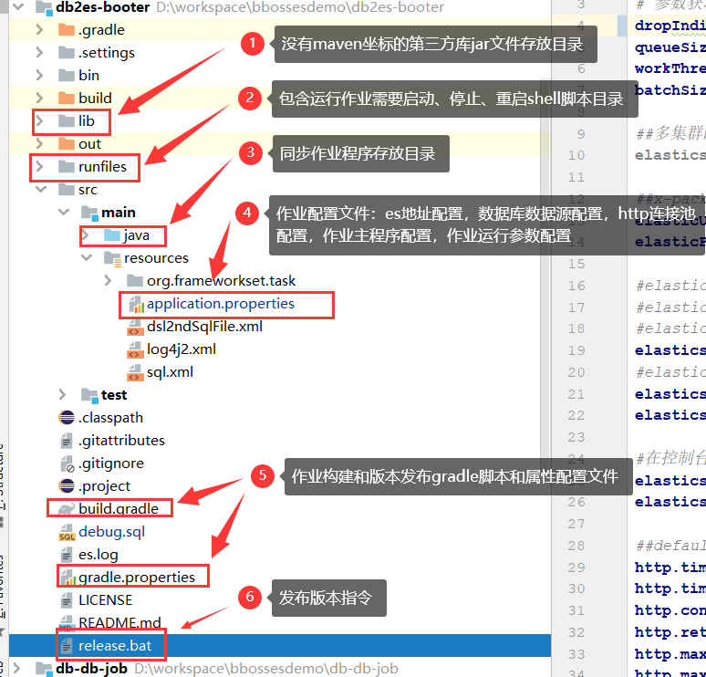
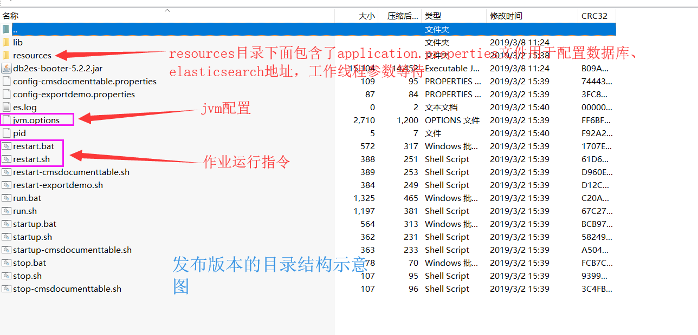

# DB-ES数据同步工具使用方法

bboss提供了一个数据库到Elasticsearch数据同步样板工程:[db-elasticsearch-tool](https://github.com/bbossgroups/db-elasticsearch-tool)，用来将写好的同步代码打包发布成可以运行的二进制包上传到服务器运行，[db-elasticsearch-tool](https://github.com/bbossgroups/db-elasticsearch-tool)提供了现成的运行指令和jvm配置文件。

# 1 环境准备

首先需要从Github下载最新的工具源码：

https://github.com/bbossgroups/db-elasticsearch-tool

工具目录结构说明：




[db-elasticsearch-tool](https://github.com/bbossgroups/db-elasticsearch-tool)是一个gradle工程，因此需要安装最新版本的gradle并配置好gradle环境变量，gradle安装和配置参考文档：

https://esdoc.bbossgroups.com/#/bboss-build

安装和配置好gradle，就可以将db-elasticsearch-tool工程导入idea或者eclipse，然后进行数据同步逻辑的开发、调试以及构建打包工作。

# 2 同步作业主程序定义

Dbdemo-提供了上述文中提供的各种导入数据的方法，可以根据自己的要求实效自己的方法逻辑，然后在Dbdemo的main方法中指定要执行的方法即可：

```java
public static void main(String args[]){
   Dbdemo dbdemo = new Dbdemo();
   boolean dropIndice = true;//CommonLauncher.getBooleanAttribute("dropIndice",false);//同时指定了默认值
   dbdemo.scheduleFullImportData(  dropIndice);
}
```

dbdemo类部分内容：

```java
package org.frameworkset.elasticsearch.imp;


import org.frameworkset.elasticsearch.ElasticSearchHelper;
import org.frameworkset.tran.*;
import org.frameworkset.tran.schedule.CallInterceptor;
import org.frameworkset.tran.schedule.ImportIncreamentConfig;
import org.frameworkset.tran.schedule.TaskContext;
import org.frameworkset.runtime.CommonLauncher;
import org.frameworkset.spi.geoip.IpInfo;
import org.slf4j.Logger;
import org.slf4j.LoggerFactory;

import java.util.Date;
import java.util.concurrent.atomic.AtomicInteger;

/**
 * <p>Description: 同步处理程序，如需调试同步功能，
 * 请运行测试用例DbdemoTest中调试</p>

 */
public class Dbdemo {
   private static Logger logger = LoggerFactory.getLogger(Dbdemo.class);
   public static void main(String args[]){
      Dbdemo dbdemo = new Dbdemo();
      boolean dropIndice = true;//CommonLauncher.getBooleanAttribute("dropIndice",false);//同时指定了默认值
      dbdemo.scheduleFullImportData(  dropIndice);
   }

   
   /**
    * elasticsearch地址和数据库地址都从外部配置文件application.properties中获取，加载数据源配置和es配置
    */
   public void scheduleFullImportData(boolean dropIndice){
      DB2ESImportBuilder importBuilder = DB2ESImportBuilder.newInstance();
      dropIndice = CommonLauncher.getBooleanAttribute("dropIndice",true);//同时指定了默认值
      int batchSize = CommonLauncher.getIntProperty("batchSize",10);//同时指定了默认值
      int queueSize = CommonLauncher.getIntProperty("queueSize",50);//同时指定了默认值
      int workThreads = CommonLauncher.getIntProperty("workThreads",10);//同时指定了默认值
      //增量定时任务不要删表，但是可以通过删表来做初始化操作
      if(dropIndice) {
         try {
            //清除测试表,导入的时候回重建表，测试的时候加上为了看测试效果，实际线上环境不要删表
            String repsonse = ElasticSearchHelper.getRestClientUtil().dropIndice("dbdemo");
            System.out.println(repsonse);
         } catch (Exception e) {
         }
      }
      //设置数据bulk导入任务结果处理回调函数，对每次bulk任务的结果进行成功和失败反馈，然后针对失败的bulk任务通过error方法进行相应处理
      importBuilder.setExportResultHandler(new ExportResultHandler<String,String>() {
         @Override
         public void success(TaskCommand<String,String> taskCommand, String result) {
            String datas = taskCommand.getDatas();//执行的批量数据
//          System.out.println(result);//打印成功结果
         }

         @Override
         public void error(TaskCommand<String,String> taskCommand, String result) {
            //任务执行完毕，但是结果中包含错误信息
            //具体怎么处理失败数据可以自行决定,下面的示例显示重新导入失败数据的逻辑：
            // 从result中分析出导入失败的记录，然后重新构建data，设置到taskCommand中，重新导入，
            // 支持的导入次数由getMaxRetry方法返回的数字决定
            // String failDatas = ...;
            //taskCommand.setDatas(failDatas);
            //taskCommand.execute();
            String datas = taskCommand.getDatas();//执行的批量数据
//          System.out.println(result);//打印成功结果
         }

         @Override
         public void exception(TaskCommand<String, String> taskCommand, Exception exception) {
            //任务执行抛出异常，失败处理方法
         }

         /**
          * 如果对于执行有错误的任务，可以进行修正后重新执行，通过本方法
          * 返回允许的最大重试次数
          * @return
          */
         @Override
         public int getMaxRetry() {
            return -1;
         }
      });

      //指定导入数据的sql语句，必填项，可以设置自己的提取逻辑，
      // 设置增量变量log_id，增量变量名称#[log_id]可以多次出现在sql语句的不同位置中，例如：
      // select * from td_sm_log where log_id > #[log_id] and parent_id = #[log_id]
      // log_id和数据库对应的字段一致,就不需要设置setLastValueColumn信息，
      // 但是需要设置setLastValueType告诉工具增量字段的类型

      importBuilder.setSql("select * from td_sm_log ");

//    importBuilder.setSql("select * from td_sm_log ");
      /**
       * es相关配置
       */
      importBuilder
            .setIndex("dbdemo") //必填项
            .setIndexType("dbdemo") //es 7以后的版本不需要设置indexType，es7以前的版本必需设置indexType
//          .setRefreshOption("refresh")//可选项，null表示不实时刷新，importBuilder.setRefreshOption("refresh");表示实时刷新
            .setUseJavaName(true) //可选项,将数据库字段名称转换为java驼峰规范的名称，true转换，false不转换，默认false，例如:doc_id -> docId
            .setUseLowcase(false)  //可选项，true 列名称转小写，false列名称不转换小写，默认false，只要在UseJavaName为false的情况下，配置才起作用
            .setPrintTaskLog(true) //可选项，true 打印任务执行日志（耗时，处理记录数） false 不打印，默认值false
            .setBatchSize(batchSize);  //可选项,批量导入es的记录数，默认为-1，逐条处理，> 0时批量处理

      //定时任务配置，
      importBuilder.setFixedRate(false)//参考jdk timer task文档对fixedRate的说明
//              .setScheduleDate(date) //指定任务开始执行时间：日期
            .setDeyLay(1000L) // 任务延迟执行deylay毫秒后执行
            .setPeriod(10000L); //每隔period毫秒执行，如果不设置，只执行一次
      //定时任务配置结束
//
//    //设置任务执行拦截器，可以添加多个
//    importBuilder.addCallInterceptor(new CallInterceptor() {
//       @Override
//       public void preCall(TaskContext taskContext) {
//          System.out.println("preCall");
//       }
//
//       @Override
//       public void afterCall(TaskContext taskContext) {
//          System.out.println("afterCall");
//       }
//
//       @Override
//       public void throwException(TaskContext taskContext, Exception e) {
//          System.out.println("throwException");
//       }
//    }).addCallInterceptor(new CallInterceptor() {
//       @Override
//       public void preCall(TaskContext taskContext) {
//          System.out.println("preCall 1");
//       }
//
//       @Override
//       public void afterCall(TaskContext taskContext) {
//          System.out.println("afterCall 1");
//       }
//
//       @Override
//       public void throwException(TaskContext taskContext, Exception e) {
//          System.out.println("throwException 1");
//       }
//    });
//    //设置任务执行拦截器结束，可以添加多个
      //增量配置开始
//    importBuilder.setLastValueColumn("log_id");//手动指定数字增量查询字段，默认采用上面设置的sql语句中的增量变量名称作为增量查询字段的名称，指定以后就用指定的字段
      importBuilder.setFromFirst(true);//setFromfirst(false)，如果作业停了，作业重启后从上次截止位置开始采集数据，
			//setFromfirst(true) 如果作业停了，作业重启后，重新开始采集数据
      importBuilder.setLastValueStorePath("logtable_import");//记录上次采集的增量字段值的文件路径，作为下次增量（或者重启后）采集数据的起点，不同的任务这个路径要不一样
//    importBuilder.setLastValueStoreTableName("logs");//记录上次采集的增量字段值的表，可以不指定，采用默认表名increament_tab
      importBuilder.setLastValueType(ImportIncreamentConfig.NUMBER_TYPE);//如果没有指定增量查询字段名称，则需要指定字段类型：ImportIncreamentConfig.NUMBER_TYPE 数字类型
      // 或者ImportIncreamentConfig.TIMESTAMP_TYPE 日期类型
      //增量配置结束

      //映射和转换配置开始
//    /**
//     * db-es mapping 表字段名称到es 文档字段的映射：比如document_id -> docId
//     * 可以配置mapping，也可以不配置，默认基于java 驼峰规则进行db field-es field的映射和转换
//     */
//    importBuilder.addFieldMapping("document_id","docId")
//          .addFieldMapping("docwtime","docwTime")
//          .addIgnoreFieldMapping("channel_id");//添加忽略字段
//
//
//    /**
//     * 为每条记录添加额外的字段和值
//     * 可以为基本数据类型，也可以是复杂的对象
//     */
//    importBuilder.addFieldValue("testF1","f1value");
//    importBuilder.addFieldValue("testInt",0);
//    importBuilder.addFieldValue("testDate",new Date());
//    importBuilder.addFieldValue("testFormateDate","yyyy-MM-dd HH",new Date());
//    TestObject testObject = new TestObject();
//    testObject.setId("testid");
//    testObject.setName("jackson");
//    importBuilder.addFieldValue("testObject",testObject);
//
      final AtomicInteger s = new AtomicInteger(0);

      /**
       * 重新设置es数据结构
       */
      importBuilder.setDataRefactor(new DataRefactor() {
         public void refactor(Context context) throws Exception  {
            //可以根据条件定义是否丢弃当前记录
            //context.setDrop(true);return;
//          if(s.incrementAndGet() % 2 == 0) {
//             context.setDrop(true);
//             return;
//          }
            //空值处理，判断字段content的值是否为空
            if(context.getValue("content") == null){
               context.addFieldValue("content","");//将content设置为""
            }
            context.addFieldValue("content","");//将content设置为""
            CustomObject customObject = new CustomObject();
            customObject.setAuthor((String)context.getValue("author"));
            customObject.setTitle((String)context.getValue("title"));
            customObject.setSubtitle((String)context.getValue("subtitle"));

            customObject.setIds(new int[]{1,2,3});
            context.addFieldValue("author",customObject);

            long testtimestamp = context.getLongValue("testtimestamp");//将long类型的时间戳转换为Date类型
            context.addFieldValue("testtimestamp",new Date(testtimestamp));//将long类型的时间戳转换为Date类型

//          context.addIgnoreFieldMapping("title");
            //上述三个属性已经放置到docInfo中，如果无需再放置到索引文档中，可以忽略掉这些属性
//          context.addIgnoreFieldMapping("author");

            //修改字段名称title为新名称newTitle，并且修改字段的值
            context.newName2ndData("title","newTitle",(String)context.getValue("title")+" append new Value");
            context.addIgnoreFieldMapping("subtitle");
            /**
             * 获取ip对应的运营商和区域信息
             */
            IpInfo ipInfo = context.getIpInfo("remoteAddr");
            context.addFieldValue("ipInfo",ipInfo);
            context.addFieldValue("collectTime",new Date());
            /**
            //关联查询数据,单值查询
            Map headdata = SQLExecutor.queryObjectWithDBName(Map.class,context.getEsjdbc().getDbConfig().getDbName(),
                                                "select * from head where billid = ? and othercondition= ?",
                                                context.getIntegerValue("billid"),"otherconditionvalue");//多个条件用逗号分隔追加
            //将headdata中的数据,调用addFieldValue方法将数据加入当前es文档，具体如何构建文档数据结构根据需求定
            context.addFieldValue("headdata",headdata);
            //关联查询数据,多值查询
            List<Map> facedatas = SQLExecutor.queryListWithDBName(Map.class,context.getEsjdbc().getDbConfig().getDbName(),
                  "select * from facedata where billid = ?",
                  context.getIntegerValue("billid"));
            //将facedatas中的数据,调用addFieldValue方法将数据加入当前es文档，具体如何构建文档数据结构根据需求定
            context.addFieldValue("facedatas",facedatas);
             */
         }
      });
      //映射和转换配置结束

      /**
       * 一次、作业创建一个内置的线程池，实现多线程并行数据导入elasticsearch功能，作业完毕后关闭线程池
       */
      importBuilder.setParallel(true);//设置为多线程并行批量导入,false串行
      importBuilder.setQueue(queueSize);//设置批量导入线程池等待队列长度
      importBuilder.setThreadCount(workThreads);//设置批量导入线程池工作线程数量
      importBuilder.setContinueOnError(true);//任务出现异常，是否继续执行作业：true（默认值）继续执行 false 中断作业执行
      importBuilder.setAsyn(false);//true 异步方式执行，不等待所有导入作业任务结束，方法快速返回；false（默认值） 同步方式执行，等待所有导入作业任务结束，所有作业结束后方法才返回
      importBuilder.setEsIdField("log_id");//设置文档主键，不设置，则自动产生文档id
//    importBuilder.setDebugResponse(false);//设置是否将每次处理的reponse打印到日志文件中，默认false，不打印响应报文将大大提升性能，只有在调试需要的时候才打开，log日志级别同时要设置为INFO
//    importBuilder.setDiscardBulkResponse(true);//设置是否需要批量处理的响应报文，不需要设置为false，true为需要，默认true，如果不需要响应报文将大大提升处理速度

      importBuilder.setDebugResponse(false);//设置是否将每次处理的reponse打印到日志文件中，默认false
      importBuilder.setDiscardBulkResponse(true);//设置是否需要批量处理的响应报文，不需要设置为false，true为需要，默认false
      /**
       importBuilder.setEsIdGenerator(new EsIdGenerator() {
       //如果指定EsIdGenerator，则根据下面的方法生成文档id，
       // 否则根据setEsIdField方法设置的字段值作为文档id，
       // 如果默认没有配置EsIdField和如果指定EsIdGenerator，则由es自动生成文档id

       @Override
       public Object genId(Context context) throws Exception {
       return SimpleStringUtil.getUUID();//返回null，则由es自动生成文档id
       }
       });
       */
      /**
       * 执行数据库表数据导入es操作
       */
      DataStream dataStream = importBuilder.builder();
      dataStream.execute();//执行导入操作

      System.out.println();


   }

  
}
```

Dbdemo完整的内容参考：

<https://github.com/bbossgroups/db-elasticsearch-tool/blob/master/src/main/java/org/frameworkset/elasticsearch/imp/Dbdemo.java>

开发过程中可以直接运行Dbdemo中的main方法来调试作业程序。

# 3 es数据源配置

修改配置文件src\test\resources\application.properties

```properties
# elasticsearch客户端配置
##x-pack或者searchguard账号和口令
elasticUser=elastic
elasticPassword=changeme

#elasticsearch.rest.hostNames=10.1.236.88:9200
#elasticsearch.rest.hostNames=127.0.0.1:9200
#elasticsearch.rest.hostNames=10.21.20.168:9200
elasticsearch.rest.hostNames=192.168.137.1:9200
#elasticsearch.rest.hostNames=10.180.211.27:9280,10.180.211.27:9281,10.180.211.27:9282
elasticsearch.dateFormat=yyyy.MM.dd
elasticsearch.timeZone=Asia/Shanghai
elasticsearch.ttl=2d
#在控制台输出脚本调试开关showTemplate,false关闭，true打开，同时log4j至少是info级别
elasticsearch.showTemplate=false
elasticsearch.discoverHost=false

##elasticsearch客户端使用的http连接池配置
http.timeoutConnection = 5000
http.timeoutSocket = 50000
http.connectionRequestTimeout=10000
http.retryTime = 1
http.maxLineLength = -1
http.maxHeaderCount = 200
http.maxTotal = 200
http.defaultMaxPerRoute = 100
http.soReuseAddress = false
http.soKeepAlive = false
http.timeToLive = 3600000
http.keepAlive = 3600000
http.keystore =
http.keyPassword =
# ssl 主机名称校验，是否采用default配置，
# 如果指定为default，就采用DefaultHostnameVerifier,否则采用 SSLConnectionSocketFactory.ALLOW_ALL_HOSTNAME_VERIFIER
http.hostnameVerifier =

# dsl配置文件热加载扫描时间间隔，毫秒为单位，默认5秒扫描一次，<= 0时关闭扫描机制
dslfile.refreshInterval = 3000
```

# 4 数据库数据源配置

修改配置文件src\test\resources\application.properties，以mysql未来介绍数据源配置：

```properties
db.name = test  #数据源名称，持久层通过dbname引用定义的数据源
db.user = root
db.password = 123456
db.driver = com.mysql.jdbc.Driver
db.url = jdbc:mysql://192.168.137.1:3306/bboss?useCursorFetch=true&useUnicode=true&characterEncoding=utf-8&useSSL=false
db.usePool = true
db.validateSQL = select 1
db.jdbcFetchSize = 10000
db.showsql = true
```

# 5 自定义适配器数据源配置

定义达梦数据库的适配器： 

 dbAdaptor专用于设置不支持的数据库类型名称和数据库适配器，方便用户扩展不支持的数据库的数据导入

 dbAdaptor必须继承自com.frameworkset.orm.adapter.DB或者其继承DB的类 

```java
package org.frameworkset.elasticsearch.imp;
import com.frameworkset.orm.adapter.DBOracle;

/**
 * <p>Description: 达梦数据库adaptor</p>
 * <p></p>
 * <p>Copyright (c) 2018</p>
 * @Date 2019/4/21 13:28
 * @author biaoping.yin
 * @version 1.0
 */
public class DMAdaptor extends DBOracle {
}
```

在配置文件src\test\resources\application.properties中指定自定义数据源适配器

```properties
# 国产数据库达梦数据源配置，展示额外定制的达梦dbAdaptor，
# 通过定制自己的dbAdaptor可以非常方便地实现bboss本身不支持的数据库的数据同步工作
#   /**
#   * dbtype专用于设置不支持的数据库类型名称和数据库适配器，方便用户扩展不支持的数据库的数据导入
#   * 可选字段，设置了dbAdaptor可以不设置dbtype，默认为数据库driver类路径
#   */
#  private String dbtype ;
#  /**
#   * dbAdaptor专用于设置不支持的数据库类型名称和数据库适配器，方便用户扩展不支持的数据库的数据导入
#   * dbAdaptor必须继承自com.frameworkset.orm.adapter.DB或者其继承DB的类
#   */
db.name = test
db.user = username
db.password = password
db.driver = dm.jdbc.driver.DmDriver
db.url = jdbc:dm://localhost:12345/dbname
db.usePool = true
db.validateSQL = select 1
db.jdbcFetchSize = 10000
db.showsql = true
db.dbtype = dm
#指定dm数据库适配器
db.dbAdaptor = org.frameworkset.elasticsearch.imp.DMAdaptor
```

api方式配置自定义适配器：

```java
importBuilder.setDbAdaptor("org.frameworkset.elasticsearch.imp.DMAdaptor");
```

# 6 保存增量状态的数据源配置

采用分布式作业调度引擎时，定时增量导入需要指定保存增量状态的数据源：

修改配置文件src\main\resources\application.properties

```properties
# 增量导入状态存储数据源配置，默认采用sqlite，增量导入装存储到本地的sqlite数据库中，采用分布式的外部定时任务引擎时，
# 就不能将状态存储到本地，需要采用外部的数据库（mysql,oracle等）来存储增量导入状态。
# 如果做了config.db配置，则采用配置的的数据源，必须指定创建statusTableName的建表语句，每种数据库对应的语法做适当调整
# create table $statusTableName  (ID number(2),lasttime number(10),lastvalue number(10),lastvaluetype number(1),PRIMARY KEY (ID))
#
# 一般情况下不需要使用外部状态数据源，除非采用分布式的外部定时任务引擎，
# 外部状态数据源可以直接使用上面的导入数据源
config.db.name=test
#config.db.name = testconfig
#config.db.user = root
#config.db.password = 123456
#config.db.driver = com.mysql.jdbc.Driver
#config.db.url = jdbc:mysql://192.168.137.1:3306/bboss?useCursorFetch=true&useUnicode=true&characterEncoding=utf-8&useSSL=false
#config.db.usePool = true
#config.db.validateSQL = select 1
#config.db.jdbcFetchSize = 10000
#config.db.showsql = true
### mysql
#config.db.statusTableDML = CREATE TABLE $statusTableName ( ID bigint(10) NOT NULL AUTO_INCREMENT, lasttime bigint(10) NOT NULL, lastvalue bigint(10) NOT NULL, lastvaluetype int(1) NOT NULL, PRIMARY KEY(ID)) ENGINE=InnoDB
```

# 7 同步作业主程序配置

定义好同步作业主程序后，需要在application.properties文件中通过mainclass属性指定需要执行的作业主程序，这样bboss在启动作业的时候就会运行其中定义的main方法,执行数据同步功能：

```java
public static void main(String args[]){
   Dbdemo dbdemo = new Dbdemo();
   boolean dropIndice = true;//CommonLauncher.getBooleanAttribute("dropIndice",false);//同时指定了默认值
   dbdemo.scheduleFullImportData(  dropIndice);
}
```

在application.properties文件中通过mainclass属性指定需要执行的作业主程序：

```properties
#同步作业主程序
mainclass=org.frameworkset.elasticsearch.imp.Dbdemo
```

# 8 测试以及调试同步代码

在Dbdemo类添加main方法，在其中添加Dbdemo执行代码，即可运行调试同步代码：

```java
public static void main(String args[]){

      long t = System.currentTimeMillis();
      Dbdemo dbdemo = new Dbdemo();
      boolean dropIndice = true;//CommonLauncher.getBooleanAttribute("dropIndice",false);//同时指定了默认值
//    dbdemo.scheduleImportData(  dropIndice);//定时增量导入
      dbdemo.scheduleFullImportData(dropIndice);//定时全量导入
//    dbdemo.scheduleRefactorImportData(dropIndice);//定时全量导入，在context中排除remark1字段

//    dbdemo.scheduleFullAutoUUIDImportData(dropIndice);//定时全量导入，自动生成UUID
//    dbdemo.scheduleDatePatternImportData(dropIndice);//定时增量导入，按日期分表yyyy.MM.dd
   }
```


# 9 查看任务执行详细日志

如果要查看任务执行过程中的详细日志，只需设置以下参数即可：

```java
importBuilder.setPrintTaskLog(true) //可选项，true 打印任务执行日志（耗时，处理记录数） false 不打印，默认值false
```

这样在任务执行的时候会打印如下日志信息：

```
15:47:45.704 [DB2ESImportThread-1] DEBUG org.frameworkset.tran.TaskCall - Task[39] finish,import 10 records,Total import 390 records,Take time:432ms
15:47:45.704 [DB2ESImportThread-1] INFO  org.frameworkset.tran.TaskCall - Task[41] starting ......
15:47:45.704 [DB2ESImportThread-2] INFO  org.frameworkset.tran.TaskCall - Task[40] starting ......
15:47:46.238 [DB2ESImportThread-1] DEBUG org.frameworkset.tran.TaskCall - Task[41] finish,import 10 records,Total import 420 records,Take time:534ms
15:47:46.238 [DB2ESImportThread-2] DEBUG org.frameworkset.tran.TaskCall - Task[40] finish,import 10 records,Total import 410 records,Take time:534ms
15:47:46.238 [DB2ESImportThread-1] INFO  org.frameworkset.tran.TaskCall - Task[42] starting ......
15:47:46.530 [DB2ESImportThread-1] DEBUG org.frameworkset.tran.TaskCall - Task[42] finish,import 8 records,Total import 428 records,Take time:292ms
15:47:46.530 [main] INFO  org.frameworkset.tran.JDBCRestClientUtil - Complete tasks:43,Total import 428 records.
```


# 10 数据导入不完整原因分析及处理

如果在任务执行完毕后，发现es中的数据与数据库源表的数据不匹配，可能的原因如下：

**1.并行执行的过程中存在失败的任务（比如服务端超时），这种情况通过setExportResultHandler设置的exception监听方法进行定位分析**

参考章节【[设置任务执行结果回调处理函数](https://esdoc.bbossgroups.com/#/db-es-tool?id=_2312-%e8%ae%be%e7%bd%ae%e4%bb%bb%e5%8a%a1%e6%89%a7%e8%a1%8c%e7%bb%93%e6%9e%9c%e5%9b%9e%e8%b0%83%e5%a4%84%e7%90%86%e5%87%bd%e6%95%b0)】

```java
 public void exception(TaskCommand<String, String> taskCommand, Exception exception) {
//任务执行抛出异常，失败处理方法,特殊的异常可以调用taskCommand的execute方法重试
     if(need retry)
     	taskCommand.execute();
}
```

解决办法：

a) 优化elasticsearch服务器配置(加节点，加内存和cpu等运算资源，调优网络性能等)

b) 调整同步程序导入线程数、批处理batchSize参数，降低并行度。

```java
importBuilder.setBatchSize(10000);//每次bulk批处理的记录条数
importBuilder.setParallel(true);//设置为多线程并行批量导入,false串行
importBuilder.setQueue(100);//设置批量导入线程池等待队列长度
importBuilder.setThreadCount(50);//设置批量导入线程池工作线程数量
```

c) 对于read或者等待超时的异常，亦可以调整配置文件src\test\resources\application.properties中的http timeout时间参数

http.timeoutConnection = 50000

http.timeoutSocket = 50000


**2.任务执行完毕，但是存在es的bulk拒绝记录或者数据内容不合规的情况，这种情况就通过setExportResultHandler设置的error监听方法进行定位分析**

参考章节【[设置任务执行结果回调处理函数](https://esdoc.bbossgroups.com/#/db-es-tool?id=_2312-%e8%ae%be%e7%bd%ae%e4%bb%bb%e5%8a%a1%e6%89%a7%e8%a1%8c%e7%bb%93%e6%9e%9c%e5%9b%9e%e8%b0%83%e5%a4%84%e7%90%86%e5%87%bd%e6%95%b0)】

bulk拒绝记录解决办法：

a) 优化elasticsearch服务器配置(加节点，加内存和cpu等运算资源，调优网络性能等)

调整elasticsearch的相关线程和队列：调优elasticsearch配置参数

thread_pool.bulk.queue_size: 1000   es线程等待队列长度

thread_pool.bulk.size: 10   线程数量，与cpu的核数对应

b) 调整同步程序导入线程数、批处理batchSize参数，降低并行度。

数据内容不合规解决办法：拿到执行的原始批量数据，分析错误信息对应的数据记录，进行修改，然后重新导入失败的记录即可

```java
@Override
         public void error(TaskCommand<String,String> taskCommand, String result) {
            //任务执行完毕，但是结果中包含错误信息
            //具体怎么处理失败数据可以自行决定,下面的示例显示重新导入失败数据的逻辑：
            // 从result中分析出导入失败的记录，然后重新构建data，设置到taskCommand中，重新导入，
            // 支持的导入次数由getMaxRetry方法返回的数字决定
              String datas = taskCommand.getDatas();//拿到执行的原始批量数据，分析错误信息对应的数据记录，进行修改，然后重新导入失败的记录即可
            // String failDatas = ...;
            //taskCommand.setDatas(failDatas);
            //taskCommand.execute();
           
//          System.out.println(result);//打印成功结果
         }
```

# 11 作业运行jvm内存配置

修改jvm.options,设置作业运行需要的jvm内存，按照比例调整Xmx和MaxNewSize参数：

```properties
-Xms1g
-Xmx1g
-XX:NewSize=512m
-XX:MaxNewSize=512m
```

Xms和Xmx保持一样，NewSize和MaxNewSize保持一样，Xmx和MaxNewSize大小保持的比例可以为3:1或者2:1

# 12 发布版本

代码写好并经过调试后，就可以执行gradle指令构建发布db-elasticsearch-tool运行包，需要安装最新版本的gradle并配置好gradle环境变量。

gradle安装和配置参考文档：https://esdoc.bbossgroups.com/#/bboss-build

我们可以在cmd行，idea、eclipse中运行打包指令，以工程目录cmd窗口为例：

```gradle
先切换到工程的根目录
cd D:\workspace\bbossesdemo\db-elasticsearch-tool
release.bat
```

构建成功后，将会在工程目录下面生成可部署的二进制包：

build/distributions/db-elasticsearch-tool-1.0.0-released.zip

包的目录结构如下：



运行里面的即可启动作业：

windows: restart.bat 

linux: restart.sh