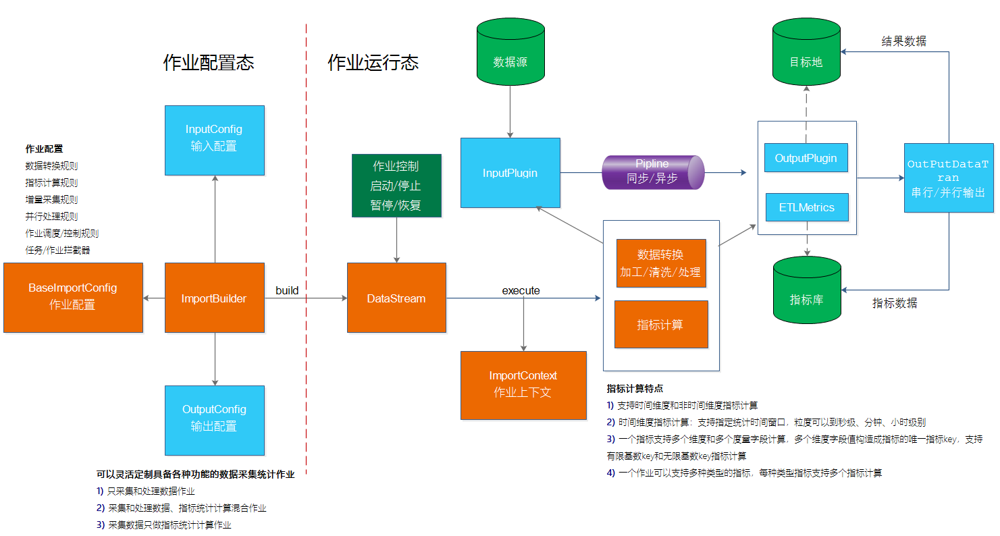
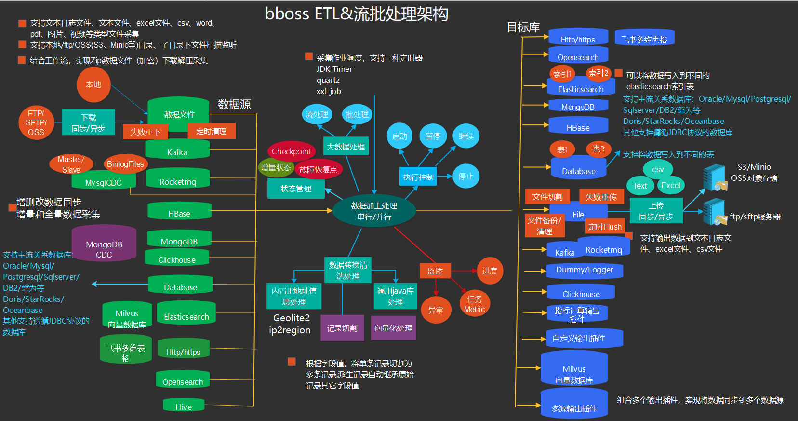

# 数据采集&流批一体化处理使用指南

bboss-datatran由 [bboss ](https://www.bbossgroups.com)开源的[数据采集同步ETL工具](db-es-tool.md)，提供数据采集、数据清洗转换处理和数据入库以及数据指标统计计算流批一体化处理功能。本文介绍数据采集&流批一体化处理使用指南。	



# 在项目中集成

在项目中集成使用数据采集&流批一体化处理功能，可以参考文档：[在工程中导入bboss-maven坐标](https://esdoc.bbossgroups.com/#/db-es-tool?id=_11-%e5%9c%a8%e5%b7%a5%e7%a8%8b%e4%b8%ad%e5%af%bc%e5%85%a5bboss-maven%e5%9d%90%e6%a0%87)

# 1.流批一体化作业类型

通过bboss可以灵活定制具备各种功能的数据采集统计作业

1) 只采集和处理数据作业

2) 采集和处理数据、指标统计计算混合作业--通过ImportBuilder注册ETLMetrics+其他数据源Output插件结合实现

```java
importBuilder.setDataTimeField("logOpertime");
importBuilder.addMetrics(keyMetrics);//通过importBuilder注册指标计算器，对采集数据进行指标计算并保存指标计算结果到各种数据库
ElasticsearchOutputConfig elasticsearchOutputConfig = new ElasticsearchOutputConfig();
      elasticsearchOutputConfig
                .setTargetElasticsearch("default")
            .setIndex("dbdemo")
            .setEsIdField("log_id")//设置文档主键，不设置，则自动产生文档id
            .setDebugResponse(false)//设置是否将每次处理的reponse打印到日志文件中，默认false
            .setDiscardBulkResponse(false);//设置是否需要批量处理的响应报文，不需要设置为false，true为需要，默认false    

      importBuilder.setOutputConfig(elasticsearchOutputConfig);//设置Elasticsearch输出插件，保存加工后的原始数据
```

3) 采集数据只做指标统计计算作业--通过指标插件MetricsOutputConfig实现

```java
 MetricsOutputConfig metricsOutputConfig = new MetricsOutputConfig();

        metricsOutputConfig.setDataTimeField("logOpertime");
        metricsOutputConfig.addMetrics(keyMetrics);//通过Metrics输出插件注册指标计算器，对采集数据进行指标计算并保存指标计算结果到各种数据库

      importBuilder.setOutputConfig(metricsOutputConfig);//设置Metrics输出插件
```

4）在应用中单独集成和使用指标统计功能

# 2.指标计算特点

1) 支持时间维度和非时间维度指标计算

2) 时间维度指标计算：支持指定统计滑动时间窗口

3) 一个指标支持多个维度和多个度量字段计算，多个维度字段值构造成指标的唯一指标key，支持有限基数key和无限基数key指标计算   

4) 一个作业可以支持多种类型的指标，每种类型指标支持多个指标计算

5）支持准实时指标统计计算和离线指标统计计算

6）可以从不同的数据输入来源获取需要统计的指标数据，亦可以将指标计算结果保存到各种不同的目标数据源

目前支持的数据来源类型如下图所示，根据实际需要，可以按照bboss的插件规范非常方便地扩展更多的输入数据源：



# 3.关键对象和参数

下面说明数据采集&流批一体化处理中涉及的常用对象，并介绍其中的属性和重要方法。

流批一体化处理涉及的两个关键对象和相应方法：

**ETLMetrics和Metrics对象的persistent方法**：实现指标计算结果存储到关系数据库或者其他分布式数据库

**TimeMetric对象的incr方法**：实现具体的指标统计计算逻辑，可以实现简单的计数、求总量、平均值，亦可以实现非常复杂的指标计算（譬如：用户访问深度、不同深度用户分布、用户留存、用户活跃、用户引流转化漏斗指标等复杂指标计算）

下面分别进行介绍说明。

## **3.1 ImportBuidler** 

 采集作业配置，如果是数据采集和指标计算一体化的作业，则通过ImportBuilder配置ETLMetrics和数据采集输入/输出插件

| 属性                                                | 描述                                                         |
| --------------------------------------------------- | ------------------------------------------------------------ |
| dataTimeField                                       | String类型,设置指标时间维度字段，不是设置默认采用当前时间，否则采用字段对应的时间值 |
| useDefaultMapData                                   | boolean类型,控制ETLMetrics是否构建默认MapData对象<br/>      true 如果ETLMetrics没有设置dataTimeField，没有提供自定义的MapdataBuilder，则使用默认构建MapData对象<br/>      false 不构建默认MapData对象 |
| addMetrics                                          | 方法类型，添加ETLMetrics到ImportBuilder方法，可以用于添加1到多个ETLMetrics对象 |
| flushMetricsOnScheduleTaskCompleted                 | boolean类型,在不没有时间窗口的场景下，控制采集和指标计算混合作业定时调度时，是否在任务结束时强制flush metric进行持久化处理  true 强制flush  false 不强制刷新 默认值 |
| cleanKeysWhenflushMetricsOnScheduleTaskCompleted    | boolean类型,控制flush metrics时是否清空指标key内存缓存区  true 清空  false 不清空，默认值 |
| waitCompleteWhenflushMetricsOnScheduleTaskCompleted | boolean类型,控制是否等待flush metric持久化操作完成再返回，还是不等待直接返回（异步flush） true 等待，默认值  false 不等待 |

## **3.2 MetricsOutputConfig** 

 指标插件配置，提供指标计算规则配置：ETLMetrics、时间维度字段配置等，可以添加多个ETLMetrics

| 属性              | 描述                                                         |
| ----------------- | ------------------------------------------------------------ |
| dataTimeField     | String类型,设置指标时间维度字段，不是设置默认采用当前时间，否则采用字段对应的时间值 |
| useDefaultMapData | boolean类型,控制ETLMetrics是否构建默认MapData对象<br/>      true 如果ETLMetrics没有设置dataTimeField，没有提供自定义的MapdataBuilder，则使用默认构建MapData对象<br/>      false 不构建默认MapData对象 |
| addMetrics        | 方法类型，添加ETLMetrics到ImportBuilder方法，可以用于添加1到多个ETLMetrics对象 |

## 3.3 Metrics

通用流批一体化数据处理指标计算器，

| 属性           | 描述                                                         |
| -------------- | ------------------------------------------------------------ |
| builderMetrics | 方法类型，用于初始化ETLMetrics参数，包括：设置BuildMapData接口（用于构建自定义MapData对象）、添加MetricBuilder（用于生成指标key和指标key对应的KeyMetric构建器KeyMetricBuilder）、TimeWindows（时间窗口大小，单位为秒）、TimeWindowType（时间窗口类型）、SegmentBoundSize |
| metricsType    | int类型，指标构建器类型，目前提供了四种类型KeyTimeMetircs，TimeKeyMetircs; TimeMetircs;KeyMetircs; |
| **persistent** | 方法类型，**非常关键的方法**，实现指标统计结果持久化，一般采用异步批处理机制持久化指标统计结果，Elasticsearch存储指标时，可以使用[BulkProcessor进行处理](https://esdoc.bbossgroups.com/#/bulkProcessor)，其他数据源可以使用[通用BulkProcessor异步批处理组件](https://esdoc.bbossgroups.com/#/bulkProcessor-common)处理 |
| timeWindowType | int类型，包含以下几种类型，见下文说明                        |
| map            | 方法类型，可选实现，内部提供默认实现，可以重载实现自定义的map逻辑 |
| metric         | 方法类型，无需自行实现，直接接收String类型指标key、MapData以及KeyMetricBuilder类型参数，内部根据具体的指标类型，根据需要通过KeyMetricBuilder创建KeyMetric对象，通过指标key缓存KeyMetric对象，后续通过指标key检索KeyMetric对象（如果没有则创建），通过检索到KeyMetric对象对MapData中包含的数据进行具体指标统计计算 |


## **3.4 ETLMetrics** 

专用于ETL数据采集协同实现流批一体化数据处理指标计算器，Metrics的子类，用于指标统计计算逻辑、指标维度字段、指标时间维度字段、指标key生成规则、指标对象构建器、指标数据校验、指标计算结果持久化、设置时间窗口大小、时间窗口类型、指标存储内存区S0、S1交换区大小

| 属性             | 描述                                                         |
| ---------------- | ------------------------------------------------------------ |
| dataTimeField    | String类型,设置指标时间维度字段，不是设置默认采用当前时间，否则采用字段对应的时间值 |
| metricsType      | int类型，指标构建器类型，目前提供了四种类型KeyTimeMetircs，TimeKeyMetircs; TimeMetircs;KeyMetircs; |
| builderMetrics   | 方法类型，用于初始化ETLMetrics参数，包括：设置BuildMapData接口（用于构建自定义MapData对象）、添加MetricBuilder（用于生成指标key和指标key对应的KeyMetric构建器KeyMetricBuilder）、TimeWindows（时间窗口大小，单位为秒）、TimeWindowType（时间窗口类型）、SegmentBoundSize |
| **persistent**   | 方法类型，**非常关键的方法**，实现指标统计结果持久化，一般采用异步批处理机制持久化指标统计结果，Elasticsearch存储指标时，可以使用[BulkProcessor进行处理](https://esdoc.bbossgroups.com/#/bulkProcessor)，其他数据源可以使用[通用BulkProcessor异步批处理组件](https://esdoc.bbossgroups.com/#/bulkProcessor-common)处理 |
| timeWindowType   | int类型，包含以下几种类型，见下文说明                        |
| addMetricBuilder | 方法类型，为ETLMetrics对象添加多个指标对象构建器MetricBuilder，每个MetricBuilder创建特定的指标对象和对应的指标key |

指标类型metricsType的使用方法，通过以下Metrics对象的4个常量指定：
	

```java
public static int MetricsType_KeyTimeMetircs = 0;  //关键字+时间维度，适用于有限基数和无限基数指标key的场景，默认类型
	public static int MetricsType_TimeKeyMetircs = 1;//时间维度+关键字，适用于有限基数和无限基数指标key的场景
	public static int MetricsType_TimeMetircs = 2;//关键字+时间维度，适用于只有有限基数指标key的场景
	public static int MetricsType_KeyMetircs = 3;//关键字维度，用于无时间维度的统计场景，适用于有限基数和无限基数指标key的场景
```

构建不同类型指标构建器方法：

```java
ETLMetrics keyMetrics = new ETLMetrics(Metrics.MetricsType_KeyMetircs)
```

timeWindowType几种类型：

```java
public final static int TIME_WINDOW_TYPE_SECOND = 1;//秒时间窗口
public final static int TIME_WINDOW_TYPE_MINUTE = 2;//分钟时间窗口，默认值
public final static int TIME_WINDOW_TYPE_HOUR = 3;//小时时间窗口
public final static int TIME_WINDOW_TYPE_DAY = 4;//天时间窗口
public final static int TIME_WINDOW_TYPE_WEEK = 5;//周时间窗口
public final static int TIME_WINDOW_TYPE_MONTH = 6;//月时间窗口
```

提供了两种定义ETLMetrics的方法，一般来说方法1 更加直观，推荐使用方法1创建ETLMetrics

### 3.4.1 方法 1 实现map和persistent

通过实现map和persistent方法，定义一个ETLMetrics

```java
 // 直接实现map和persistent方法，定义一个ETLMetrics
        ETLMetrics keyMetrics1 = new ETLMetrics(Metrics.MetricsType_KeyTimeMetircs){
            @Override
            public void map(MapData mapData) {
                CommonRecord data = (CommonRecord) mapData.getData();
                //可以添加多个指标

                //指标1 按操作模块统计模块操作次数
                String operModule = (String) data.getData("operModule");
                if(operModule == null || operModule.equals("")){
                    operModule = "未知模块";
                }
                String metricKey = operModule;
                metric(metricKey, mapData, new KeyMetricBuilder() {
                    @Override
                    public KeyMetric build() {
                        return new LoginModuleMetric();
                    }

                });

                //指标2 按照用户统计操作次数
                String logUser = (String) data.getData("logOperuser");
                metricKey = logUser;
                metric(metricKey, mapData, new KeyMetricBuilder() {
                    @Override
                    public KeyMetric build() {
                        return new LoginUserMetric();
                    }

                });


            }

            @Override
            public void persistent(Collection< KeyMetric> metrics) {
                metrics.forEach(keyMetric->{
                    if(keyMetric instanceof LoginModuleMetric) {
                        LoginModuleMetric testKeyMetric = (LoginModuleMetric) keyMetric;
                        Map esData = new HashMap();
                        esData.put("dataTime", testKeyMetric.getDataTime());
                        esData.put("hour", testKeyMetric.getDayHour());
                        esData.put("minute", testKeyMetric.getMinute());
                        esData.put("day", testKeyMetric.getDay());
                        esData.put("metric", testKeyMetric.getMetric());
                        esData.put("operModule", testKeyMetric.getOperModule());
                        esData.put("count", testKeyMetric.getCount());
                        bulkProcessor.insertData("vops-loginmodulemetrics", esData);
                    }
                    else if(keyMetric instanceof LoginUserMetric) {
                        LoginUserMetric testKeyMetric = (LoginUserMetric) keyMetric;
                        Map esData = new HashMap();
                        esData.put("dataTime", testKeyMetric.getDataTime());
                        esData.put("hour", testKeyMetric.getDayHour());
                        esData.put("minute", testKeyMetric.getMinute());
                        esData.put("day", testKeyMetric.getDay());
                        esData.put("metric", testKeyMetric.getMetric());
                        esData.put("logUser", testKeyMetric.getLogUser());
                        esData.put("count", testKeyMetric.getCount());
                        bulkProcessor.insertData("vops-loginusermetrics", esData);
                    }

                });

            }
        };
        // key metrics中包含两个segment(S0,S1)
        keyMetrics1.setSegmentBoundSize(5000000);
        keyMetrics1.setTimeWindows(10);
        keyMetrics1.init();
		metricsOutputConfig.addMetrics(keyMetrics);//指标计算作业
		//importBuilder.addMetrics(keyMetrics1); 采集作业和指标计算混合作业模式
```

#### 自定义MapData

如果要自定义创建MapData,设置BuildMapData即可

```java
//如果要自定义创建MapData,设置BuildMapData即可
        keyMetrics1.setBuildMapData(new BuildMapData() {
            @Override
            public MapData buildMapData(MetricsData metricsData) {
                BuildMapDataContext buildMapDataContext = metricsData.getBuildMapDataContext();
                MapData mapData = new MapData(){
                    /**
                     * 根据指标标识，获取指标的时间统计维度字段，默认返回dataTime字段值，不同的指标需要指定不同的时间维度统计字段
                     * 分析处理作业可以覆盖本方法，自定义获取时间维度字段值
                     * @param metricsKey
                     * @return
                     */
                    public Date metricsDataTime(String metricsKey) {
//                if(metricsKey.equals("xxxx") ) {
//                   Date time = (Date)data.get("collectime");
//                   return time;
//                }
                        return getDataTime();
                    }

                };
                Date dateTime = (Date) metricsData.getCommonRecord().getData("logOpertime");
                mapData.setDataTime(dateTime);//默认按照操作时间作为指标时间维度字段，上面复写了metricsDataTime方法，可以根据指标key指定不同的时间维度值
                mapData.setData(metricsData.getCommonRecord());
                mapData.setDayFormat(buildMapDataContext.getDayFormat());
                mapData.setHourFormat(buildMapDataContext.getHourFormat());
                mapData.setMinuteFormat(buildMapDataContext.getMinuteFormat());
                mapData.setYearFormat(buildMapDataContext.getYearFormat());
                mapData.setMonthFormat(buildMapDataContext.getMonthFormat());
                mapData.setWeekFormat(buildMapDataContext.getWeekFormat());
                return mapData;
            }
        });
```

### 3.4.2 方法2  实现builderMetrics和persistent方法

通过实现builderMetrics和persistent方法，定义一个ETLMetrics

```java
ETLMetrics keyMetrics = new ETLMetrics(Metrics.MetricsType_KeyTimeMetircs){
         @Override
         public void builderMetrics(){
                //自定义MapData，只能设置一个BuildMapData
                setBuildMapData(new BuildMapData() {
                    @Override
                    public MapData buildMapData(MetricsData metricsData) {
                        BuildMapDataContext buildMapDataContext = metricsData.getBuildMapDataContext();
                        MapData mapData = new MapData(){
                            /**
                             * 根据指标标识，获取指标的时间统计维度字段，默认返回dataTime字段值，不同的指标需要指定不同的时间维度统计字段
                             * 分析处理作业可以覆盖本方法，自定义获取时间维度字段值
                             * @param metricsKey
                             * @return
                             */
                            public Date metricsDataTime(String metricsKey) {
//                if(metricsKey.equals("xxxx") ) {
//                   Date time = (Date)data.get("collectime");
//                   return time;
//                }
                                return getDataTime();
                            }

                        };
                        Date dateTime = (Date) metricsData.getCommonRecord().getData("logOpertime");
                        mapData.setDataTime(dateTime);//默认按照操作时间作为指标时间维度字段，上面复写了metricsDataTime方法，可以根据指标key指定不同的时间维度值
                        mapData.setData(metricsData.getCommonRecord());
                        mapData.setDayFormat(buildMapDataContext.getDayFormat());
                        mapData.setHourFormat(buildMapDataContext.getHourFormat());
                        mapData.setMinuteFormat(buildMapDataContext.getMinuteFormat());
                        mapData.setYearFormat(buildMapDataContext.getYearFormat());
                        mapData.setMonthFormat(buildMapDataContext.getMonthFormat());
                        mapData.setWeekFormat(buildMapDataContext.getWeekFormat());
                        return mapData;
                    }
                });
                //可以添加多个指标构建器
            //指标1 按操作模块统计模块操作次数
            addMetricBuilder(new MetricBuilder() {
               @Override
               public String buildMetricKey(MapData mapData){ //生成指标key
                        CommonRecord data = (CommonRecord) mapData.getData();
                        String operModule = (String) data.getData("operModule");
                        if(operModule == null || operModule.equals("")){
                            operModule = "未知模块";
                        }
                  return operModule;
               }
               @Override
               public KeyMetricBuilder metricBuilder(){
                  return new KeyMetricBuilder() {
                     @Override
                     public KeyMetric build() {//生成指标对象
                        return new LoginModuleMetric();
                     }
                  };
               }
            });

            //指标2 按照用户统计操作次数
            addMetricBuilder(new MetricBuilder() {
               @Override
               public String buildMetricKey(MapData mapData){
                        CommonRecord data = (CommonRecord) mapData.getData();
                        String logUser = (String) data.getData("logOperuser");//
                        if(logUser == null || logUser.equals("")){
                            logUser = "未知用户";
                        }
                  return logUser;
               }
               @Override
               public KeyMetricBuilder metricBuilder(){
                  return new KeyMetricBuilder() {
                     @Override
                     public KeyMetric build() {
                        return new LoginUserMetric();
                     }
                  };
               }
            });
            // key metrics中包含两个segment(S0,S1)
            setSegmentBoundSize(5000000);
            setTimeWindows(60 );//统计时间窗口
                this.setTimeWindowType(MetricsConfig.TIME_WINDOW_TYPE_MINUTE);//统计时间窗口类型
         }

            /**
             * 存储指标计算结果
             * @param metrics
             */
         @Override
         public void persistent(Collection< KeyMetric> metrics) {
            metrics.forEach(keyMetric->{
               if(keyMetric instanceof LoginModuleMetric) {
                        LoginModuleMetric testKeyMetric = (LoginModuleMetric) keyMetric;
                  Map esData = new HashMap();
                  esData.put("dataTime", testKeyMetric.getDataTime());
                  esData.put("hour", testKeyMetric.getDayHour());
                  esData.put("minute", testKeyMetric.getMinute());
                  esData.put("day", testKeyMetric.getDay());
                  esData.put("metric", testKeyMetric.getMetric());
                  esData.put("operModule", testKeyMetric.getOperModule());
                  esData.put("count", testKeyMetric.getCount());
                  bulkProcessor.insertData("vops-loginmodulemetrics", esData);
               }
               else if(keyMetric instanceof LoginUserMetric) {
                        LoginUserMetric testKeyMetric = (LoginUserMetric) keyMetric;
                  Map esData = new HashMap();
                  esData.put("dataTime", testKeyMetric.getDataTime());
                  esData.put("hour", testKeyMetric.getDayHour());
                  esData.put("minute", testKeyMetric.getMinute());
                  esData.put("day", testKeyMetric.getDay());
                  esData.put("metric", testKeyMetric.getMetric());
                  esData.put("logUser", testKeyMetric.getLogUser());
                  esData.put("count", testKeyMetric.getCount());
                  bulkProcessor.insertData("vops-loginusermetrics", esData);
               }

            });

         }
      };
```

## **3.5 TimeMetric**  

非常关键的一个对象，指标对象抽象类，所有的指标都需要被定义为TimeMetric的子类，封装指标维度字段信息、指标计算逻辑，TimeMetric内置了时间相关的维度字段，用来标记指标对应的year、month、week、day、hour、minitue信息，来源于时间维度字段值，通过这些时间维度字段值可以非常方便地实现性能优异的年报、月报、周报、日报、小时、分钟级别的统计报表。dataTime代表了指定对应的Date时间，可以用户时间范围统计。

### 3.5.1 属性和方法说明

具体属性和方法说明如下

| 属性         | 描述                                                         |
| ------------ | ------------------------------------------------------------ |
| init         | 抽象方法类型,接收MapData类型参数，初始化指标对象对应的指标维度字段以及其他指标计算依赖的信息或者第三方组件 |
| **incr**     | 方法类型，**非常关键的方法**，接收MapData类型参数，实现指标度量字段的计算，可以实现简单的计数、求总量、平均值，亦可以实现非常复杂的指标计算（譬如：用户访问深度、不同深度用户分布、用户留存、用户活跃、用户引流转化漏斗指标等复杂指标计算） |
| metric       | String类型，指标key，框架自动维护，不需人工干预              |
| dataTime     | Date类型，指标对应的时间维度值，框架自动维护，不需人工干预   |
| count        | long类型,内置的count计数器变量，无需自己定义计数器变量，在incr方法里面进行计算 |
| min          | Object类型，保存最小值指标，在incr方法里面进行计算           |
| max          | Object类型，保存最大值指标，在incr方法里面进行计算           |
| avg          | Object类型，保存平均值指标，在incr方法里面进行计算           |
| success      | long类型，保存成功量指标，在incr方法里面进行计算             |
| failed       | long类型，保存失败量指标，在incr方法里面进行计算             |
| totalElapsed | float类型，保存总耗时指标，在incr方法里面进行计算            |
| ips          | long类型，保存ip数指标，在incr方法里面进行计算               |
| pv           | long类型，保存pv指标，在incr方法里面进行计算                 |
| year         | String类型，保存指标对应的年份值，框架自动维护，不需人工干预，例如：2023 |
| month        | String类型，保存指标对应的月份值，框架自动维护，不需人工干预，例如：2023-02 |
| week         | String类型，保存指标月份对应的第几周，框架自动维护，不需人工干预，例如：2023-02-1T |
| day          | String类型，保存指标对应的日期值，框架自动维护，不需人工干预，例如：2023-02-19 |
| dayHour      | String类型，保存指标对应的小时值，框架自动维护，不需人工干预，例如：2023-02-19 16 |
| minute       | String类型，保存指标对应的分钟值，框架自动维护，不需人工干预，例如：2023-02-19 16:53 |

### 3.5.2 简单示例

TimeMetric的一个简单实现如下：按操作模块统计模块操作次数LoginModuleMetric

```java
public class LoginModuleMetric extends TimeMetric {
    private String operModule ;//维度字段，操作模块
    @Override
    public void init(MapData firstData) {//接收MapData类型参数，初始化指标对象对应的指标维度字段以及其他指标计算依赖的信息或者第三方组件
        CommonRecord data = (CommonRecord) firstData.getData();//CommonRecord对象，封装了作业采集处理后的数据记录，可以通过getData(fieldName)获取数据字段值,通过数据的加工处理，对数据进行转换、打标处理操作
        operModule = (String) data.getData("operModule");//初始化操作模块维度字段值
    }

    @Override
    public void incr(MapData data) {
         CommonRecord data = (CommonRecord) data.getData();//CommonRecord对象，封装了作业采集处理后的数据记录，可以通过getData(fieldName)获取数据字段值,通过数据的加工处理，对数据进行转换、打标处理操作，根据数据的标签，进行相关指标的统计计算，例如代表用户行为的PV、UV指标等，这里可以实现非常复杂的指标统计计算
        count ++;//一个简单的计数统计
    }
//返回维度字段，用于在persistent指标计算结果时调用获取指标的对应操作模块
    public String getOperModule() {
        return operModule;
    }
}
```

### 3.5.3 自定义指标值示例

我们可以根据实际需要为指标对象添加新的指标度量值字段，根据实际的情况实现incr方法,通过下面的示例进行了解：

```java
/**
 * 网页访问统计、重点页面统计指标
 */
public class WebpageMetric  extends BaseWebPageMetric  {


    protected String postionId;

    private String postionChanCode; //触点渠道

    /**
     * 访问量独立访客次数uv
     */
    private long uv;

    /**
     * url对应的独立访客统计
     */
    private long urlUv;

    /**
     * url对应的手机号码独立访客统计
     */
    private long urlPhoneUv;

    /**
     * 访问量新独立访客数uv
     */
    private long newUv;


    /**
     * 访问量新独立访客数uv
     */
    private long newPhoneUv;

    /**
     * 访问量独立访客数uv
     */
    private long phoneUv;


    /**
     * 访客数浏览量
     */
//    private long visitorViews;
    /**
     * 新访客数浏览量
     */
    private long newVisitorViews;

    /**
     * 手机号码维度访客数浏览量
     */
//    private long phoneVisitorViews;
    /**
     * 手机号码维度新访客数浏览量
     */
    private long phoneNewVisitorViews;


    /**
     * 登录用户数
     */
    private long loginUser;

    /**
     * 未登录用户数
     */
    private long unoginUser;
    /**
     * 回头客数
     */
    private int rv;

    /**
     * session个数
     */
    private int sessions;

    /**
     * 新访客浏览量
     */
    private long newPv;

    /**
     * 老访客浏览量
     */
    private long oldPv;

    /**
     * 跳出用户数
     */
    private long jumpOutUser;

    private long normal;

    private long abnormal;

    private String urlConfigId;

    public WebpageMetric() {
    }

    public long getPhoneUv() {
        return phoneUv;
    }
    public String getRegion() {
        return region;
    }


    @Override
    public void init(MapData firstData) {
        super.init(firstData);
        TerminalMessages data = (TerminalMessages) firstData.getData();
        postionId = data.getPostionId();
        postionChanCode = data.getPostionChanCode();
        urlConfigId = data.getUrlConfigId();
    }

    @Override
    public void incr(MapData data) {
        //statics from Map data
        super.incr(data);
        this.ips++;
        this.pv++;

        TerminalMessages message = (TerminalMessages) data.getData();
        long reqt = message.getPerformance().getReqt();
        this.totalElapsed += reqt;
        this.failed += message.getErrorFlag() == 0 ? 0 : 1;
        this.success += message.getErrorFlag() == 0 ? 1 : 0;
        this.abnormal += message.getFailFlag() == 0 ? 0 : 1;
        this.normal += message.getFailFlag() == 0 ? 1 : 0;


        int newUvTag = message.getNewUvTag();
        if(newUvTag == 1){
            this.newUv++;

        }

        int newPhoneUvTag = message.getNewPhoneUvTag();
        if(newPhoneUvTag == 1){
            this.newPhoneUv++;

        }

        int phoneUvTag = message.getPhoneUvTag();
        if(phoneUvTag == 1){
            this.phoneUv++;

        }
        int uvTag = message.getUvTag();
        if(uvTag == 1){
            this.uv++;

        }

        if(message.getUrlUvTag() == 1){
            urlUv ++;
        }

        if(message.getUrlPhoneUvTag() == 1){
            urlPhoneUv ++;
        }

        int loginTag = message.getLoginTag();

        if(loginTag == 1){
            this.loginUser++;
        }else {
            this.unoginUser++;
        }
        int rvTag = message.getRvTag();
        if(rvTag == 1){
            rv ++;
        }
        if(message.getNewSessionTag() == 1){
            sessions ++;
        }


            /**
             * 新访客数浏览量
             */
            int newUvSidTag = message.getNewUvSidTag();
            if(newUvSidTag == 1){
                newVisitorViews++;

            }


            /**
             * 手机号码维度新访客数浏览量
             */
            int newPhoneUvSidTag = message.getNewPhoneUvSidTag();
            if(newPhoneUvSidTag == 1){
                phoneNewVisitorViews++;

            }


    }

    public int getSessions() {
        return sessions;
    }

    public int getRv() {
        return rv;
    }

    public long getUv() {
        return uv;
    }

    public void setUv(long uv) {
        this.uv = uv;
    }

    public long getNewUv() {
        return newUv;
    }

    public void setNewUv(long newUv) {
        this.newUv = newUv;
    }

    public long getNewPhoneUv() {
        return newPhoneUv;
    }

    public void setNewPhoneUv(long newPhoneUv) {
        this.newPhoneUv = newPhoneUv;
    }

    public long getLoginUser() {
        return loginUser;
    }

    public void setLoginUser(long loginUser) {
        this.loginUser = loginUser;
    }

    public long getUnoginUser() {
        return unoginUser;
    }

    public void setUnoginUser(long unoginUser) {
        this.unoginUser = unoginUser;
    }


    public long getNewPv() {
        return newPv;
    }

    public void setNewPv(long newPv) {
        this.newPv = newPv;
    }

    public long getOldPv() {
        return oldPv;
    }

    public void setOldPv(long oldPv) {
        this.oldPv = oldPv;
    }


    public long getNewVisitorViews() {
        return newVisitorViews;
    }

    public void setNewVisitorViews(long newVisitorViews) {
        this.newVisitorViews = newVisitorViews;
    }


    public long getPhoneNewVisitorViews() {
        return phoneNewVisitorViews;
    }

    public void setPhoneNewVisitorViews(long phoneNewVisitorViews) {
        this.phoneNewVisitorViews = phoneNewVisitorViews;
    }

    public long getUrlUv() {
        return urlUv;
    }

    public long getNormal() {
        return normal;
    }

    public void setNormal(long normal) {
        this.normal = normal;
    }

    public long getAbnormal() {
        return abnormal;
    }

    public void setAbnormal(long abnormal) {
        this.abnormal = abnormal;
    }

    public long getUrlPhoneUv() {
        return urlPhoneUv;
    }

    public void setUrlPhoneUv(long urlPhoneUv) {
        this.urlPhoneUv = urlPhoneUv;
    }

    public String getPostionId() {
        return postionId;
    }

    public void setPostionId(String postionId) {
        this.postionId = postionId;
    }

    public String getPostionChanCode() {
        return postionChanCode;
    }

    public void setPostionChanCode(String postionChanCode) {
        this.postionChanCode = postionChanCode;
    }

    public String getUrlConfigId() {
        return urlConfigId;
    }

    public void setUrlConfigId(String urlConfigId) {
        this.urlConfigId = urlConfigId;
    }
}
```


## **3.6 KeyMetricBuilder**  

 指标对象构建器，用于构建指标对象，同时提供数据校验逻辑，校验符合条件的数据才会提交给指标对象进行计算

| 属性         | 描述                                                         |
| ------------ | ------------------------------------------------------------ |
| build        | 方法类型,构建一个TimeKey对象                                 |
| validateData | 返回boolean的方法类型，校验mapdata中的原始数据是否需要采用build方法返回的指标对象进行计算处理，默认返回true，可以自行覆盖方法实现 |


## **3.7 MetricBuilder** 

 用户构建指标key和KeyMetricBuilder ，ETLMetrics中可以通过addMetricBuilder添加多个MetricBuilder 用户统计多个指标

| 属性           | 描述                                                  |
| -------------- | ----------------------------------------------------- |
| buildMetricKey | 返回String的方法类型,根据mapdata中的数据，构建指标key |
| metricBuilder  | 方法类型，构建KeyMetricBuilder对象                    |

## 3.8 MapData

在数据采集作业中，MapData默认封装了：

data属性：原始统计数据CommonRecord记录，指标对象从CommonRecord中获取指标维度字段，并根据维度字段生成指标key。可以通过BuildMapData接口自定义特定类型的MapData，示例如下：

```java
//自定义MapData，只能设置一个BuildMapData
                setBuildMapData(new BuildMapData() {
                    @Override
                    public MapData buildMapData(MetricsData metricsData) {
                        BuildMapDataContext buildMapDataContext = metricsData.getBuildMapDataContext();
                        MapData mapData = new MapData(){
                            /**
                             * 根据指标标识，获取指标的时间统计维度字段，默认返回dataTime字段值，不同的指标需要指定不同的时间维度统计字段
                             * 分析处理作业可以覆盖本方法，自定义获取时间维度字段值
                             * @param metricsKey
                             * @return
                             */
                            public Date metricsDataTime(String metricsKey) {
//                if(metricsKey.equals("xxxx") ) {
//                   Date time = (Date)data.get("collectime");
//                   return time;
//                }
                                return getDataTime();
                            }

                        };
                        Date dateTime = (Date) metricsData.getCommonRecord().getData("logOpertime");
                        mapData.setDataTime(dateTime);//默认按照操作时间作为指标时间维度字段，上面复写了metricsDataTime方法，可以根据指标key指定不同的时间维度值
                        mapData.setData(metricsData.getCommonRecord());
                        mapData.setDayFormat(buildMapDataContext.getDayFormat());
                        mapData.setHourFormat(buildMapDataContext.getHourFormat());
                        mapData.setMinuteFormat(buildMapDataContext.getMinuteFormat());
                        mapData.setYearFormat(buildMapDataContext.getYearFormat());
                        mapData.setMonthFormat(buildMapDataContext.getMonthFormat());
                        mapData.setWeekFormat(buildMapDataContext.getWeekFormat());
                        return mapData;
                    }
                });
```

从示例里面可以看到，通过自定义mapdata，还可以为不同的指标使用不同的时间维度字段值，通过重载MapData的方法metricsDataTime实现：

```java
 MapData mapData = new MapData(){
                            /**
                             * 根据指标标识，获取指标的时间统计维度字段，默认返回dataTime字段值，不同的指标需要指定不同的时间维度统计字段
                             * 分析处理作业可以覆盖本方法，自定义获取时间维度字段值
                             * @param metricsKey
                             * @return
                             */
                            public Date metricsDataTime(String metricsKey) {
//                if(metricsKey.equals("xxxx") ) {
//                   Date time = (Date)data.get("collectime");
//                   return time;
//                }
                                return getDataTime();
                            }

                        };
```

mapdata对象中还封装了dataTime时间维度值、各种时间格式，用来处理格式化时间维度相关的字段。

# 4.案例介绍

案例工程下载地址：

https://gitee.com/bboss/bboss-datatran-demo

## 4.1 用户操作次数指标统计


基于数字类型db-es增量同步及指标统计计算案例，如需调试功能，直接运行main方法即可。本案例实时按照一定的时间间隔，从数据库用户操作日志表中增量采集用户操作日志数据，并对用户IP地址信息数据进行加工处理后，交给指标插件统计不同的用户每分钟操作系统次数，以及不同模块每分钟操作次数，将统计结果写入Elasticsearch数据库。数据采集频率每10秒采集一次，统计实际窗口为1分钟，时间维度字段为logOpertime（操作时间）。

通过MetricsOutputConfig插件设置ETLMetrics和时间维度字段

```java
 MetricsOutputConfig metricsOutputConfig = new MetricsOutputConfig();

        metricsOutputConfig.setDataTimeField("logOpertime");
        metricsOutputConfig.addMetrics(keyMetrics);

      importBuilder.setOutputConfig(metricsOutputConfig);
```

案例代码如下：https://gitee.com/bboss/bboss-datatran-demo/blob/main/src/main/java/org/frameworkset/elasticsearch/imp/metrics/Db2MetricsDemo.java

```java
public void scheduleTimestampImportData(boolean dropIndice){

      ImportBuilder importBuilder = new ImportBuilder() ;
      //在任务数据抽取之前做一些初始化处理，例如：通过删表来做初始化操作


        importBuilder.setImportStartAction(new ImportStartAction() {
            /**
             * 初始化之前执行的处理操作，比如后续初始化操作、数据处理过程中依赖的资源初始化
             * @param importContext
             */
            @Override
            public void startAction(ImportContext importContext) {
            }

            /**
             * 所有初始化操作完成后，导出数据之前执行的操作
             * @param importContext
             */
            @Override
            public void afterStartAction(ImportContext importContext) {
                try {
                    //清除测试表,导入的时候回重建表，测试的时候加上为了看测试效果，实际线上环境不要删表
                    ElasticSearchHelper.getRestClientUtil().dropIndice("vops-loginmodulemetrics");
                } catch (Exception e) {
                    logger.error("Drop indice  vops-loginmodulemetrics failed:",e);
                }
                try {
                    //清除测试表,导入的时候回重建表，测试的时候加上为了看测试效果，实际线上环境不要删表
                    ElasticSearchHelper.getRestClientUtil().dropIndice("vops-loginusermetrics");
                } catch (Exception e) {
                    logger.error("Drop indice  vops-loginusermetrics failed:",e);
                }

            }
        });

      DBInputConfig dbInputConfig = new DBInputConfig();
      //指定导入数据的sql语句，必填项，可以设置自己的提取逻辑，
      // 设置增量变量log_id，增量变量名称#[log_id]可以多次出现在sql语句的不同位置中，例如：
      // select * from td_sm_log where log_id > #[log_id] and parent_id = #[log_id]
      // 需要设置setLastValueColumn信息log_id，
      // 通过setLastValueType方法告诉工具增量字段的类型，默认是数字类型

//    importBuilder.setSql("select * from td_sm_log where LOG_OPERTIME > #[LOG_OPERTIME]");
      dbInputConfig.setSql("select * from td_sm_log where log_id > #[log_id]")
            .setDbName("test")
            .setDbDriver("com.mysql.cj.jdbc.Driver") //数据库驱动程序，必须导入相关数据库的驱动jar包
            .setDbUrl("jdbc:mysql://192.168.137.1:3306/bboss?useUnicode=true&characterEncoding=utf-8&useSSL=false&rewriteBatchedStatements=true") //通过useCursorFetch=true启用mysql的游标fetch机制，否则会有严重的性能隐患，useCursorFetch必须和jdbcFetchSize参数配合使用，否则不会生效
            .setDbUser("root")
            .setDbPassword("123456")
            .setValidateSQL("select 1")
            .setUsePool(true)
            .setDbInitSize(5)
            .setDbMinIdleSize(5)
            .setDbMaxSize(10)
            .setShowSql(true);//是否使用连接池;
      importBuilder.setInputConfig(dbInputConfig);


        //bulkprocessor和Elasticsearch输出插件共用Elasticsearch数据源，因此额外进行数据源初始化定义
        Map properties = new HashMap();

//default为默认的Elasitcsearch数据源名称
        properties.put("elasticsearch.serverNames","default");

        /**
         * 默认的default数据源配置，每个配置项可以加default.前缀，也可以不加
         */


        properties.put("default.elasticsearch.rest.hostNames","192.168.137.1:9200");
        properties.put("default.elasticsearch.showTemplate","true");
        properties.put("default.elasticUser","elastic");
        properties.put("default.elasticPassword","changeme");
        properties.put("default.elasticsearch.failAllContinue","true");
        properties.put("default.http.timeoutSocket","60000");
        properties.put("default.http.timeoutConnection","40000");
        properties.put("default.http.connectionRequestTimeout","70000");
        properties.put("default.http.maxTotal","200");
        properties.put("default.http.defaultMaxPerRoute","100");
        ElasticSearchBoot.boot(properties);

      BulkProcessorBuilder bulkProcessorBuilder = new BulkProcessorBuilder();
      bulkProcessorBuilder.setBlockedWaitTimeout(-1)//指定bulk工作线程缓冲队列已满时后续添加的bulk处理排队等待时间，如果超过指定的时候bulk将被拒绝处理，单位：毫秒，默认为0，不拒绝并一直等待成功为止

            .setBulkSizes(200)//按批处理数据记录数
            .setFlushInterval(5000)//强制bulk操作时间，单位毫秒，如果自上次bulk操作flushInterval毫秒后，数据量没有满足BulkSizes对应的记录数，但是有记录，那么强制进行bulk处理

            .setWarnMultsRejects(1000)//由于没有空闲批量处理工作线程，导致bulk处理操作出于阻塞等待排队中，BulkProcessor会对阻塞等待排队次数进行计数统计，bulk处理操作被每被阻塞排队WarnMultsRejects次（1000次），在日志文件中输出拒绝告警信息
            .setWorkThreads(10)//bulk处理工作线程数
            .setWorkThreadQueue(50)//bulk处理工作线程池缓冲队列大小
            .setBulkProcessorName("detail_bulkprocessor")//工作线程名称，实际名称为BulkProcessorName-+线程编号
            .setBulkRejectMessage("detail bulkprocessor")//bulk处理操作被每被拒绝WarnMultsRejects次（1000次），在日志文件中输出拒绝告警信息提示前缀
            .setElasticsearch("default")//指定明细Elasticsearch集群数据源名称，bboss可以支持多数据源
            .setFilterPath(BulkConfig.ERROR_FILTER_PATH)
            .addBulkInterceptor(new BulkInterceptor() {
               public void beforeBulk(BulkCommand bulkCommand) {

               }

               public void afterBulk(BulkCommand bulkCommand, String result) {
                  if(logger.isDebugEnabled()){
                     logger.debug(result);
                  }
               }

               public void exceptionBulk(BulkCommand bulkCommand, Throwable exception) {
                  if(logger.isErrorEnabled()){
                     logger.error("exceptionBulk",exception);
                  }
               }
               public void errorBulk(BulkCommand bulkCommand, String result) {
                  if(logger.isWarnEnabled()){
                     logger.warn(result);
                  }
               }
            })//添加批量处理执行拦截器，可以通过addBulkInterceptor方法添加多个拦截器
      ;
      /**
       * 构建BulkProcessor批处理组件，一般作为单实例使用，单实例多线程安全，可放心使用
       */
      BulkProcessor bulkProcessor = bulkProcessorBuilder.build();//构建批处理作业组件
      ETLMetrics keyMetrics = new ETLMetrics(Metrics.MetricsType_KeyTimeMetircs){
         @Override
         public void builderMetrics(){
            //指标1 按操作模块统计模块操作次数
            addMetricBuilder(new MetricBuilder() {
               @Override
               public String buildMetricKey(MapData mapData){
                        CommonRecord data = (CommonRecord) mapData.getData();
                        String operModule = (String) data.getData("operModule");
                        if(operModule == null || operModule.equals("")){
                            operModule = "未知模块";
                        }
                  return operModule;
               }
               @Override
               public KeyMetricBuilder metricBuilder(){
                  return new KeyMetricBuilder() {
                     @Override
                     public KeyMetric build() {
                        return new LoginModuleMetric();
                     }
                  };
               }
            });

            //指标2 按照用户统计登录次数
            addMetricBuilder(new MetricBuilder() {
               @Override
               public String buildMetricKey(MapData mapData){
                        CommonRecord data = (CommonRecord) mapData.getData();
                        String logUser = (String) data.getData("logOperuser");//
                        if(logUser == null || logUser.equals("")){
                            logUser = "未知用户";
                        }
                  return logUser;
               }
               @Override
               public KeyMetricBuilder metricBuilder(){
                  return new KeyMetricBuilder() {
                     @Override
                     public KeyMetric build() {
                        return new LoginUserMetric();
                     }
                  };
               }
            });
            // key metrics中包含两个segment(S0,S1)
            setSegmentBoundSize(5000000);
            setTimeWindows(60 );//统计时间窗口
                this.setTimeWindowType(MetricsConfig.TIME_WINDOW_TYPE_MINUTE);
         }

            /**
             * 存储指标计算结果
             * @param metrics
             */
         @Override
         public void persistent(Collection< KeyMetric> metrics) {
            metrics.forEach(keyMetric->{
               if(keyMetric instanceof LoginModuleMetric) {
                        LoginModuleMetric testKeyMetric = (LoginModuleMetric) keyMetric;
                  Map esData = new HashMap();
                  esData.put("dataTime", testKeyMetric.getDataTime());
                  esData.put("hour", testKeyMetric.getDayHour());
                  esData.put("minute", testKeyMetric.getMinute());
                  esData.put("day", testKeyMetric.getDay());
                  esData.put("metric", testKeyMetric.getMetric());
                  esData.put("operModule", testKeyMetric.getOperModule());
                  esData.put("count", testKeyMetric.getCount());
                  bulkProcessor.insertData("vops-loginmodulemetrics", esData);
               }
               else if(keyMetric instanceof LoginUserMetric) {
                        LoginUserMetric testKeyMetric = (LoginUserMetric) keyMetric;
                  Map esData = new HashMap();
                  esData.put("dataTime", testKeyMetric.getDataTime());
                  esData.put("hour", testKeyMetric.getDayHour());
                  esData.put("minute", testKeyMetric.getMinute());
                  esData.put("day", testKeyMetric.getDay());
                  esData.put("metric", testKeyMetric.getMetric());
                  esData.put("logUser", testKeyMetric.getLogUser());
                  esData.put("count", testKeyMetric.getCount());
                  bulkProcessor.insertData("vops-loginusermetrics", esData);
               }

            });

         }
      };
        //作业结束后销毁初始化阶段自定义的http数据源
        importBuilder.setImportEndAction(new ImportEndAction() {
            @Override
            public void endAction(ImportContext importContext, Exception e) {

                bulkProcessor.shutDown();

            }
        });
        MetricsOutputConfig metricsOutputConfig = new MetricsOutputConfig();

        metricsOutputConfig.setDataTimeField("logOpertime");
        metricsOutputConfig.addMetrics(keyMetrics);

      importBuilder.setOutputConfig(metricsOutputConfig);


      importBuilder
//
            .setUseJavaName(true) //可选项,将数据库字段名称转换为java驼峰规范的名称，true转换，false不转换，默认false，例如:doc_id -> docId
            .setPrintTaskLog(true) //可选项，true 打印任务执行日志（耗时，处理记录数） false 不打印，默认值false
            .setBatchSize(10);  //可选项,批量导入es的记录数，默认为-1，逐条处理，> 0时批量处理

      //定时任务配置，
      importBuilder.setFixedRate(false)//参考jdk timer task文档对fixedRate的说明
//              .setScheduleDate(date) //指定任务开始执行时间：日期
            .setDeyLay(1000L) // 任务延迟执行deylay毫秒后执行
            .setPeriod(10000L); //每隔period毫秒执行，如果不设置，只执行一次
      //定时任务配置结束


        //增量配置开始
//    importBuilder.setStatusDbname("test");//设置增量状态数据源名称
        importBuilder.setLastValueColumn("log_id");//手动指定数字增量查询字段，默认采用上面设置的sql语句中的增量变量名称作为增量查询字段的名称，指定以后就用指定的字段
        importBuilder.setFromFirst(true);//setFromfirst(false)，如果作业停了，作业重启后从上次截止位置开始采集数据，
//    setFromfirst(true) 如果作业停了，作业重启后，重新开始采集数据
        importBuilder.setLastValueStorePath("db2metrics_import");//记录上次采集的增量字段值的文件路径，作为下次增量（或者重启后）采集数据的起点，不同的任务这个路径要不一样
//    importBuilder.setLastValueStoreTableName("logstable");//记录上次采集的增量字段值的表，可以不指定，采用默认表名increament_tab
        importBuilder.setLastValueType(ImportIncreamentConfig.NUMBER_TYPE);//如果没有指定增量查询字段名称，则需要指定字段类型：ImportIncreamentConfig.NUMBER_TYPE 数字类型

        /**
         * 重新设置es数据结构
         */
        importBuilder.setDataRefactor(new DataRefactor() {
            public void refactor(Context context) throws Exception  {
//          Date date = context.getDateValue("LOG_OPERTIME");
                context.addFieldValue("collecttime",new Date());
                IpInfo ipInfo = context.getIpInfoByIp("219.133.80.136");
                if(ipInfo != null)
                    context.addFieldValue("ipInfo", SimpleStringUtil.object2json(ipInfo));
            }
        });
        //映射和转换配置结束

        /**
         * 内置线程池配置，实现多线程并行数据导入功能，作业完成退出时自动关闭该线程池
         */
        importBuilder.setParallel(true);//设置为多线程并行批量导入,false串行
        importBuilder.setQueue(10);//设置批量导入线程池等待队列长度
        importBuilder.setThreadCount(50);//设置批量导入线程池工作线程数量
        importBuilder.setContinueOnError(true);//任务出现异常，是否继续执行作业：true（默认值）继续执行 false 中断作业执行
        importBuilder.setAsyn(false);//true 异步方式执行，不等待所有导入作业任务结束，方法快速返回；false（默认值） 同步方式执行，等待所有导入作业任务结束，所有作业结束后方法才返回


//    //设置任务执行拦截器，可以添加多个，定时任务每次执行的拦截器
      importBuilder.addCallInterceptor(new CallInterceptor() {
         @Override
         public void preCall(TaskContext taskContext) {
            System.out.println("preCall");
         }

         @Override
         public void afterCall(TaskContext taskContext) {
            System.out.println("afterCall");
         }

         @Override
         public void throwException(TaskContext taskContext, Throwable e) {
            System.out.println("throwException");
         }
      });
        //    //设置任务执行拦截器结束，可以添加多个

      importBuilder.setExportResultHandler(new ExportResultHandler<String,String>() {
         @Override
         public void success(TaskCommand<String,String> taskCommand, String result) {
            TaskMetrics taskMetrics = taskCommand.getTaskMetrics();
            logger.info(taskMetrics.toString());
            logger.debug(result);
         }

         @Override
         public void error(TaskCommand<String,String> taskCommand, String result) {
            TaskMetrics taskMetrics = taskCommand.getTaskMetrics();
            logger.info(taskMetrics.toString());
            logger.debug(result);
         }

         @Override
         public void exception(TaskCommand<String,String> taskCommand, Throwable exception) {
            TaskMetrics taskMetrics = taskCommand.getTaskMetrics();
            logger.debug(taskMetrics.toString());
         }


      });


      /**
       * 构建和执行数据库表数据导入es和指标统计作业
       */
      DataStream dataStream = importBuilder.builder();
      dataStream.execute();


   }
```

### 4.1.1 两个指标对象

指标1 按操作模块统计模块操作次数

```java
public class LoginModuleMetric extends TimeMetric {
    private String operModule ;
    @Override
    public void init(MapData firstData) {
        CommonRecord data = (CommonRecord) firstData.getData();
        operModule = (String) data.getData("operModule");
    }

    @Override
    public void incr(MapData data) {
        count ++;
    }

    public String getOperModule() {
        return operModule;
    }
}
```

指标2 按照用户统计操作次数

```java
public class LoginUserMetric extends TimeMetric {
    private String logUser;
    @Override
    public void init(MapData firstData) {
        CommonRecord data = (CommonRecord) firstData.getData();
        logUser = (String) data.getData("logOperuser");
    }

    @Override
    public void incr(MapData data) {
        count ++;
    }

    public String getLogUser() {
        return logUser;
    }
}
```

### 4.1.2持久化指标结果到Elasticsearch

通过BulkProcessor异步批处理组件持久化指标计算结果到Elasticsearch：

```java
public void persistent(Collection< KeyMetric> metrics) {
   metrics.forEach(keyMetric->{
      if(keyMetric instanceof LoginModuleMetric) {
                     LoginModuleMetric testKeyMetric = (LoginModuleMetric) keyMetric;
         Map esData = new HashMap();
         esData.put("dataTime", testKeyMetric.getDataTime());
         esData.put("hour", testKeyMetric.getDayHour());
         esData.put("minute", testKeyMetric.getMinute());
         esData.put("day", testKeyMetric.getDay());
         esData.put("metric", testKeyMetric.getMetric());
         esData.put("operModule", testKeyMetric.getOperModule());//登录用户操作模块
         esData.put("count", testKeyMetric.getCount());//对应模块操作次数
         bulkProcessor.insertData("vops-loginmodulemetrics", esData);
      }
      else if(keyMetric instanceof LoginUserMetric) {
                     LoginUserMetric testKeyMetric = (LoginUserMetric) keyMetric;
         Map esData = new HashMap();
         esData.put("dataTime", testKeyMetric.getDataTime());//指标统计计算时间
         esData.put("hour", testKeyMetric.getDayHour());//指标小时字段，例如2023-02-19 16
         esData.put("minute", testKeyMetric.getMinute());//指标日期字段，例如2023-02-19 16:53
         esData.put("day", testKeyMetric.getDay());//指标日期字段，例如2023-02-19
         esData.put("metric", testKeyMetric.getMetric());//指标key
         esData.put("logUser", testKeyMetric.getLogUser());//登录用户
         esData.put("count", testKeyMetric.getCount());//用户操作次数
         bulkProcessor.insertData("vops-loginusermetrics", esData);//统计结果写入Elasticsearch表vops-loginusermetrics
      }

   });

}
```

亦可以将指标数据保存到数据库：


### 4.1.3 定时采集数据策略配置

采用jdk timer执行数据采集调度策略，设置增量采集字段log_id,通过setFromFirst（true）控制作业重启是否重新采集数据，通过setLastValueStorePath设置增量状态保存文件路径（默认采用sqlite保存，可以切换其他数据库存储增量状态），通过setLastValueType设置增量状态字段类型（时间或者数字）

```java
  //定时任务配置，
      importBuilder.setFixedRate(false)//参考jdk timer task文档对fixedRate的说明
//              .setScheduleDate(date) //指定任务开始执行时间：日期
            .setDeyLay(1000L) // 任务延迟执行deylay毫秒后执行
            .setPeriod(10000L); //每隔period毫秒执行，如果不设置，只执行一次
      //定时任务配置结束


        //增量配置开始
//    importBuilder.setStatusDbname("test");//设置增量状态数据源名称
        importBuilder.setLastValueColumn("log_id");//手动指定数字增量查询字段，默认采用上面设置的sql语句中的增量变量名称作为增量查询字段的名称，指定以后就用指定的字段
        importBuilder.setFromFirst(true);//setFromfirst(false)，如果作业停了，作业重启后从上次截止位置开始采集数据，
//    setFromfirst(true) 如果作业停了，作业重启后，重新开始采集数据
        importBuilder.setLastValueStorePath("db2metrics_import");//记录上次采集的增量字段值的文件路径，作为下次增量（或者重启后）采集数据的起点，不同的任务这个路径要不一样
//    importBuilder.setLastValueStoreTableName("logstable");//记录上次采集的增量字段值的表，可以不指定，采用默认表名increament_tab
        importBuilder.setLastValueType(ImportIncreamentConfig.NUMBER_TYPE);//如果没有指定增量查询字段名称，则需要指定字段类型：ImportIncreamentConfig.NUMBER_TYPE 数字类型
```

另外还可以设置第一次增量起始值，更多资料，参考文档：[定时增量导入](https://esdoc.bbossgroups.com/#/db-es-tool?id=_285-%e5%ae%9a%e6%97%b6%e5%a2%9e%e9%87%8f%e5%af%bc%e5%85%a5)

### 4.1.4 案例运行数据样本

运行指标输出的Elasticsearch 指标dsl数据样本：

```json
{ "index" : { "_index" : "vops-loginmodulemetrics" } }
{"hour":"2018032100","dataTime":"2018-03-20T16:21:00.000Z","metric":"文档管理","count":1,"operModule":"文档管理","day":"20180321","minute":"201803210021"}
{ "index" : { "_index" : "vops-loginmodulemetrics" } }
{"hour":"2018032100","dataTime":"2018-03-20T16:22:00.000Z","metric":"文档管理","count":1,"operModule":"文档管理","day":"20180321","minute":"201803210022"}
{ "index" : { "_index" : "vops-loginmodulemetrics" } }
{"hour":"2018032121","dataTime":"2018-03-21T13:48:00.000Z","metric":"文档管理","count":1,"operModule":"文档管理","day":"20180321","minute":"201803212148"}
{ "index" : { "_index" : "vops-loginmodulemetrics" } }
{"hour":"2018032100","dataTime":"2018-03-20T16:27:00.000Z","metric":"文档管理","count":1,"operModule":"文档管理","day":"20180321","minute":"201803210027"}
{ "index" : { "_index" : "vops-loginmodulemetrics" } }
{"hour":"2018032100","dataTime":"2018-03-20T16:30:00.000Z","metric":"文档管理","count":1,"operModule":"文档管理","day":"20180321","minute":"201803210030"}
{ "index" : { "_index" : "vops-loginmodulemetrics" } }
{"hour":"2018041222","dataTime":"2018-04-12T14:16:00.000Z","metric":"文档管理","count":1,"operModule":"文档管理","day":"20180412","minute":"201804122216"}
{ "index" : { "_index" : "vops-loginmodulemetrics" } }
{"hour":"2018050522","dataTime":"2018-05-05T14:11:00.000Z","metric":"文档管理","count":1,"operModule":"文档管理","day":"20180505","minute":"201805052211"}
{ "index" : { "_index" : "vops-loginmodulemetrics" } }
{"hour":"2018050522","dataTime":"2018-05-05T14:15:00.000Z","metric":"文档管理","count":1,"operModule":"文档管理","day":"20180505","minute":"201805052215"}
{ "index" : { "_index" : "vops-loginmodulemetrics" } }
{"hour":"2018050611","dataTime":"2018-05-06T03:30:00.000Z","metric":"文档管理","count":1,"operModule":"文档管理","day":"20180506","minute":"201805061130"}
```

## 4.2 一次性离线用户操作数据统计

本案例比较简单，通过去除定时策略，一次性统计用户操作表全量操作日志，统计用户操作次数指标和模块被操作次数指标，并将统计结果写入Elasticsearch指标库。

数据采集作业一次性或定期采集控制策略参考文档：[数据同步模式控制](https://esdoc.bbossgroups.com/#/db-es-tool?id=_11-数据同步模式控制)

通过MetricsOutputConfig插件设置ETLMetrics和时间维度字段

```java
 MetricsOutputConfig metricsOutputConfig = new MetricsOutputConfig();

        metricsOutputConfig.setDataTimeField("logOpertime");
        metricsOutputConfig.addMetrics(keyMetrics);

      importBuilder.setOutputConfig(metricsOutputConfig);
```

案例代码如下：https://gitee.com/bboss/bboss-datatran-demo/blob/main/src/main/java/org/frameworkset/elasticsearch/imp/metrics/Db2KeyMetricsDemo.java

```java
ImportBuilder importBuilder = new ImportBuilder() ;
      //在任务数据抽取之前做一些初始化处理，例如：通过删表来做初始化操作


        importBuilder.setImportStartAction(new ImportStartAction() {
            /**
             * 初始化之前执行的处理操作，比如后续初始化操作、数据处理过程中依赖的资源初始化
             * @param importContext
             */
            @Override
            public void startAction(ImportContext importContext) {
            }

            /**
             * 所有初始化操作完成后，导出数据之前执行的操作
             * @param importContext
             */
            @Override
            public void afterStartAction(ImportContext importContext) {
                try {
                    //清除测试表,导入的时候回重建表，测试的时候加上为了看测试效果，实际线上环境不要删表
                    ElasticSearchHelper.getRestClientUtil().dropIndice("vops-loginmodulemetrics");
                } catch (Exception e) {
                    logger.error("Drop indice  vops-loginmodulemetrics failed:",e);
                }
                try {
                    //清除测试表,导入的时候回重建表，测试的时候加上为了看测试效果，实际线上环境不要删表
                    ElasticSearchHelper.getRestClientUtil().dropIndice("vops-loginusermetrics");
                } catch (Exception e) {
                    logger.error("Drop indice  vops-loginusermetrics failed:",e);
                }

            }
        });

      DBInputConfig dbInputConfig = new DBInputConfig();
      //指定导入数据的sql语句，必填项，可以设置自己的提取逻辑，
      // 设置增量变量log_id，增量变量名称#[log_id]可以多次出现在sql语句的不同位置中，例如：
      // select * from td_sm_log where log_id > #[log_id] and parent_id = #[log_id]
      // 需要设置setLastValueColumn信息log_id，
      // 通过setLastValueType方法告诉工具增量字段的类型，默认是数字类型

//    importBuilder.setSql("select * from td_sm_log where LOG_OPERTIME > #[LOG_OPERTIME]");
      dbInputConfig.setSql("select * from td_sm_log")
            .setDbName("test")
            .setDbDriver("com.mysql.cj.jdbc.Driver") //数据库驱动程序，必须导入相关数据库的驱动jar包
            .setDbUrl("jdbc:mysql://192.168.137.1:3306/bboss?useUnicode=true&characterEncoding=utf-8&useSSL=false&rewriteBatchedStatements=true") //通过useCursorFetch=true启用mysql的游标fetch机制，否则会有严重的性能隐患，useCursorFetch必须和jdbcFetchSize参数配合使用，否则不会生效
            .setDbUser("root")
            .setDbPassword("123456")
            .setValidateSQL("select 1")
            .setUsePool(true)
            .setDbInitSize(5)
            .setDbMinIdleSize(5)
            .setDbMaxSize(10)
            .setShowSql(true);//是否使用连接池;
      importBuilder.setInputConfig(dbInputConfig);


        //bulkprocessor和Elasticsearch输出插件共用Elasticsearch数据源，因此额外进行数据源初始化定义
        Map properties = new HashMap();

//default为默认的Elasitcsearch数据源名称
        properties.put("elasticsearch.serverNames","default");

        /**
         * 默认的default数据源配置，每个配置项可以加default.前缀，也可以不加
         */


        properties.put("default.elasticsearch.rest.hostNames","192.168.137.1:9200");
        properties.put("default.elasticsearch.showTemplate","true");
        properties.put("default.elasticUser","elastic");
        properties.put("default.elasticPassword","changeme");
        properties.put("default.elasticsearch.failAllContinue","true");
        properties.put("default.http.timeoutSocket","60000");
        properties.put("default.http.timeoutConnection","40000");
        properties.put("default.http.connectionRequestTimeout","70000");
        properties.put("default.http.maxTotal","200");
        properties.put("default.http.defaultMaxPerRoute","100");
        ElasticSearchBoot.boot(properties);

      BulkProcessorBuilder bulkProcessorBuilder = new BulkProcessorBuilder();
      bulkProcessorBuilder.setBlockedWaitTimeout(-1)//指定bulk工作线程缓冲队列已满时后续添加的bulk处理排队等待时间，如果超过指定的时候bulk将被拒绝处理，单位：毫秒，默认为0，不拒绝并一直等待成功为止

            .setBulkSizes(200)//按批处理数据记录数
            .setFlushInterval(5000)//强制bulk操作时间，单位毫秒，如果自上次bulk操作flushInterval毫秒后，数据量没有满足BulkSizes对应的记录数，但是有记录，那么强制进行bulk处理

            .setWarnMultsRejects(1000)//由于没有空闲批量处理工作线程，导致bulk处理操作出于阻塞等待排队中，BulkProcessor会对阻塞等待排队次数进行计数统计，bulk处理操作被每被阻塞排队WarnMultsRejects次（1000次），在日志文件中输出拒绝告警信息
            .setWorkThreads(10)//bulk处理工作线程数
            .setWorkThreadQueue(50)//bulk处理工作线程池缓冲队列大小
            .setBulkProcessorName("detail_bulkprocessor")//工作线程名称，实际名称为BulkProcessorName-+线程编号
            .setBulkRejectMessage("detail bulkprocessor")//bulk处理操作被每被拒绝WarnMultsRejects次（1000次），在日志文件中输出拒绝告警信息提示前缀
            .setElasticsearch("default")//指定明细Elasticsearch集群数据源名称，bboss可以支持多数据源
            .setFilterPath(BulkConfig.ERROR_FILTER_PATH)
            .addBulkInterceptor(new BulkInterceptor() {
               public void beforeBulk(BulkCommand bulkCommand) {

               }

               public void afterBulk(BulkCommand bulkCommand, String result) {
                  if(logger.isDebugEnabled()){
                     logger.debug(result);
                  }
               }

               public void exceptionBulk(BulkCommand bulkCommand, Throwable exception) {
                  if(logger.isErrorEnabled()){
                     logger.error("exceptionBulk",exception);
                  }
               }
               public void errorBulk(BulkCommand bulkCommand, String result) {
                  if(logger.isWarnEnabled()){
                     logger.warn(result);
                  }
               }
            })//添加批量处理执行拦截器，可以通过addBulkInterceptor方法添加多个拦截器
      ;
      /**
       * 构建BulkProcessor批处理组件，一般作为单实例使用，单实例多线程安全，可放心使用
       */
      BulkProcessor bulkProcessor = bulkProcessorBuilder.build();//构建批处理作业组件
      ETLMetrics keyMetrics = new ETLMetrics(Metrics.MetricsType_KeyMetircs){
         @Override
         public void builderMetrics(){
            //指标1 按操作模块统计模块操作次数
            addMetricBuilder(new MetricBuilder() {
               @Override
               public String buildMetricKey(MapData mapData){
                        CommonRecord data = (CommonRecord) mapData.getData();
                        String operModule = (String) data.getData("operModule");
                        if(operModule == null || operModule.equals("")){
                            operModule = "未知模块";
                        }
                  return operModule;
               }
               @Override
               public KeyMetricBuilder metricBuilder(){
                  return new KeyMetricBuilder() {
                     @Override
                     public KeyMetric build() {
                        return new LoginModuleMetric();
                     }
                  };
               }
            });

            //指标2 按照用户统计操作次数
            addMetricBuilder(new MetricBuilder() {
               @Override
               public String buildMetricKey(MapData mapData){
                        CommonRecord data = (CommonRecord) mapData.getData();
                        String logUser = (String) data.getData("logOperuser");//
                        if(logUser == null || logUser.equals("")){
                            logUser = "未知用户";
                        }
                  return logUser;
               }
               @Override
               public KeyMetricBuilder metricBuilder(){
                  return new KeyMetricBuilder() {
                     @Override
                     public KeyMetric build() {
                        return new LoginUserMetric();
                     }
                  };
               }
            });
            // key metrics中包含两个segment(S0,S1)
            setSegmentBoundSize(5000000);
         }

            /**
             * 存储指标计算结果
             * @param metrics
             */
         @Override
         public void persistent(Collection< KeyMetric> metrics) {
            metrics.forEach(keyMetric->{
               if(keyMetric instanceof LoginModuleMetric) {
                        LoginModuleMetric testKeyMetric = (LoginModuleMetric) keyMetric;
                  Map esData = new HashMap();
                  esData.put("dataTime", testKeyMetric.getDataTime());

                  esData.put("metric", testKeyMetric.getMetric());
                  esData.put("operModule", testKeyMetric.getOperModule());
                  esData.put("count", testKeyMetric.getCount());
                  bulkProcessor.insertData("vops-loginmodulekeymetrics", esData);
               }
               else if(keyMetric instanceof LoginUserMetric) {
                        LoginUserMetric testKeyMetric = (LoginUserMetric) keyMetric;
                  Map esData = new HashMap();
                  esData.put("dataTime", testKeyMetric.getDataTime());

                  esData.put("metric", testKeyMetric.getMetric());
                  esData.put("logUser", testKeyMetric.getLogUser());
                  esData.put("count", testKeyMetric.getCount());
                  bulkProcessor.insertData("vops-loginuserkeymetrics", esData);
               }

            });

         }
      };
        //作业结束后销毁初始化阶段自定义的http数据源
        importBuilder.setImportEndAction(new ImportEndAction() {
            @Override
            public void endAction(ImportContext importContext, Exception e) {

                bulkProcessor.shutDown();

            }
        });
        MetricsOutputConfig metricsOutputConfig = new MetricsOutputConfig();

        metricsOutputConfig.setDataTimeField("logOpertime");
        metricsOutputConfig.addMetrics(keyMetrics);

      importBuilder.setOutputConfig(metricsOutputConfig);


      importBuilder
//
            .setUseJavaName(true) //可选项,将数据库字段名称转换为java驼峰规范的名称，true转换，false不转换，默认false，例如:doc_id -> docId
            .setPrintTaskLog(true) //可选项，true 打印任务执行日志（耗时，处理记录数） false 不打印，默认值false
            .setBatchSize(10);  //可选项,批量导入es的记录数，默认为-1，逐条处理，> 0时批量处理


      /**
       * 内置线程池配置，实现多线程并行数据导入功能，作业完成退出时自动关闭该线程池
       */
      importBuilder.setParallel(true);//设置为多线程并行批量导入,false串行
      importBuilder.setQueue(10);//设置批量导入线程池等待队列长度
      importBuilder.setThreadCount(50);//设置批量导入线程池工作线程数量
      importBuilder.setContinueOnError(true);//任务出现异常，是否继续执行作业：true（默认值）继续执行 false 中断作业执行
      importBuilder.setAsyn(false);//true 异步方式执行，不等待所有导入作业任务结束，方法快速返回；false（默认值） 同步方式执行，等待所有导入作业任务结束，所有作业结束后方法才返回

      importBuilder.setExportResultHandler(new ExportResultHandler<String,String>() {
         @Override
         public void success(TaskCommand<String,String> taskCommand, String result) {
            TaskMetrics taskMetrics = taskCommand.getTaskMetrics();
            logger.info(taskMetrics.toString());
            logger.debug(result);
         }

         @Override
         public void error(TaskCommand<String,String> taskCommand, String result) {
            TaskMetrics taskMetrics = taskCommand.getTaskMetrics();
            logger.info(taskMetrics.toString());
            logger.debug(result);
         }

         @Override
         public void exception(TaskCommand<String,String> taskCommand, Throwable exception) {
            TaskMetrics taskMetrics = taskCommand.getTaskMetrics();
            logger.debug(taskMetrics.toString());
         }


      });


      /**
       * 构建和执行数据库表数据导入es和指标统计作业
       */
      DataStream dataStream = importBuilder.builder();
      dataStream.execute();
```

运行指标输出的Elasticsearch 指标dsl数据样本：

```json
{ "index" : { "_index" : "vops-loginmodulekeymetrics" } }
{"dataTime":"2016-11-02T15:54:09.000Z","metric":"认证管理","count":417,"operModule":"认证管理"}
{ "index" : { "_index" : "vops-loginuserkeymetrics" } }
{"logUser":"admin","dataTime":"2016-11-02T15:54:09.000Z","metric":"admin","count":468}
{ "index" : { "_index" : "vops-loginmodulekeymetrics" } }
{"dataTime":"2016-11-02T12:30:11.000Z","metric":"机构管理","count":3,"operModule":"机构管理"}
{ "index" : { "_index" : "vops-loginmodulekeymetrics" } }
{"dataTime":"2016-11-02T15:21:39.000Z","metric":"用户管理","count":6,"operModule":"用户管理"}
{ "index" : { "_index" : "vops-loginmodulekeymetrics" } }
{"dataTime":"2016-12-06T16:09:35.000Z","metric":"岗位管理","count":1,"operModule":"岗位管理"}
{ "index" : { "_index" : "vops-loginmodulekeymetrics" } }
{"dataTime":"2016-12-20T08:17:56.000Z","metric":"资源管理","count":1,"operModule":"资源管理"}
{ "index" : { "_index" : "vops-loginuserkeymetrics" } }
{"logUser":"fffff","dataTime":"2017-02-03T05:52:01.000Z","metric":"fffff","count":3}
{ "index" : { "_index" : "vops-loginmodulekeymetrics" } }
{"dataTime":"2017-02-03T05:52:58.000Z","metric":"权限管理","count":4,"operModule":"权限管理"}
{ "index" : { "_index" : "vops-loginmodulekeymetrics" } }
{"dataTime":"2018-03-12T15:37:34.000Z","metric":"站点管理","count":3,"operModule":"站点管理"}
{ "index" : { "_index" : "vops-loginmodulekeymetrics" } }
{"dataTime":"2018-03-12T15:40:53.000Z","metric":"频道管理","count":3,"operModule":"频道管理"}
{ "index" : { "_index" : "vops-loginmodulekeymetrics" } }
{"dataTime":"2018-03-12T15:59:20.000Z","metric":"文档管理","count":26,"operModule":"文档管理"}
{ "index" : { "_index" : "vops-loginmodulekeymetrics" } }
{"dataTime":"2018-03-12T17:00:14.000Z","metric":"璁よ瘉绠＄悊","count":7,"operModule":"璁よ瘉绠＄悊"}
{ "index" : { "_index" : "vops-loginmodulekeymetrics" } }
{"dataTime":"2016-11-02T12:57:04.000Z","metric":"认证-管理","count":26,"operModule":"认证-管理"}
{ "index" : { "_index" : "vops-loginuserkeymetrics" } }
{"logUser":"|admin","dataTime":"2016-11-02T12:57:04.000Z","metric":"|admin","count":26}
```

## 4.3 增量采集用户操作数据并对用户操作数据进行统计

基于数字类型db-es增量同步及指标统计计算案例，如需调试功能，直接运行main方法即可。本案例实时按照一定的时间间隔，从数据库用户操作日志表中增量采集用户操作日志数据，并对用户IP地址信息数据进行加工处理后写入Elasticsearch数据库，同时将采集的数据交给指标插件，统计不同的用户每分钟操作系统次数，以及不同模块每分钟操作次数，将统计结果写入Elasticsearch数据库。数据采集频率每10秒采集一次，统计实际窗口为1分钟，时间维度字段为logOpertime（操作时间）。

本案例直接通过importBuilder添加ETLMetrics，并设置时间维度字段：

```java
importBuilder.setDataTimeField("logOpertime");
importBuilder.addMetrics(keyMetrics);
ElasticsearchOutputConfig elasticsearchOutputConfig = new ElasticsearchOutputConfig();
      elasticsearchOutputConfig
                .setTargetElasticsearch("default")
            .setIndex("dbdemo")
            .setEsIdField("log_id")//设置文档主键，不设置，则自动产生文档id
            .setDebugResponse(false)//设置是否将每次处理的reponse打印到日志文件中，默认false
            .setDiscardBulkResponse(false);//设置是否需要批量处理的响应报文，不需要设置为false，true为需要，默认false    

      importBuilder.setOutputConfig(elasticsearchOutputConfig);

```

同时结合ElasticsearchOutputConfig输出加工后的原始数据到Elasticsearch

案例代码如下：

https://gitee.com/bboss/bboss-datatran-demo/blob/main/src/main/java/org/frameworkset/elasticsearch/imp/metrics/Db2EleasticsearchMetricsDemo.java

```java
ImportBuilder importBuilder = new ImportBuilder() ;
      //在任务数据抽取之前做一些初始化处理，例如：通过删表来做初始化操作


      importBuilder.setImportStartAction(new ImportStartAction() {
         /**
          * 初始化之前执行的处理操作，比如后续初始化操作、数据处理过程中依赖的资源初始化
          * @param importContext
          */
         @Override
         public void startAction(ImportContext importContext) {


            importContext.addResourceStart(new ResourceStart() {
               @Override
               public ResourceStartResult startResource() {
                  DBConf tempConf = new DBConf();
                  tempConf.setPoolname("testStatus");
                  tempConf.setDriver("com.mysql.cj.jdbc.Driver");
                  tempConf.setJdbcurl("jdbc:mysql://192.168.137.1:3306/bboss?useUnicode=true&characterEncoding=utf-8&useSSL=false&rewriteBatchedStatements=true");

                  tempConf.setUsername("root");
                  tempConf.setPassword("123456");
                  tempConf.setValidationQuery("select 1");

                  tempConf.setInitialConnections(5);
                  tempConf.setMinimumSize(10);
                  tempConf.setMaximumSize(10);
                  tempConf.setUsepool(true);
                  tempConf.setShowsql(true);
                  tempConf.setJndiName("testStatus-jndi");
                  //# 控制map中的列名采用小写，默认为大写
                  tempConf.setColumnLableUpperCase(false);
                  //启动数据源
                  boolean result = SQLManager.startPool(tempConf);
                  ResourceStartResult resourceStartResult = null;
                  //记录启动的数据源信息，用户作业停止时释放数据源
                  if(result){
                     resourceStartResult = new DBStartResult();
                     resourceStartResult.addResourceStartResult("testStatus");
                  }
                  return resourceStartResult;
               }
            });

         }

         /**
          * 所有初始化操作完成后，导出数据之前执行的操作
          * @param importContext
          */
         @Override
         public void afterStartAction(ImportContext importContext) {
                if(dropIndice) {
                    try {
                        //清除测试表,导入的时候回重建表，测试的时候加上为了看测试效果，实际线上环境不要删表
                        ElasticSearchHelper.getRestClientUtil().dropIndice("dbdemo");
                    } catch (Exception e) {
                        logger.error("Drop indice dbdemo failed:",e);
                    }
                }
         }
      });


      DBInputConfig dbInputConfig = new DBInputConfig();
      //指定导入数据的sql语句，必填项，可以设置自己的提取逻辑，
      // 设置增量变量log_id，增量变量名称#[log_id]可以多次出现在sql语句的不同位置中，例如：
      // select * from td_sm_log where log_id > #[log_id] and parent_id = #[log_id]
      // 需要设置setLastValueColumn信息log_id，
      // 通过setLastValueType方法告诉工具增量字段的类型，默认是数字类型

//    importBuilder.setSql("select * from td_sm_log where LOG_OPERTIME > #[LOG_OPERTIME]");
      dbInputConfig.setSql("select * from td_sm_log where log_id > #[log_id]")
            .setDbName("test")
            .setDbDriver("com.mysql.cj.jdbc.Driver") //数据库驱动程序，必须导入相关数据库的驱动jar包
            .setDbUrl("jdbc:mysql://192.168.137.1:3306/bboss?useUnicode=true&characterEncoding=utf-8&useSSL=false&rewriteBatchedStatements=true") //通过useCursorFetch=true启用mysql的游标fetch机制，否则会有严重的性能隐患，useCursorFetch必须和jdbcFetchSize参数配合使用，否则不会生效
            .setDbUser("root")
            .setDbPassword("123456")
            .setValidateSQL("select 1")
            .setUsePool(true)
            .setDbInitSize(5)
            .setDbMinIdleSize(5)
            .setDbMaxSize(10)
            .setShowSql(true);//是否使用连接池;
      importBuilder.setInputConfig(dbInputConfig);


        //bulkprocessor和Elasticsearch输出插件共用Elasticsearch数据源，因此额外进行数据源初始化定义
        Map properties = new HashMap();

//default为默认的Elasitcsearch数据源名称
        properties.put("elasticsearch.serverNames","default");

        /**
         * 默认的default数据源配置，每个配置项可以加default.前缀，也可以不加
         */


        properties.put("default.elasticsearch.rest.hostNames","192.168.137.1:9200");
        properties.put("default.elasticsearch.showTemplate","true");
        properties.put("default.elasticUser","elastic");
        properties.put("default.elasticPassword","changeme");
        properties.put("default.elasticsearch.failAllContinue","true");
        properties.put("default.http.timeoutSocket","60000");
        properties.put("default.http.timeoutConnection","40000");
        properties.put("default.http.connectionRequestTimeout","70000");
        properties.put("default.http.maxTotal","200");
        properties.put("default.http.defaultMaxPerRoute","100");
        ElasticSearchBoot.boot(properties);

      BulkProcessorBuilder bulkProcessorBuilder = new BulkProcessorBuilder();
      bulkProcessorBuilder.setBlockedWaitTimeout(-1)//指定bulk工作线程缓冲队列已满时后续添加的bulk处理排队等待时间，如果超过指定的时候bulk将被拒绝处理，单位：毫秒，默认为0，不拒绝并一直等待成功为止

            .setBulkSizes(200)//按批处理数据记录数
            .setFlushInterval(5000)//强制bulk操作时间，单位毫秒，如果自上次bulk操作flushInterval毫秒后，数据量没有满足BulkSizes对应的记录数，但是有记录，那么强制进行bulk处理

            .setWarnMultsRejects(1000)//由于没有空闲批量处理工作线程，导致bulk处理操作出于阻塞等待排队中，BulkProcessor会对阻塞等待排队次数进行计数统计，bulk处理操作被每被阻塞排队WarnMultsRejects次（1000次），在日志文件中输出拒绝告警信息
            .setWorkThreads(10)//bulk处理工作线程数
            .setWorkThreadQueue(50)//bulk处理工作线程池缓冲队列大小
            .setBulkProcessorName("detail_bulkprocessor")//工作线程名称，实际名称为BulkProcessorName-+线程编号
            .setBulkRejectMessage("detail bulkprocessor")//bulk处理操作被每被拒绝WarnMultsRejects次（1000次），在日志文件中输出拒绝告警信息提示前缀
            .setElasticsearch("default")//指定明细Elasticsearch集群数据源名称，bboss可以支持多数据源
            .setFilterPath(BulkConfig.ERROR_FILTER_PATH)
            .addBulkInterceptor(new BulkInterceptor() {
               public void beforeBulk(BulkCommand bulkCommand) {

               }

               public void afterBulk(BulkCommand bulkCommand, String result) {
                  if(logger.isDebugEnabled()){
                     logger.debug(result);
                  }
               }

               public void exceptionBulk(BulkCommand bulkCommand, Throwable exception) {
                  if(logger.isErrorEnabled()){
                     logger.error("exceptionBulk",exception);
                  }
               }
               public void errorBulk(BulkCommand bulkCommand, String result) {
                  if(logger.isWarnEnabled()){
                     logger.warn(result);
                  }
               }
            })//添加批量处理执行拦截器，可以通过addBulkInterceptor方法添加多个拦截器
      ;
      /**
       * 构建BulkProcessor批处理组件，一般作为单实例使用，单实例多线程安全，可放心使用
       */
      BulkProcessor bulkProcessor = bulkProcessorBuilder.build();//构建批处理作业组件
      ETLMetrics keyMetrics = new ETLMetrics(Metrics.MetricsType_KeyTimeMetircs){
         @Override
         public void builderMetrics(){
            //指标1 按操作模块统计模块操作次数
            addMetricBuilder(new MetricBuilder() {
               @Override
               public String buildMetricKey(MapData mapData){
                        CommonRecord data = (CommonRecord) mapData.getData();
                        String operModule = (String) data.getData("operModule");
                        if(operModule == null || operModule.equals("")){
                            operModule = "未知模块";
                        }
                  return operModule;
               }
               @Override
               public KeyMetricBuilder metricBuilder(){
                  return new KeyMetricBuilder() {
                     @Override
                     public KeyMetric build() {
                        return new LoginModuleMetric();
                     }
                  };
               }
            });

            //指标2 按照用户统计操作次数
            addMetricBuilder(new MetricBuilder() {
               @Override
               public String buildMetricKey(MapData mapData){
                        CommonRecord data = (CommonRecord) mapData.getData();
                        String logUser = (String) data.getData("logOperuser");//
                        if(logUser == null || logUser.equals("")){
                            logUser = "未知用户";
                        }
                  return logUser;
               }
               @Override
               public KeyMetricBuilder metricBuilder(){
                  return new KeyMetricBuilder() {
                     @Override
                     public KeyMetric build() {
                        return new LoginUserMetric();
                     }
                  };
               }
            });
            // key metrics中包含两个segment(S0,S1)
            setSegmentBoundSize(5000000);
            setTimeWindows(60 );//统计时间窗口
                this.setTimeWindowType(MetricsConfig.TIME_WINDOW_TYPE_MINUTE);
         }

            /**
             * 存储指标计算结果
             * @param metrics
             */
         @Override
         public void persistent(Collection< KeyMetric> metrics) {
            metrics.forEach(keyMetric->{
               if(keyMetric instanceof LoginModuleMetric) {
                        LoginModuleMetric testKeyMetric = (LoginModuleMetric) keyMetric;
                  Map esData = new HashMap();
                  esData.put("dataTime", testKeyMetric.getDataTime());
                  esData.put("hour", testKeyMetric.getDayHour());
                  esData.put("minute", testKeyMetric.getMinute());
                  esData.put("day", testKeyMetric.getDay());
                  esData.put("metric", testKeyMetric.getMetric());
                  esData.put("operModule", testKeyMetric.getOperModule());
                  esData.put("count", testKeyMetric.getCount());
                  bulkProcessor.insertData("vops-loginmodulemetrics", esData);
               }
               else if(keyMetric instanceof LoginUserMetric) {
                        LoginUserMetric testKeyMetric = (LoginUserMetric) keyMetric;
                  Map esData = new HashMap();
                  esData.put("dataTime", testKeyMetric.getDataTime());
                  esData.put("hour", testKeyMetric.getDayHour());
                  esData.put("minute", testKeyMetric.getMinute());
                  esData.put("day", testKeyMetric.getDay());
                  esData.put("metric", testKeyMetric.getMetric());
                  esData.put("logUser", testKeyMetric.getLogUser());
                  esData.put("count", testKeyMetric.getCount());
                  bulkProcessor.insertData("vops-loginusermetrics", esData);
               }

            });

         }
      };
        //作业结束后销毁初始化阶段自定义的http数据源
        importBuilder.setImportEndAction(new ImportEndAction() {
            @Override
            public void endAction(ImportContext importContext, Exception e) {
                //销毁初始化阶段自定义的数据源
                importContext.destroyResources(new ResourceEnd() {
                    @Override
                    public void endResource(ResourceStartResult resourceStartResult) {
                        if(resourceStartResult instanceof DBStartResult) { //作业停止时，释放db数据源
                            DataTranPluginImpl.stopDatasources((DBStartResult) resourceStartResult);
                        }
                    }
                });
                bulkProcessor.shutDown();

            }
        });

      importBuilder.setDataTimeField("logOpertime");
        importBuilder.setUseDefaultMapData(false);
      importBuilder.addMetrics(keyMetrics);

      ElasticsearchOutputConfig elasticsearchOutputConfig = new ElasticsearchOutputConfig();
      elasticsearchOutputConfig
                .setTargetElasticsearch("default")
            .setIndex("dbdemo")
            .setEsIdField("log_id")//设置文档主键，不设置，则自动产生文档id
            .setDebugResponse(false)//设置是否将每次处理的reponse打印到日志文件中，默认false
            .setDiscardBulkResponse(false);//设置是否需要批量处理的响应报文，不需要设置为false，true为需要，默认false
      

      importBuilder.setOutputConfig(elasticsearchOutputConfig);

      /**
       * 设置IP地址信息库
       */
      importBuilder.setGeoipDatabase("E:/workspace/hnai/terminal/geolite2/GeoLite2-City.mmdb");
      importBuilder.setGeoipAsnDatabase("E:/workspace/hnai/terminal/geolite2/GeoLite2-ASN.mmdb");
      importBuilder.setGeoip2regionDatabase("E:/workspace/hnai/terminal/geolite2/ip2region.db");

      importBuilder
//
            .setUseJavaName(true) //可选项,将数据库字段名称转换为java驼峰规范的名称，true转换，false不转换，默认false，例如:doc_id -> docId
            .setPrintTaskLog(true) //可选项，true 打印任务执行日志（耗时，处理记录数） false 不打印，默认值false
            .setBatchSize(10);  //可选项,批量导入es的记录数，默认为-1，逐条处理，> 0时批量处理

      //定时任务配置，
      importBuilder.setFixedRate(false)//参考jdk timer task文档对fixedRate的说明
//              .setScheduleDate(date) //指定任务开始执行时间：日期
            .setDeyLay(1000L) // 任务延迟执行deylay毫秒后执行
            .setPeriod(5000L); //每隔period毫秒执行，如果不设置，只执行一次
      //定时任务配置结束
//
//    //设置任务执行拦截器，可以添加多个，定时任务每次执行的拦截器
      importBuilder.addCallInterceptor(new CallInterceptor() {
         @Override
         public void preCall(TaskContext taskContext) {
            System.out.println("preCall");
         }

         @Override
         public void afterCall(TaskContext taskContext) {
            System.out.println("afterCall");
         }

         @Override
         public void throwException(TaskContext taskContext, Throwable e) {
            System.out.println("throwException");
         }
      });
//    //设置任务执行拦截器结束，可以添加多个
      //增量配置开始
//    importBuilder.setStatusDbname("test");//设置增量状态数据源名称
      importBuilder.setLastValueColumn("log_id");//手动指定数字增量查询字段，默认采用上面设置的sql语句中的增量变量名称作为增量查询字段的名称，指定以后就用指定的字段
      importBuilder.setFromFirst(false);//setFromfirst(false)，如果作业停了，作业重启后从上次截止位置开始采集数据，
//    setFromfirst(true) 如果作业停了，作业重启后，重新开始采集数据
      importBuilder.setStatusDbname("testStatus");//指定增量状态数据源名称
//    importBuilder.setLastValueStorePath("logtable_import");//记录上次采集的增量字段值的文件路径，作为下次增量（或者重启后）采集数据的起点，不同的任务这个路径要不一样
      importBuilder.setLastValueStoreTableName("logstable");//记录上次采集的增量字段值的表，可以不指定，采用默认表名increament_tab
      importBuilder.setLastValueType(ImportIncreamentConfig.NUMBER_TYPE);//如果没有指定增量查询字段名称，则需要指定字段类型：ImportIncreamentConfig.NUMBER_TYPE 数字类型

//
      /**
       * 重新设置es数据结构
       */
      importBuilder.setDataRefactor(new DataRefactor() {
         public void refactor(Context context) throws Exception  {
//          Date date = context.getDateValue("LOG_OPERTIME");
            context.addFieldValue("collecttime",new Date());
            IpInfo ipInfo = context.getIpInfoByIp("219.133.80.136");
            if(ipInfo != null)
               context.addFieldValue("ipInfo", SimpleStringUtil.object2json(ipInfo));
         }
      });
      //映射和转换配置结束

      /**
       * 内置线程池配置，实现多线程并行数据导入功能，作业完成退出时自动关闭该线程池
       */
      importBuilder.setParallel(true);//设置为多线程并行批量导入,false串行
      importBuilder.setQueue(10);//设置批量导入线程池等待队列长度
      importBuilder.setThreadCount(50);//设置批量导入线程池工作线程数量
      importBuilder.setContinueOnError(true);//任务出现异常，是否继续执行作业：true（默认值）继续执行 false 中断作业执行
      importBuilder.setAsyn(false);//true 异步方式执行，不等待所有导入作业任务结束，方法快速返回；false（默认值） 同步方式执行，等待所有导入作业任务结束，所有作业结束后方法才返回

      importBuilder.setExportResultHandler(new ExportResultHandler<String,String>() {
         @Override
         public void success(TaskCommand<String,String> taskCommand, String result) {
            TaskMetrics taskMetrics = taskCommand.getTaskMetrics();
            logger.info(taskMetrics.toString());
            logger.debug(result);
         }

         @Override
         public void error(TaskCommand<String,String> taskCommand, String result) {
            TaskMetrics taskMetrics = taskCommand.getTaskMetrics();
            logger.info(taskMetrics.toString());
            logger.debug(result);
         }

         @Override
         public void exception(TaskCommand<String,String> taskCommand, Throwable exception) {
            TaskMetrics taskMetrics = taskCommand.getTaskMetrics();
            logger.debug(taskMetrics.toString());
         }


      });


      /**
       * 构建和执行数据库表数据导入es和指标统计作业
       */
      DataStream dataStream = importBuilder.builder();
      dataStream.execute();
```

定时统计用户操作次数

## 4.4 定时采集统计指标并flush指标统计结果

定时增量采集统计指标并flush指标统计结果案例，构建KeyMetrics类型的指标计算器，不设置指标时间维度相关字段。

### 4.4.1 任务调度后强制flush指标计算结果

在采用KeyMetrics类型，实现定时统计计算场景下，没有按照时间滑动窗口自动flush指标计算结果功能，因此需要在每次定时调度完毕时强制flush指标计算结果到指标数据库，通过以下代码控制每次任务调度完成后，强制flush指标计算结果存储到Elasticsearch指标数据库：

```java
 importBuilder.setFlushMetricsOnScheduleTaskCompleted(true);//强制flush指标计算结果存储到Elasticsearch指标数据库
        importBuilder.setWaitCompleteWhenflushMetricsOnScheduleTaskCompleted(true);//等待flush处理完毕后才返回
        importBuilder.setCleanKeysWhenflushMetricsOnScheduleTaskCompleted(true);//flush完成后清理掉缓存区中的所有指标key对象

```

案例代码：https://gitee.com/bboss/bboss-datatran-demo/blob/main/src/main/java/org/frameworkset/elasticsearch/imp/metrics/Db2KeyMetricsScheduleDemo.java

```java
ImportBuilder importBuilder = new ImportBuilder() ;
      //在任务数据抽取之前做一些初始化处理，例如：通过删表来做初始化操作


        importBuilder.setImportStartAction(new ImportStartAction() {
            /**
             * 初始化之前执行的处理操作，比如后续初始化操作、数据处理过程中依赖的资源初始化
             * @param importContext
             */
            @Override
            public void startAction(ImportContext importContext) {
            }

            /**
             * 所有初始化操作完成后，导出数据之前执行的操作
             * @param importContext
             */
            @Override
            public void afterStartAction(ImportContext importContext) {
                try {
                    //清除测试表,导入的时候回重建表，测试的时候加上为了看测试效果，实际线上环境不要删表
                    ElasticSearchHelper.getRestClientUtil().dropIndice("vops-loginmodulemetrics");
                } catch (Exception e) {
                    logger.error("Drop indice  vops-loginmodulemetrics failed:",e);
                }
                try {
                    //清除测试表,导入的时候回重建表，测试的时候加上为了看测试效果，实际线上环境不要删表
                    ElasticSearchHelper.getRestClientUtil().dropIndice("vops-loginusermetrics");
                } catch (Exception e) {
                    logger.error("Drop indice  vops-loginusermetrics failed:",e);
                }

            }
        });

      DBInputConfig dbInputConfig = new DBInputConfig();
      //指定导入数据的sql语句，必填项，可以设置自己的提取逻辑，
      // 设置增量变量log_id，增量变量名称#[log_id]可以多次出现在sql语句的不同位置中，例如：
      // select * from td_sm_log where log_id > #[log_id] and parent_id = #[log_id]
      // 需要设置setLastValueColumn信息log_id，
      // 通过setLastValueType方法告诉工具增量字段的类型，默认是数字类型

//    importBuilder.setSql("select * from td_sm_log where LOG_OPERTIME > #[LOG_OPERTIME]");
      dbInputConfig.setSql("select * from td_sm_log  where log_id > #[log_id]")
            .setDbName("test")
            .setDbDriver("com.mysql.cj.jdbc.Driver") //数据库驱动程序，必须导入相关数据库的驱动jar包
            .setDbUrl("jdbc:mysql://192.168.137.1:3306/bboss?useUnicode=true&characterEncoding=utf-8&useSSL=false&rewriteBatchedStatements=true") //通过useCursorFetch=true启用mysql的游标fetch机制，否则会有严重的性能隐患，useCursorFetch必须和jdbcFetchSize参数配合使用，否则不会生效
            .setDbUser("root")
            .setDbPassword("123456")
            .setValidateSQL("select 1")
            .setUsePool(true)
            .setDbInitSize(5)
            .setDbMinIdleSize(5)
            .setDbMaxSize(10)
            .setShowSql(true);//是否使用连接池;
      importBuilder.setInputConfig(dbInputConfig);


        //定义bulkprocessor依赖的Elasticsearch数据源
        Map properties = new HashMap();

       //default为默认的Elasitcsearch数据源名称
        properties.put("elasticsearch.serverNames","default");

        /**
         * 默认的default数据源配置，每个配置项可以加default.前缀，也可以不加
         */


        properties.put("default.elasticsearch.rest.hostNames","192.168.137.1:9200");
        properties.put("default.elasticsearch.showTemplate","true");
        properties.put("default.elasticUser","elastic");
        properties.put("default.elasticPassword","changeme");
        properties.put("default.elasticsearch.failAllContinue","true");
        properties.put("default.http.timeoutSocket","60000");
        properties.put("default.http.timeoutConnection","40000");
        properties.put("default.http.connectionRequestTimeout","70000");
        properties.put("default.http.maxTotal","200");
        properties.put("default.http.defaultMaxPerRoute","100");
        ElasticSearchBoot.boot(properties);

      BulkProcessorBuilder bulkProcessorBuilder = new BulkProcessorBuilder();
      bulkProcessorBuilder.setBlockedWaitTimeout(-1)//指定bulk工作线程缓冲队列已满时后续添加的bulk处理排队等待时间，如果超过指定的时候bulk将被拒绝处理，单位：毫秒，默认为0，不拒绝并一直等待成功为止

            .setBulkSizes(200)//按批处理数据记录数
            .setFlushInterval(5000)//强制bulk操作时间，单位毫秒，如果自上次bulk操作flushInterval毫秒后，数据量没有满足BulkSizes对应的记录数，但是有记录，那么强制进行bulk处理

            .setWarnMultsRejects(1000)//由于没有空闲批量处理工作线程，导致bulk处理操作出于阻塞等待排队中，BulkProcessor会对阻塞等待排队次数进行计数统计，bulk处理操作被每被阻塞排队WarnMultsRejects次（1000次），在日志文件中输出拒绝告警信息
            .setWorkThreads(10)//bulk处理工作线程数
            .setWorkThreadQueue(50)//bulk处理工作线程池缓冲队列大小
            .setBulkProcessorName("detail_bulkprocessor")//工作线程名称，实际名称为BulkProcessorName-+线程编号
            .setBulkRejectMessage("detail bulkprocessor")//bulk处理操作被每被拒绝WarnMultsRejects次（1000次），在日志文件中输出拒绝告警信息提示前缀
            .setElasticsearch("default")//指定明细Elasticsearch集群数据源名称，bboss可以支持多数据源
            .setFilterPath(BulkConfig.ERROR_FILTER_PATH)
            .addBulkInterceptor(new BulkInterceptor() {
               public void beforeBulk(BulkCommand bulkCommand) {

               }

               public void afterBulk(BulkCommand bulkCommand, String result) {
                  if(logger.isDebugEnabled()){
                     logger.debug(result);
                  }
               }

               public void exceptionBulk(BulkCommand bulkCommand, Throwable exception) {
                  if(logger.isErrorEnabled()){
                     logger.error("exceptionBulk",exception);
                  }
               }
               public void errorBulk(BulkCommand bulkCommand, String result) {
                  if(logger.isWarnEnabled()){
                     logger.warn(result);
                  }
               }
            })//添加批量处理执行拦截器，可以通过addBulkInterceptor方法添加多个拦截器
      ;
      /**
       * 构建BulkProcessor批处理组件，一般作为单实例使用，单实例多线程安全，可放心使用
       */
      BulkProcessor bulkProcessor = bulkProcessorBuilder.build();//构建批处理作业组件
      ETLMetrics keyMetrics = new ETLMetrics(Metrics.MetricsType_KeyMetircs){
            @Override
            public void map(MapData mapData) {
                CommonRecord data = (CommonRecord) mapData.getData();
                //可以添加多个指标

                //指标1 按操作模块统计模块操作次数
                String operModule = (String) data.getData("operModule");
                if(operModule == null || operModule.equals("")){
                    operModule = "未知模块";
                }
                String metricKey = operModule;
                metric(metricKey, mapData, new KeyMetricBuilder() {
                    @Override
                    public KeyMetric build() {
                        return new LoginModuleMetric();
                    }

                });

                //指标2 按照用户统计操作次数
                String logUser = (String) data.getData("logOperuser");
                metricKey = logUser;
                metric(metricKey, mapData, new KeyMetricBuilder() {
                    @Override
                    public KeyMetric build() {
                        return new LoginUserMetric();
                    }

                });


            }

            @Override
            public void persistent(Collection< KeyMetric> metrics) {
                metrics.forEach(keyMetric->{
                    if(keyMetric instanceof LoginModuleMetric) {
                        LoginModuleMetric testKeyMetric = (LoginModuleMetric) keyMetric;
                        Map esData = new HashMap();
                        esData.put("dataTime", testKeyMetric.getDataTime());
                        esData.put("hour", testKeyMetric.getDayHour());
                        esData.put("minute", testKeyMetric.getMinute());
                        esData.put("day", testKeyMetric.getDay());
                        esData.put("metric", testKeyMetric.getMetric());
                        esData.put("operModule", testKeyMetric.getOperModule());
                        esData.put("count", testKeyMetric.getCount());
                        bulkProcessor.insertData("vops-loginmodulemetrics", esData);
                    }
                    else if(keyMetric instanceof LoginUserMetric) {
                        LoginUserMetric testKeyMetric = (LoginUserMetric) keyMetric;
                        Map esData = new HashMap();
                        esData.put("dataTime", testKeyMetric.getDataTime());
                        esData.put("hour", testKeyMetric.getDayHour());
                        esData.put("minute", testKeyMetric.getMinute());
                        esData.put("day", testKeyMetric.getDay());
                        esData.put("metric", testKeyMetric.getMetric());
                        esData.put("logUser", testKeyMetric.getLogUser());
                        esData.put("count", testKeyMetric.getCount());
                        bulkProcessor.insertData("vops-loginusermetrics", esData);
                    }

                });

            }
      };
        //作业结束后销毁初始化阶段自定义的http数据源
        importBuilder.setImportEndAction(new ImportEndAction() {
            @Override
            public void endAction(ImportContext importContext, Exception e) {

                bulkProcessor.shutDown();

            }
        });
        MetricsOutputConfig metricsOutputConfig = new MetricsOutputConfig();

        metricsOutputConfig.setDataTimeField("logOpertime");
        metricsOutputConfig.addMetrics(keyMetrics);

        importBuilder.setFlushMetricsOnScheduleTaskCompleted(true);
        importBuilder.setWaitCompleteWhenflushMetricsOnScheduleTaskCompleted(true);
        importBuilder.setCleanKeysWhenflushMetricsOnScheduleTaskCompleted(true);

      importBuilder.setOutputConfig(metricsOutputConfig);


      importBuilder
//
            .setUseJavaName(true) //可选项,将数据库字段名称转换为java驼峰规范的名称，true转换，false不转换，默认false，例如:doc_id -> docId
            .setPrintTaskLog(true) //可选项，true 打印任务执行日志（耗时，处理记录数） false 不打印，默认值false
            .setBatchSize(10);  //可选项,批量导入es的记录数，默认为-1，逐条处理，> 0时批量处理

//定时任务配置，
        importBuilder.setFixedRate(false)//参考jdk timer task文档对fixedRate的说明
//              .setScheduleDate(date) //指定任务开始执行时间：日期
                .setDeyLay(1000L) // 任务延迟执行deylay毫秒后执行
                .setPeriod(30000L); //每隔period毫秒执行，如果不设置，只执行一次
        //定时任务配置结束


        //增量配置开始
//

        importBuilder.setLastValueColumn("log_id");//手动指定数字增量查询字段，默认采用上面设置的sql语句中的增量变量名称作为增量查询字段的名称，指定以后就用指定的字段
        importBuilder.setFromFirst(false);//setFromfirst(false)，如果作业停了，作业重启后从上次截止位置开始采集数据，
//    setFromfirst(true) 如果作业停了，作业重启后，重新开始采集数据
      importBuilder.setLastValueStorePath("logtablemetrics_import");//记录上次采集的增量字段值的文件路径，作为下次增量（或者重启后）采集数据的起点，不同的任务这个路径要不一样
        importBuilder.setLastValueType(ImportIncreamentConfig.NUMBER_TYPE);//如果没有指定增量查询字段名称，则需要指定字段类型：ImportIncreamentConfig.NUMBER_TYPE 数字类型


        /**
         * 内置线程池配置，实现多线程并行数据导入功能，作业完成退出时自动关闭该线程池
         */
      importBuilder.setParallel(true);//设置为多线程并行批量导入,false串行
      importBuilder.setQueue(10);//设置批量导入线程池等待队列长度
      importBuilder.setThreadCount(50);//设置批量导入线程池工作线程数量
      importBuilder.setContinueOnError(true);//任务出现异常，是否继续执行作业：true（默认值）继续执行 false 中断作业执行
      importBuilder.setAsyn(false);//true 异步方式执行，不等待所有导入作业任务结束，方法快速返回；false（默认值） 同步方式执行，等待所有导入作业任务结束，所有作业结束后方法才返回

      importBuilder.setExportResultHandler(new ExportResultHandler<String,String>() {
         @Override
         public void success(TaskCommand<String,String> taskCommand, String result) {
            TaskMetrics taskMetrics = taskCommand.getTaskMetrics();
            logger.info(taskMetrics.toString());
            logger.debug(result);
         }

         @Override
         public void error(TaskCommand<String,String> taskCommand, String result) {
            TaskMetrics taskMetrics = taskCommand.getTaskMetrics();
            logger.info(taskMetrics.toString());
            logger.debug(result);
         }

         @Override
         public void exception(TaskCommand<String,String> taskCommand, Throwable exception) {
            TaskMetrics taskMetrics = taskCommand.getTaskMetrics();
            logger.debug(taskMetrics.toString());
         }


      });


      /**
       * 构建和执行数据库表数据导入es和指标统计作业
       */
      DataStream dataStream = importBuilder.builder();
      dataStream.execute();
```

## 4.5 存储指标计算结果到数据库

增量采集数据并进行计算，存储指标计算结果到数据库，可以直接使用dbinput插件配置的数据源，也可以参考文档：[自定义数据库数据源](https://esdoc.bbossgroups.com/#/db-es-tool?id=_215-%e8%87%aa%e5%ae%9a%e4%b9%89%e5%90%af%e5%8a%a8db%e6%95%b0%e6%8d%ae%e6%ba%90%e6%a1%88%e4%be%8b)

案例代码如下：

```java
ImportBuilder importBuilder = new ImportBuilder() ;
      //在任务数据抽取之前做一些初始化处理，例如：通过删表来做初始化操作


        importBuilder.setImportStartAction(new ImportStartAction() {
            /**
             * 初始化之前执行的处理操作，比如后续初始化操作、数据处理过程中依赖的资源初始化
             * @param importContext
             */
            @Override
            public void startAction(ImportContext importContext) {
            }

            /**
             * 所有初始化操作完成后，导出数据之前执行的操作
             * @param importContext
             */
            @Override
            public void afterStartAction(ImportContext importContext) {

                try {
                    //清除测试表,导入的时候回重建表，测试的时候加上为了看测试效果，实际线上环境不要删表
                    ElasticSearchHelper.getRestClientUtil().dropIndice("vops-loginmodulemetrics");
                } catch (Exception e) {
                    logger.error("Drop indice  vops-loginmodulemetrics failed:",e);
                }
                try {
                    //清除测试表,导入的时候回重建表，测试的时候加上为了看测试效果，实际线上环境不要删表
                    ElasticSearchHelper.getRestClientUtil().dropIndice("vops-loginusermetrics");
                } catch (Exception e) {
                    logger.error("Drop indice  vops-loginusermetrics failed:",e);
                }

            }
        });

      DBInputConfig dbInputConfig = new DBInputConfig();
      //指定导入数据的sql语句，必填项，可以设置自己的提取逻辑，
      // 设置增量变量log_id，增量变量名称#[log_id]可以多次出现在sql语句的不同位置中，例如：
      // select * from td_sm_log where log_id > #[log_id] and parent_id = #[log_id]
      // 需要设置setLastValueColumn信息log_id，
      // 通过setLastValueType方法告诉工具增量字段的类型，默认是数字类型

//    importBuilder.setSql("select * from td_sm_log where LOG_OPERTIME > #[LOG_OPERTIME]");
      dbInputConfig.setSql("select * from td_sm_log where log_id > #[log_id]")
            .setDbName("test")
            .setDbDriver("com.mysql.cj.jdbc.Driver") //数据库驱动程序，必须导入相关数据库的驱动jar包
            .setDbUrl("jdbc:mysql://192.168.137.1:3306/bboss?useUnicode=true&characterEncoding=utf-8&useSSL=false&rewriteBatchedStatements=true") //通过useCursorFetch=true启用mysql的游标fetch机制，否则会有严重的性能隐患，useCursorFetch必须和jdbcFetchSize参数配合使用，否则不会生效
            .setDbUser("root")
            .setDbPassword("123456")
            .setValidateSQL("select 1")
            .setUsePool(true)
            .setDbInitSize(5)
            .setDbMinIdleSize(5)
            .setDbMaxSize(10)
            .setShowSql(true);//是否使用连接池;
      importBuilder.setInputConfig(dbInputConfig);


        //bulkprocessor和Elasticsearch输出插件共用Elasticsearch数据源，因此额外进行数据源初始化定义
        Map properties = new HashMap();

//default为默认的Elasitcsearch数据源名称
        properties.put("elasticsearch.serverNames","default");

        /**
         * 默认的default数据源配置，每个配置项可以加default.前缀，也可以不加
         */


        properties.put("default.elasticsearch.rest.hostNames","192.168.137.1:9200");
        properties.put("default.elasticsearch.showTemplate","true");
        properties.put("default.elasticUser","elastic");
        properties.put("default.elasticPassword","changeme");
        properties.put("default.elasticsearch.failAllContinue","true");
        properties.put("default.http.timeoutSocket","60000");
        properties.put("default.http.timeoutConnection","40000");
        properties.put("default.http.connectionRequestTimeout","70000");
        properties.put("default.http.maxTotal","200");
        properties.put("default.http.defaultMaxPerRoute","100");
        ElasticSearchBoot.boot(properties);

        int bulkSize = 150;
        int workThreads = 5;
        int workThreadQueue = 100;
        //定义BulkProcessor批处理组件构建器
        CommonBulkProcessorBuilder bulkProcessorBuilder = new CommonBulkProcessorBuilder();
        bulkProcessorBuilder.setBlockedWaitTimeout(-1)//指定bulk工作线程缓冲队列已满时后续添加的bulk处理排队等待时间，如果超过指定的时候bulk将被拒绝处理，单位：毫秒，默认为0，不拒绝并一直等待成功为止

                .setBulkSizes(bulkSize)//按批处理数据记录数
                .setFlushInterval(5000)//强制bulk操作时间，单位毫秒，如果自上次bulk操作flushInterval毫秒后，数据量没有满足BulkSizes对应的记录数，但是有记录，那么强制进行bulk处理

                .setWarnMultsRejects(1000)//由于没有空闲批量处理工作线程，导致bulk处理操作出于阻塞等待排队中，BulkProcessor会对阻塞等待排队次数进行计数统计，bulk处理操作被每被阻塞排队WarnMultsRejects次（1000次），在日志文件中输出拒绝告警信息
                .setWorkThreads(workThreads)//bulk处理工作线程数
                .setWorkThreadQueue(workThreadQueue)//bulk处理工作线程池缓冲队列大小
                .setBulkProcessorName("db_bulkprocessor")//工作线程名称，实际名称为BulkProcessorName-+线程编号
                .setBulkRejectMessage("db bulkprocessor ")//bulk处理操作被每被拒绝WarnMultsRejects次（1000次），在日志文件中输出拒绝告警信息提示前缀
                .addBulkInterceptor(new CommonBulkInterceptor() {// 添加异步处理结果回调函数
                    /**
                     * 执行前回调方法
                     * @param bulkCommand
                     */
                    public void beforeBulk(CommonBulkCommand bulkCommand) {

                    }

                    /**
                     * 执行成功回调方法
                     * @param bulkCommand
                     * @param result
                     */
                    public void afterBulk(CommonBulkCommand bulkCommand, BulkResult result) {
                        if(logger.isDebugEnabled()){
//                           logger.debug(result.getResult());
                        }
                    }

                    /**
                     * 执行异常回调方法
                     * @param bulkCommand
                     * @param exception
                     */
                    public void exceptionBulk(CommonBulkCommand bulkCommand, Throwable exception) {
                        if(logger.isErrorEnabled()){
                            logger.error("exceptionBulk",exception);
                        }
                    }

                    /**
                     * 执行过程中部分数据有问题回调方法
                     * @param bulkCommand
                     * @param result
                     */
                    public void errorBulk(CommonBulkCommand bulkCommand, BulkResult result) {
                        if(logger.isWarnEnabled()){
//                            logger.warn(result);
                        }
                    }
                })//添加批量处理执行拦截器，可以通过addBulkInterceptor方法添加多个拦截器
                /**
                 * 设置执行数据批处理接口，实现对数据的异步批处理功能逻辑
                 */
                .setBulkAction(new BulkAction() {
                    public BulkResult execute(CommonBulkCommand command) {
                        List<CommonBulkData> bulkDataList = command.getBatchBulkDatas();//拿出要进行批处理操作的数据
                        List<Map> logUserMetrics = new ArrayList<>();
                        List<Map> logModuleMetrics = new ArrayList<>();
                        for(int i = 0; i < bulkDataList.size(); i ++){
                            CommonBulkData commonBulkData = bulkDataList.get(i);
                            Map data = (Map)commonBulkData.getData();
                            if(data.get("operModule") != null){
                                logModuleMetrics.add(data);
                            }
                            else{
                                logUserMetrics.add(data);
                            }
                            /**
                             * 可以根据操作类型，对数据进行相应处理
                             */
//                            if(commonBulkData.getType() == CommonBulkData.INSERT) 新增记录
//                            if(commonBulkData.getType() == CommonBulkData.UPDATE) 修改记录
//                            if(commonBulkData.getType() == CommonBulkData.DELETE) 删除记录

                        }
                        BulkResult bulkResult = new BulkResult();//构建批处理操作结果对象
                        try {
                            //调用数据库dao executor，将数据批量写入数据库，对应的sql语句addPositionUrl在xml配置文件dbbulktest.xml中定义


                            if(logUserMetrics.size() > 0) {
                                //直接使用dbinput插件配置的数据源test，可以参考文档自定义数据库数据源
                                SQLExecutor.executeBatch("test","insert into logusermetrics(dataTime,hour,minute,day,metric,logUser,count) values(?,?,?,?,?,?,?)", logUserMetrics, 150, new BatchHandler<Map>() {
                                    public void handler(PreparedStatement stmt, Map record, int i) throws SQLException {
                                        stmt.setDate(1, new java.sql.Date(((Date)record.get("dataTime")).getTime()));
                                        stmt.setString(2, (String)record.get("hour"));
                                        stmt.setString(3, (String)record.get("minute"));
                                        stmt.setString(4, (String)record.get("day"));
                                        stmt.setString(5, (String)record.get("metric"));
                                        stmt.setString(6, (String)record.get("logUser"));
                                        stmt.setLong(6, (Long)record.get("count"));
                                    }
                                });
                            }

                            if(logModuleMetrics.size() > 0) {
                                //直接使用dbinput插件配置的数据源test
                                SQLExecutor.executeBatch("test","insert into logmodulermetrics(dataTime,hour,minute,day,metric,operModule,count) values(?,?,?,?,?,?,?)", logModuleMetrics, 150, new BatchHandler<Map>() {
                                    public void handler(PreparedStatement stmt, Map record, int i) throws SQLException {
                                        stmt.setDate(1, new java.sql.Date(((Date)record.get("dataTime")).getTime()));
                                        stmt.setString(2, (String)record.get("hour"));
                                        stmt.setString(3, (String)record.get("minute"));
                                        stmt.setString(4, (String)record.get("day"));
                                        stmt.setString(5, (String)record.get("metric"));
                                        stmt.setString(6, (String)record.get("operModule"));
                                        stmt.setLong(6, (Long)record.get("count"));
                                    }
                                });
                            }

                        }
                        catch (Exception e){
                            //如果执行出错，则将错误信息设置到结果中
                            logger.error("",e);
                            bulkResult.setError(true);
                            bulkResult.setErrorInfo(e.getMessage());
                        }
                        return bulkResult;
                    }
                })
        ;
        /**
         * 构建BulkProcessor批处理组件，一般作为单实例使用，单实例多线程安全，可放心使用
         */
        final CommonBulkProcessor bulkProcessor = bulkProcessorBuilder.build();//构建批处理作业组件

        //作业结束后销毁初始化阶段自定义的http数据源
        importBuilder.setImportEndAction(new ImportEndAction() {
            @Override
            public void endAction(ImportContext importContext, Exception e) {

                bulkProcessor.shutDown();

            }
        });

        // 直接实现map和persistent方法，定义一个ETLMetrics
        ETLMetrics keyMetrics = new ETLMetrics(Metrics.MetricsType_KeyTimeMetircs){
            @Override
            public void map(MapData mapData) {
                CommonRecord data = (CommonRecord) mapData.getData();
                //可以添加多个指标

                //指标1 按操作模块统计模块操作次数
                String operModule = (String) data.getData("operModule");
                if(operModule == null || operModule.equals("")){
                    operModule = "未知模块";
                }
                String metricKey = operModule;
                metric(metricKey, mapData, new KeyMetricBuilder() {
                    @Override
                    public KeyMetric build() {
                        return new LoginModuleMetric();
                    }

                });

                //指标2 按照用户统计操作次数
                String logUser = (String) data.getData("logOperuser");
                metricKey = logUser;
                metric(metricKey, mapData, new KeyMetricBuilder() {
                    @Override
                    public KeyMetric build() {
                        return new LoginUserMetric();
                    }

                });


            }

            @Override
            public void persistent(Collection< KeyMetric> metrics) {
                metrics.forEach(keyMetric->{
                    if(keyMetric instanceof LoginModuleMetric) {
                        LoginModuleMetric testKeyMetric = (LoginModuleMetric) keyMetric;
                        Map esData = new HashMap();
                        esData.put("dataTime", testKeyMetric.getDataTime());
                        esData.put("hour", testKeyMetric.getDayHour());
                        esData.put("minute", testKeyMetric.getMinute());
                        esData.put("day", testKeyMetric.getDay());
                        esData.put("metric", testKeyMetric.getMetric());
                        esData.put("operModule", testKeyMetric.getOperModule());
                        esData.put("count", testKeyMetric.getCount());
                        bulkProcessor.insertData( esData);
                    }
                    else if(keyMetric instanceof LoginUserMetric) {
                        LoginUserMetric testKeyMetric = (LoginUserMetric) keyMetric;
                        Map esData = new HashMap();
                        esData.put("dataTime", testKeyMetric.getDataTime());
                        esData.put("hour", testKeyMetric.getDayHour());
                        esData.put("minute", testKeyMetric.getMinute());
                        esData.put("day", testKeyMetric.getDay());
                        esData.put("metric", testKeyMetric.getMetric());
                        esData.put("logUser", testKeyMetric.getLogUser());
                        esData.put("count", testKeyMetric.getCount());
                        bulkProcessor.insertData( esData);
                    }

                });

            }
        };
        //如果要自定义创建MapData,设置BuildMapData即可
        keyMetrics.setBuildMapData(new BuildMapData() {
            @Override
            public MapData buildMapData(MetricsData metricsData) {
                BuildMapDataContext buildMapDataContext = metricsData.getBuildMapDataContext();
                MapData mapData = new MapData(){
                    /**
                     * 根据指标标识，获取指标的时间统计维度字段，默认返回dataTime字段值，不同的指标需要指定不同的时间维度统计字段
                     * 分析处理作业可以覆盖本方法，自定义获取时间维度字段值
                     * @param metricsKey
                     * @return
                     */
                    public Date metricsDataTime(String metricsKey) {
//                if(metricsKey.equals("xxxx") ) {
//                   Date time = (Date)data.get("collectime");
//                   return time;
//                }
                        return getDataTime();
                    }

                };
                Date dateTime = (Date) metricsData.getCommonRecord().getData("logOpertime");
                mapData.setDataTime(dateTime);//默认按照操作时间作为指标时间维度字段，上面复写了metricsDataTime方法，可以根据指标key指定不同的时间维度值
                mapData.setData(metricsData.getCommonRecord());
                mapData.setDayFormat(buildMapDataContext.getDayFormat());
                mapData.setHourFormat(buildMapDataContext.getHourFormat());
                mapData.setMinuteFormat(buildMapDataContext.getMinuteFormat());
                mapData.setYearFormat(buildMapDataContext.getYearFormat());
                mapData.setMonthFormat(buildMapDataContext.getMonthFormat());
                mapData.setWeekFormat(buildMapDataContext.getWeekFormat());
                return mapData;
            }
        });
        // key metrics中包含两个segment(S0,S1)
        keyMetrics.setSegmentBoundSize(5000000);
        keyMetrics.setTimeWindows(10);
        keyMetrics.init();
        MetricsOutputConfig metricsOutputConfig = new MetricsOutputConfig();

        //添加2个指标计算器
        metricsOutputConfig.addMetrics(keyMetrics);

      importBuilder.setOutputConfig(metricsOutputConfig);


      importBuilder
//
            .setUseJavaName(true) //可选项,将数据库字段名称转换为java驼峰规范的名称，true转换，false不转换，默认false，例如:doc_id -> docId
            .setPrintTaskLog(true) //可选项，true 打印任务执行日志（耗时，处理记录数） false 不打印，默认值false
            .setBatchSize(10);  //可选项,批量导入es的记录数，默认为-1，逐条处理，> 0时批量处理

      //定时任务配置，
      importBuilder.setFixedRate(false)//参考jdk timer task文档对fixedRate的说明
//              .setScheduleDate(date) //指定任务开始执行时间：日期
            .setDeyLay(1000L) // 任务延迟执行deylay毫秒后执行
            .setPeriod(10000L); //每隔period毫秒执行，如果不设置，只执行一次
      //定时任务配置结束
//
//    //设置任务执行拦截器，可以添加多个，定时任务每次执行的拦截器
      importBuilder.addCallInterceptor(new CallInterceptor() {
         @Override
         public void preCall(TaskContext taskContext) {
            System.out.println("preCall");
         }

         @Override
         public void afterCall(TaskContext taskContext) {
            System.out.println("afterCall");
         }

         @Override
         public void throwException(TaskContext taskContext, Throwable e) {
            System.out.println("throwException");
         }
      });
//    //设置任务执行拦截器结束，可以添加多个
      //增量配置开始
//    importBuilder.setStatusDbname("test");//设置增量状态数据源名称
      importBuilder.setLastValueColumn("log_id");//手动指定数字增量查询字段，默认采用上面设置的sql语句中的增量变量名称作为增量查询字段的名称，指定以后就用指定的字段
      importBuilder.setFromFirst(true);//setFromfirst(false)，如果作业停了，作业重启后从上次截止位置开始采集数据，
//    setFromfirst(true) 如果作业停了，作业重启后，重新开始采集数据
      importBuilder.setLastValueStorePath("db2metricsmapdata_import");//记录上次采集的增量字段值的文件路径，作为下次增量（或者重启后）采集数据的起点，不同的任务这个路径要不一样
//    importBuilder.setLastValueStoreTableName("logstable");//记录上次采集的增量字段值的表，可以不指定，采用默认表名increament_tab
      importBuilder.setLastValueType(ImportIncreamentConfig.NUMBER_TYPE);//如果没有指定增量查询字段名称，则需要指定字段类型：ImportIncreamentConfig.NUMBER_TYPE 数字类型

      /**
       * 重新设置es数据结构
       */
      importBuilder.setDataRefactor(new DataRefactor() {
         public void refactor(Context context) throws Exception  {
//          Date date = context.getDateValue("LOG_OPERTIME");
            context.addFieldValue("collecttime",new Date());
            IpInfo ipInfo = context.getIpInfoByIp("219.133.80.136");
            if(ipInfo != null)
               context.addFieldValue("ipInfo", SimpleStringUtil.object2json(ipInfo));
         }
      });
      //映射和转换配置结束

      /**
       * 内置线程池配置，实现多线程并行数据导入功能，作业完成退出时自动关闭该线程池
       */
      importBuilder.setParallel(true);//设置为多线程并行批量导入,false串行
      importBuilder.setQueue(10);//设置批量导入线程池等待队列长度
      importBuilder.setThreadCount(50);//设置批量导入线程池工作线程数量
      importBuilder.setContinueOnError(true);//任务出现异常，是否继续执行作业：true（默认值）继续执行 false 中断作业执行
      importBuilder.setAsyn(false);//true 异步方式执行，不等待所有导入作业任务结束，方法快速返回；false（默认值） 同步方式执行，等待所有导入作业任务结束，所有作业结束后方法才返回

      importBuilder.setExportResultHandler(new ExportResultHandler<String,String>() {
         @Override
         public void success(TaskCommand<String,String> taskCommand, String result) {
            TaskMetrics taskMetrics = taskCommand.getTaskMetrics();
            logger.info(taskMetrics.toString());
            logger.debug(result);
         }

         @Override
         public void error(TaskCommand<String,String> taskCommand, String result) {
            TaskMetrics taskMetrics = taskCommand.getTaskMetrics();
            logger.info(taskMetrics.toString());
            logger.debug(result);
         }

         @Override
         public void exception(TaskCommand<String,String> taskCommand, Throwable exception) {
            TaskMetrics taskMetrics = taskCommand.getTaskMetrics();
            logger.debug(taskMetrics.toString());
         }


      });


      /**
       * 构建和执行数据库表数据导入es和指标统计作业
       */
      DataStream dataStream = importBuilder.builder();
      dataStream.execute();
```

## 4.6 独立指标计算统计案例

同时我们也可以在应用中直接使用Metrics组件实现更加灵活的指标统计计算功能

一个典型的通用指标计算案例：https://gitee.com/bboss/bboss-datatran-demo/blob/main/src/main/java/org/frameworkset/tran/metrics/TestKeyTimeMetrics.java

```java
//1. 定义Elasticsearch数据入库BulkProcessor批处理组件构建器
BulkProcessorBuilder bulkProcessorBuilder = new BulkProcessorBuilder();
bulkProcessorBuilder.setBlockedWaitTimeout(-1)//指定bulk工作线程缓冲队列已满时后续添加的bulk处理排队等待时间，如果超过指定的时候bulk将被拒绝处理，单位：毫秒，默认为0，不拒绝并一直等待成功为止

      .setBulkSizes(200)//按批处理数据记录数
      .setFlushInterval(5000)//强制bulk操作时间，单位毫秒，如果自上次bulk操作flushInterval毫秒后，数据量没有满足BulkSizes对应的记录数，但是有记录，那么强制进行bulk处理

      .setWarnMultsRejects(1000)//由于没有空闲批量处理工作线程，导致bulk处理操作出于阻塞等待排队中，BulkProcessor会对阻塞等待排队次数进行计数统计，bulk处理操作被每被阻塞排队WarnMultsRejects次（1000次），在日志文件中输出拒绝告警信息
      .setWorkThreads(10)//bulk处理工作线程数
      .setWorkThreadQueue(50)//bulk处理工作线程池缓冲队列大小
      .setBulkProcessorName("detail_bulkprocessor")//工作线程名称，实际名称为BulkProcessorName-+线程编号
      .setBulkRejectMessage("detail bulkprocessor")//bulk处理操作被每被拒绝WarnMultsRejects次（1000次），在日志文件中输出拒绝告警信息提示前缀
      .setElasticsearch("default")//指定明细Elasticsearch集群数据源名称，bboss可以支持多数据源
      .setFilterPath(BulkConfig.ERROR_FILTER_PATH)
      .addBulkInterceptor(new BulkInterceptor() {
         public void beforeBulk(BulkCommand bulkCommand) {

         }

         public void afterBulk(BulkCommand bulkCommand, String result) {
            if(logger.isDebugEnabled()){
               logger.debug(result);
            }
         }

         public void exceptionBulk(BulkCommand bulkCommand, Throwable exception) {
            if(logger.isErrorEnabled()){
               logger.error("exceptionBulk",exception);
            }
         }
         public void errorBulk(BulkCommand bulkCommand, String result) {
            if(logger.isWarnEnabled()){
               logger.warn(result);
            }
         }
      })//添加批量处理执行拦截器，可以通过addBulkInterceptor方法添加多个拦截器
;
/**
 * 2. 构建BulkProcessor批处理组件，一般作为单实例使用，单实例多线程安全，可放心使用
 */
BulkProcessor bulkProcessor = bulkProcessorBuilder.build();//构建批处理作业组件
      //3. 定义KeyTimeMetircs类型指标计算器Metrics
Metrics keyMetrics = new Metrics(Metrics.MetricsType_KeyTimeMetircs){

          //4. 添加具体的指标对象及对应的指标key到Metrics
   @Override
   public void builderMetrics(){
      addMetricBuilder(new MetricBuilder() {
         @Override
         public String buildMetricKey(MapData mapData){
            Map data = (Map) mapData.getData();
            String name = (String) data.get("name");
            return name;
         }
         @Override
         public KeyMetricBuilder metricBuilder(){
            return new KeyMetricBuilder() {
               @Override
               public KeyMetric build() {
                  return new TestTimeMetric();
               }
            };
         }
      });
      // 5. key metrics中包含两个segment(S0,S1)，设置每个分区的大小（元素个数）
      setSegmentBoundSize(5000000);
              // 6. 定义时间窗口
      setTimeWindows(60);
   }

          /**
           * 6. 定义指标持久化机制，将计算好的指标结果通过异步批处理组件存储到Elasticsearch中的指标表
           * @param metrics
           */
   @Override
   public void persistent(Collection< KeyMetric> metrics) {
      metrics.forEach(keyMetric->{
         TestTimeMetric testKeyMetric = (TestTimeMetric)keyMetric;
         Map esData = new HashMap();//封装指标统计结果
         esData.put("dataTime", testKeyMetric.getDataTime());//指标统计计算时间
         esData.put("hour", testKeyMetric.getDayHour());//指标小时字段，例如2023-02-19 16
         esData.put("minute", testKeyMetric.getMinute());//指标日期字段，例如2023-02-19 16:53
         esData.put("day", testKeyMetric.getDay());//指标日期字段，例如2023-02-19
         esData.put("metric", testKeyMetric.getMetric());//指标key
         esData.put("name", testKeyMetric.getName());//维度字段
         esData.put("count", testKeyMetric.getCount());//统计指标
         bulkProcessor.insertData("vops-testkeytimemetrics",esData);//将指标结果保存到Elasticsearch指标表vops-testkeytimemetrics

      });

   }
};
      // 7. 初始化指标计算器
keyMetrics.init();

      // 8. 模拟并发（10线程）产生数据，并持续运行10分钟
long startTime = System.currentTimeMillis();
long times = 10l * 60l * 1000l;

Runnable runnable = new Runnable() {
   @Override
   public void run() {
      DateFormat yearFormat = MetricsConfig.getYearFormat();
      DateFormat monthFormat = MetricsConfig.getMonthFormat();
      DateFormat weekFormat = MetricsConfig.getWeekFormat();
      DateFormat dayFormat = MetricsConfig.getDayFormat();
      DateFormat hourFormat = MetricsConfig.getHourFormat();
      DateFormat minuteFormat = MetricsConfig.getMinuteFormat();
      while(true) {
         for (int i = 0; i < 1590; i++) {
                      // 9. 通过MapData封装待统计的原始数据（一个Map类型的对象）、时间维度值、各种时间格式化对象
            MapData<Map> mapData = new MapData<>();
            mapData.setDataTime(new Date());
            Map<String, String> data = new LinkedHashMap<>();
            data.put("name", "Jack_" + i);
            mapData.setData(data);
            mapData.setDayFormat(dayFormat);
            mapData.setHourFormat(hourFormat);
            mapData.setMinuteFormat(minuteFormat);
            mapData.setYearFormat(yearFormat);
            mapData.setMonthFormat(monthFormat);
            mapData.setWeekFormat(weekFormat);
                      // 10. 将mapData交给keyMetrics，进行指标统计计算
            keyMetrics.map(mapData);
         }
         try {
            sleep(1000l);
         } catch (InterruptedException e) {
            e.printStackTrace();
         }
         long now = System.currentTimeMillis();
         long eTime = now - startTime;
         if(eTime >= times)//达到10分钟，终止生产数据
            break;
      }
   }
};
List<Thread> ts = new ArrayList<>();
for(int i = 0; i < 10; i ++){
   Thread thread = new Thread(runnable,"run-"+i);
   thread.start();
   ts.add(thread);
}
//等待所有线程运行结束
ts.forEach(t -> {
   try {
      t.join();
   } catch (InterruptedException e) {
      e.printStackTrace();
   }
});

//强制刷指标数据
keyMetrics.forceFlush(true,//清楚指标key
                            true );//等待数据处理完成后再返回
```

篇幅关系，相关案例直接访问git源码托管地址下载：

https://gitee.com/bboss/bboss-datatran-demo

对应的案例目录

https://gitee.com/bboss/bboss-datatran-demo/tree/main/src/main/java/org/frameworkset/tran/metrics