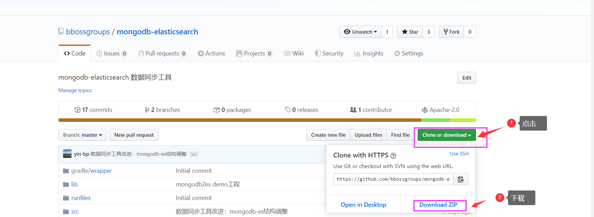
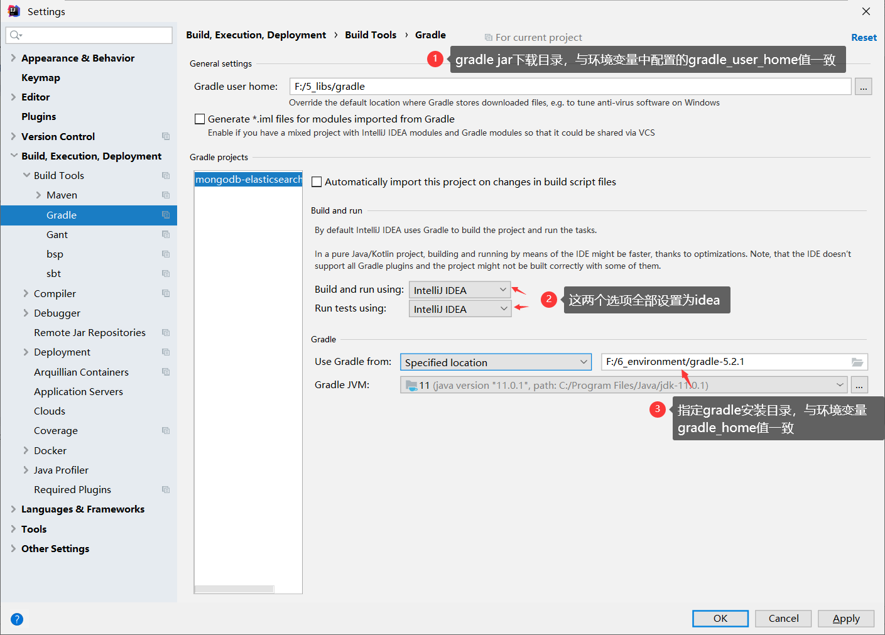

*如何快速将保存在 MongoDB 中的海量数据同步到 Elasticshearch 中是一件非常具有挑战意义的事情，本话题分享基于分布式任务调度引擎、多线程高并发技术快速将保存在 MongoDB 中的海量数据同步到 Elasticshearch 中实战技术和经验。* 

# 1.数据同步概述

先介绍一下本次实践中需要使用的数据同步工具-基于java语言的mongodb-elasticsearch数据同步工具
与logstash类似，通过mongodb-elasticsearch，可以非常方便地实现：

 - 将数据库表数据同步到Elasticsearch
 - 将数据库表数据同步到数据库表
 - 将Elasticsearch数据同步到数据库表
 - 将mongodb数据同步到Elasticsearch
 - 将mongodb数据同步到数据库表
 - 从kafka接收数据导入elasticsearch（支持kafka_2.12-0.10.2.0和kafka_2.12-2.3.0 系列版本）

支持的导入方式
 - 逐条数据导入
 - 批量数据导入
 - 批量数据多线程并行导入
 - 定时全量（串行/并行）数据导入
 - 定时增量（串行/并行）数据导入

支持的数据库： mysql,maridb，postgress,oracle ,sqlserver,db2,tidb,hive，mongodb等
支持的Elasticsearch版本： 1.x,2.x,5.x,6.x,7.x,+
支持将ip转换为对应的运营商和城市地理位置信息
支持多种定时任务执行引擎：

 - jdk timer （内置）
- quartz
- xxl-job分布式调度引擎，基于分片调度机制实现海量数据快速同步能力

mongodb-elasticsearch另一个显著的特色就是直接基于java语言来编写数据同步作业程序，基于强大的java语言和第三方工具包，能够非常方便地加工和处理需要同步的源数据，然后将最终的数据保存到目标库（Elasticsearch或者数据库）；同时也可以非常方便地在idea或者eclipse中调试和运行同步作业程序，调试无误后，通过mongodb-elasticsearch提供的gradle脚本，即可构建和发布出可部署到生产环境的同步作业包。因此，对广大的java程序员来说，mongodb-elasticsearch无疑是一个轻易快速上手的数据同步利器。

​	下面我们通过一个案例来介绍mongodb-elasticsearch的使用方法，你会发现整个过程下来，开发一个同步作业，其实就是在用大家熟悉的方式做一个简单的开发编程的事情。

# 2.同步案例介绍-同步mongodb中的session数据到Elasticsearch

场景比较简单，采用web应用session最后访问时间作为增量同步字段，将保存在mongodb中的session数据定时增量同步到Elasitcsearch中。

我们在idea中开发和调试数据同步作业，利用gradle构建和发布同步作业包，运行作业，然后启动一个往mongodb中写入session数据的web应用，打开多个浏览器访问web应用，产生和修改session数据，然后观察同步作业的同步效果，演示两种调度机制效果：
- 基于jdk timer

- 基于xxl-job来调度作业

  

  下面正式切入本文主题。

# 3.环境准备

**开发环境**

在windows环境开发和调试同步作业程序，需要在电脑上安装以下软件

- jdk 1.8或以上
- idea 2019
- gradle最新版本  https://gradle.org/releases/ 
- mongodb最新版本 
- elasticsearch最新版本
- 一个基于mongodb存储session数据的web应用(如有需要，可线下找我提供)
- mongodb-elasticsearch工具工程（基于gradle）
- xxl-job分布式定时任务引擎

自行安装好上述软件，这里着重说明一下gradle配置，需要配置三个个环境变量：

GRADLE_HOME: 指定gradle安装目录

GRADLE_USER_HOME: 指定gradle从maven中央库下载依赖包本地存放目录

 M2_HOME: maven安装目录（可选，如果有需要或者使用gradle过程中有问题就加上）


详细gradle安装和配置参考文档： https://esdoc.bbossgroups.com/#/bboss-build 

​		**运行环境**

​      jdk1.8即可

# 4.Mongodb-Elasticsearch同步作业开发环境搭建

我们无需从0开始搭建开发环境，可以到以下地址下载已经配置好的Mongodb-Elasticsearch开发环境：

 https://github.com/bbossgroups/mongodb-elasticsearch 



下载后解压到目录：


参考下面的向导将工程导入idea、调整gradle配置、熟悉idea中使用gradle

第一步 导入工程


进入setting，设置工程的gradle配置：



设置完毕后，进入gradle面板


可以选择gradle相关的任务进行clean和install构建操作：


工程采用典型的类似maven项目的目录结构管理源码：

mongodb-elasticsearch-master

|--lib  同步作业需要依赖的第三方jar存放到lib目录（在maven中央库或者本地maven库中没有的jar文件）

|--runfiles 同步作业运行和停止的windows、linux、unix指令模板，根据指令模板生成最终的运行指令

|--src/main/java  存放作业源码类文件

|--src/main/resources  存放作业运行配置文件（es配置、参数配置）

|--build.gradle   构建和发布作业的gradle构建脚本

|--gradle.properties   gradle属性配置文件，这些属性在build.gradle文件中引用

|--release.bat   构建和发布版本的指令（针对windows环境）


在此工程中已经有3个同步案例类：

```java
org.frameworkset.elasticsearch.imp.Mongodb2DBdemo --基于jdk timer mongodb到数据库同步案例
org.frameworkset.elasticsearch.imp.Mongodb2ESdemo  --基于jdk timer mongodb到elasticsearch同步案例（本文详细讲解）
org.frameworkset.elasticsearch.imp.QuartzImportTask --mongodb到elasticsearch quartz定时任务同步案例

```

另外一个配置文件就是：

src/main/resources/application.properties

这个文件是同步作业的主配置文件，包括es和mongodb的相关参数都可以这这个里面配置

到此数据同步作业工程已经导入idea，接下来进入同步作业实现、调试开发环节。

# 5.Mongodb-Elasticsearch同步作业程序开发和调试

我们先新建一个基于jdk timer的数据同步作业类Mongodb2DB，定义main方法和同步方法，xxl-job的作业在此基础上进行改进即可。

org.frameworkset.elasticsearch.imp.Mongodb2DB


jdk timer调度作业对应的mongodb session表结构和elasticsearch索引表结构映射关系如下：（首先以默认的索引结构，然后可以自定义索引结构或者索引模板）

| mongodb             | 字段类型 | elasticsearch       | 字段类型 | 说明                                                         |
| ------------------- | -------- | ------------------- | -------- | ------------------------------------------------------------ |
| _id                 | String   | _id                 | text     | 文档唯一id                                                   |
| userAccount         | String   | userAccount         | text     | session关联的用户账号                                        |
| testVO              | xml      | testVO              | json     | session的对象属性数据,在datafactor进行类型转换               |
| privateAttr         | xml      | privateAttr         | json     | session中的对象属性数据,在datafactor进行类型转换             |
| referip             | String   | referip             | text     | session对应的客户端ip                                        |
| requesturi          | String   | requesturi          | text     | 创建session对应的客户端请求url                               |
| secure              | boolean  | secure              | boolean  | session是否启用https安全机制                                 |
| sessionid           | String   | sessionid           | text     | session id                                                   |
| host                | String   | host                | text     | 创建session的服务器ip                                        |
| httpOnly            | boolean  | httpOnly            | boolean  | session是否采用httpOly机制                                   |
| lastAccessedHostIP  | String   | lastAccessedHostIP  | text     | 最近接收统一session请求的服务器ip                            |
| lastAccessedTime    | long     | lastAccessedTime    | Date     | session最近访问时间,在datafactor进行类型转换                 |
| lastAccessedUrl     | String   | lastAccessedUrl     | text     | 最近使用session的url                                         |
| local               | String   | local               | text     | session中存放的local语言代码属性数据                         |
| maxInactiveInterval | long     | maxInactiveInterval | long     | session有效期                                                |
| appKey              | String   | appKey              | text     | session关联的appKey                                          |
| creationTime        | long     | creationTime        | Date     | session创建时间,在datafactor进行类型转换                     |
|                     |          | extfiled            | int      | 在datafactor中添加的字段                                     |
|                     |          | extfiled2           | int      | 在datafactor中添加的字段                                     |
|                     |          | ipInfo              | json     | 在datafactor中添加的字段,根据referip计算出来的客户端ip地址信息（省市、地区、运营商、地理经纬度坐标等） |

同步前创建elasticsearch index mapping(可选)

mongdodb主要参数配置

elasticsearch主要参数配置（索引名称和索引类型、按日期动态索引名称）

mongodb数据检索条件

指定mongodb返回的字段

定时任务时间配置

关键参数配置：es地址、索引名称、索引类型、mongodb地址、jvm内存、线程数、队列数、fetchsize、batchsize）

设置同步作业结果回调处理函数

数据映射、加工和处理（添加字段、修改字段值、值类型转换、过滤记录、ip地理位置信息转换）

默认自动进行映射导入elasticsearch、通过datarefactor修改默认关系

调试jdk-timer调度作业、观察作业执行情况和日志

新建一个基于xxl-job的数据同步作业类：定义main方法和同步方法（参数配置和数据转换处理与jdk timer一样，只是任务调度采用外部分布式调度引擎xxl-job）

调试xxl-job调度作业（分片同步数据机制）、观察作业执行情况和日志

配置和发布作业/提取参数到配置文件中

# 6.Mongodb-Elasticsearch同步作业发布和部署


# 7.总结

增量状态管理

默认采用sqlite管理增量同步状态，如果针对xxl-job分布式调度器需要采用外部数据库管理增量状态

