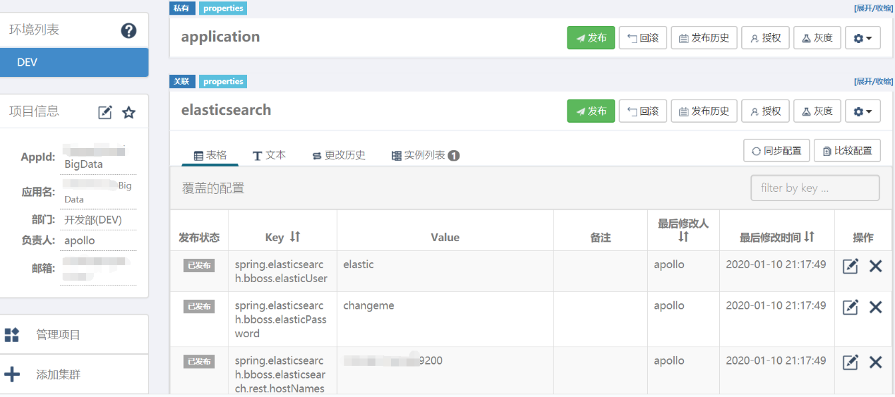

# Springboot集成bboss Elasticsearch和Apollo

# 1、pom添加Apollo和bbossEs相关依赖

<dependency>
   <groupId>com.ctrip.framework.apollo</groupId>
   <artifactId>apollo-client</artifactId>
   <version>1.6.2</version>
 </dependency>

```
<dependency>
    <groupId>com.bbossgroups.plugins</groupId>
    <artifactId>bboss-elasticsearch-rest-jdbc</artifactId>
    <version>6.6.0</version>
</dependency>
<dependency>
    <groupId>com.bbossgroups.plugins</groupId>
   <artifactId>bboss-elasticsearch-spring-boot-starter</artifactId>
    <version>6.6.0</version>
</dependency>
```

 

 

# 2、安装配置Apollo

网上有很多资料

# 3、Apollo中创建项目和namespace

Apollo项目名我这里是BigData，对于namespace来说，尽量一个组件对应一个namespace，比如这里要配es服务器的相关信息，那么就可以创建一个名为elasticsearch的namespace，其中主要配置信息如下：

spring.elasticsearch.bboss.elasticsearch.rest.hostNames = ip:9200

spring.elasticsearch.bboss.elasticsearch.dateFormat = yyyy.MM.dd

spring.elasticsearch.bboss.elasticsearch.timeZone = Asia/Shanghai

spring.elasticsearch.bboss.elasticsearch.ttl = 2d

\#在控制台输出脚本调试开关showTemplate,false关闭，true打开，同时log4j至少是info级别

spring.elasticsearch.bboss.elasticsearch.showTemplate = true

spring.elasticsearch.bboss.elasticsearch.discoverHost = false

\# dsl配置文件热加载扫描时间间隔，毫秒为单位，默认5秒扫描一次，<= 0时关闭扫描机制

spring.elasticsearch.bboss.dslfile.refreshInterval = -1

\##es client http连接池配置

spring.elasticsearch.bboss.http.timeoutConnection = 50000

spring.elasticsearch.bboss.http.timeoutSocket = 50000

spring.elasticsearch.bboss.http.connectionRequestTimeout = 50000

spring.elasticsearch.bboss.http.retryTime = 1

spring.elasticsearch.bboss.http.maxLineLength = -1

spring.elasticsearch.bboss.http.maxHeaderCount = 200

spring.elasticsearch.bboss.http.maxTotal = 400

spring.elasticsearch.bboss.http.defaultMaxPerRoute = 200

spring.elasticsearch.bboss.http.soReuseAddress = false

spring.elasticsearch.bboss.http.soKeepAlive = false

spring.elasticsearch.bboss.http.timeToLive = 3600000

spring.elasticsearch.bboss.http.keepAlive = 3600000



# 4、将Apollo信息配置到application.properties中

```
apollo.meta = http://ip:18080
#在应用启动阶段，向Spring容器注入被托管的application.properties文件的配置信息
apollo.bootstrap.enabled = true
#将Apollo配置加载提到初始化日志系统之前
apollo.bootstrap.eagerLoad.enabled = true
apollo.bootstrap.namespaces = application,elasticsearch
```

 

# 5、在springboot项目中添加Apollo项目信息

首先在resources目录下创建META-INF文件夹，然后在其中创建app.properties的文件，文件中写入app.id=Apollo项目名（我这里是BigData）。

# 6、在springboot项目的启动类中添加@EnableApolloConfig注解

# 7、完成上述操作之后，就可以正常使用bbosses的api了。

# 8.参考文档

[Spring boot整合Elasticsearch](https://esdoc.bbossgroups.com/#/spring-booter-with-bboss?id=spring-boot整合elasticsearch案例分享)

