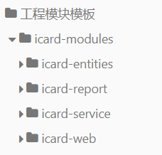
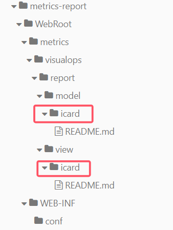

# 模块开发说明

本文介绍模块gradle配置以及前后端服务目录组织结构

## 1.模块装配

在settings.gradle中增加新增的模块
```groovy
//xxxx模块
//放置模块实体
include 'icard-modules:icard-entities'
//放置模块服务接口和实现以及接口异常
include 'icard-modules:icard-service'
//放置metrics-web控制器实现
include 'icard-modules:icard-web'
//放置metrics-report控制器实现
include 'icard-modules:icard-report'
```


## 2.模块目录规划



## 3.metrics-web集成

在build.gradle中添加icard-web模块

```groovy
api project(':icard-modules:icard-web')
```

增加metrics-web后端控制器配置文件：
```groovy
metrics-web/WebRoot/WEB-INF/conf/bboss-icard-web.xml
```
## 4.metrics-report集成

在metrics-report-base/build.gradle中增加配置：

```groovy
api project(':icard-modules:icard-report')
```

在metrics-report中建立model（存放js文件）和view（存放html、shtml文件）模块目录



增加前端控制器配置文件
```groovy
metrics-report\WebRoot\WEB-INF\conf\bboss-icard-report.xml
```


## 5.模块菜单添加

开发环境菜单添加，修改js文件，定义菜单信息：支持三级菜单

metrics-report/WebRoot/metrics/visualops/report/common/js/menu-defaults.js

```json
{
        "id": "xxxxxx",
        "url": "#",
        "name": "一级菜单",
        "icon": "#icon-table",
        "permission": "",
        "subMenus": [
            {
                "id": "xxxxxx_monitor",
                "url": "#",
                "name": "二级菜单",
                "icon": "#icon-component",
                "permission": "",
                "subMenus": [
                    {
                        "id": "xxxxx_touchpoint_lib",
                        "url": relative_path + "/view/xx/xxx/xxxx.html?menu_id=xxxxx_touchpoint_lib&parent_menuId=xxxxxx_monitor",
                        "name": "三级菜单",
                        "permission": "/xxxx/*.api"
                    }
                ]
            },
        ]
    }
    
```

