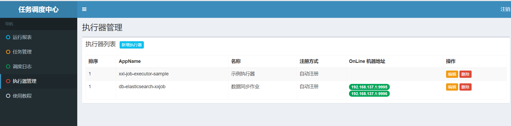
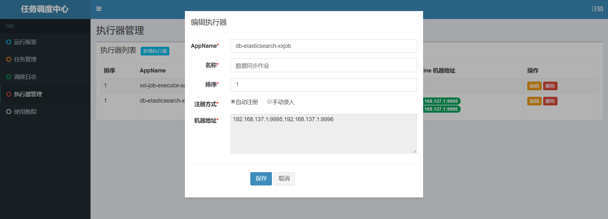
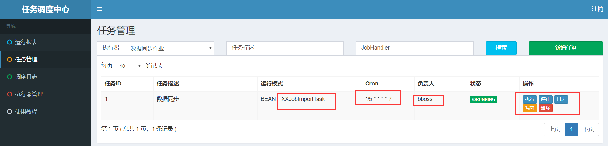
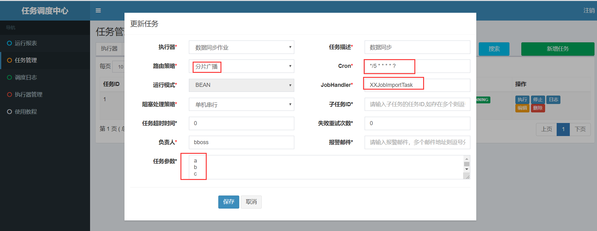
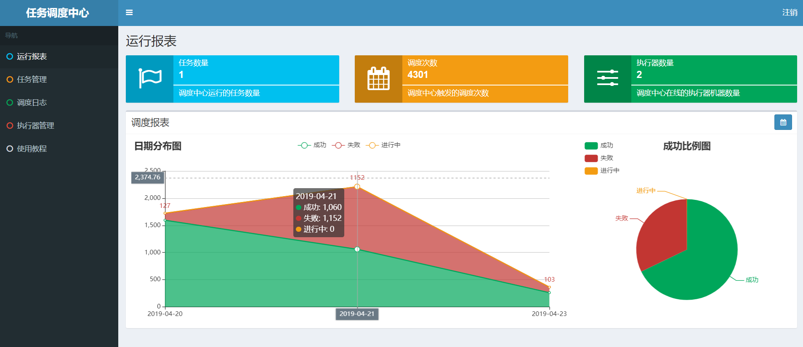

# 基于xxl-job调度数据同步作业应用

bboss提供了三种数据同步调度机制：

1. [jdk timer同步器demo](https://esdoc.bbossgroups.com/#/db-es-tool?id=_32-jdk-timer同步器demo)

2. [quartz同步器demo](https://esdoc.bbossgroups.com/#/db-es-tool?id=_33-quartz同步器demo)

3. [xxl-job同步器demo](https://esdoc.bbossgroups.com/#/db-es-tool?id=_34-xxl-job同步器demo)

本文介绍xxl-job调度机制，bboss结合xxl-job分布式定时任务调度引擎，可以非常方便地实现强大的shard分片分布式同步数据库数据到Elasticsearch功能，比如从一个10亿的数据表中同步数据，拆分为10个任务分片节点执行，每个节点同步1个亿，速度会提升10倍左右；同时提供了同步作业的故障迁移容灾能力。


要注意一下xxl-job2.3.0版本和老版本的区别如下：
xxl-job 2.3.0以下版本采用的maven坐标

```xml
        <dependency>
            <groupId>com.bbossgroups.plugins</groupId>
            <artifactId>bboss-datatran-jdbc</artifactId>
            <version>6.7.3</version>
        </dependency>
```

调整为xxl-job 2.3.0及更高版本采用的maven坐标：

```xml
        <dependency>
            <groupId>com.bbossgroups.plugins</groupId>
            <artifactId>bboss-datatran-schedule-xxljob</artifactId>
            <version>6.7.3</version>
        </dependency>
```

xxl job 低版本案例工程

https://github.com/bbossgroups/db-elasticsearch-xxjob

xxl job 2x案例工程

https://github.com/bbossgroups/db-elasticsearch-xxjob2x


bboss提供两种xxl-job作业参考实现：

1. 基于bboss gradle运行环境数据同步
2. 基于spring 环境数据同步


首先介绍第一种实现。

# 1.基于bboss gradle运行环境数据同步

在开始编写作业之前，可以先从以下地址下载gradle工程环境：

1. 下载完整的demo
   https://github.com/bbossgroups/db-elasticsearch-xxjob

2. 安装和配置gradle

   https://esdoc.bbossgroups.com/#/bboss-build

下面的案例可以直接基于本gradle工程环境编写和构建、发布调试运行。

## 1.1 定义xxl-job同步作业

在工程中定义一个XXJobImportTask作业类，必须从AbstractDB2ESXXJobHandler抽象类型继承并实现init抽象方法，在init方法中定义一个ExternalScheduler同步作业组件，通过datastream方法传入所有作业配置DB2ESImportBuilder，本案例基于数据库到elasticsearch数据同步，其他数据源同步参考文档：

https://esdoc.bbossgroups.com/#/db-es-tool

下面是完整的XXJobImportTask代码：

```java

import com.xxl.job.core.context.XxlJobHelper;
import org.frameworkset.elasticsearch.ElasticSearchHelper;
import org.frameworkset.tran.config.ImportBuilder;
import org.frameworkset.tran.plugin.db.input.DBInputConfig;
import org.frameworkset.tran.plugin.es.output.ElasticsearchOutputConfig;
import org.frameworkset.tran.schedule.ExternalScheduler;
import org.frameworkset.tran.schedule.ImportIncreamentConfig;
import org.frameworkset.tran.schedule.xxjob.AbstractXXLJobHandler;
import org.slf4j.Logger;
import org.slf4j.LoggerFactory;

/**
 * <p>Description: 使用xxl-job,quartz等外部定时任务调度引擎导入数据，需要设置：</p>
 * importBuilder.setExternalTimer(true);
 * <p></p>
 * <p>Copyright (c) 2018</p>
 * @Date 2019/4/13 13:45
 * @author biaoping.yin
 * @version 1.0
 */
public class XXJobImportTask extends AbstractXXLJobHandler {
	private static Logger logger = LoggerFactory.getLogger(XXJobImportTask.class);
	public void init(){
		// 可参考Sample示例执行器中的示例任务"ShardingJobHandler"了解试用

		externalScheduler = new ExternalScheduler();
		externalScheduler.dataStream((Object params)->{
			// 分片参数
			int shardIndex = XxlJobHelper.getShardIndex();
			int shardTotal = XxlJobHelper.getShardTotal();

			logger.info("分片参数：当前分片序号 = {}, 总分片数 = {}", shardIndex, shardTotal);

			logger.info("params:>>>>>>>>>>>>>>>>>>>" + params);
			ImportBuilder importBuilder = new ImportBuilder();
			//增量定时任务不要删表，但是可以通过删表来做初始化操作
//		if(dropIndice) {
			try {
				//清除测试表,导入的时候回重建表，测试的时候加上为了看测试效果，实际线上环境不要删表
				String repsonse = ElasticSearchHelper.getRestClientUtil().dropIndice("quartz");
				System.out.println(repsonse);
			} catch (Exception e) {
			}
//		}


			//指定导入数据的sql语句，必填项，可以设置自己的提取逻辑，
			// 设置增量变量log_id，增量变量名称#[log_id]可以多次出现在sql语句的不同位置中，例如：
			// select * from td_sm_log where log_id > #[log_id] and parent_id = #[log_id]
			// 需要设置setLastValueColumn信息log_id，
			// 通过setLastValueType方法告诉工具增量字段的类型，默认是数字类型
			DBInputConfig dbInputConfig = new DBInputConfig();
			dbInputConfig.setSql("select * from td_sm_log where log_id > #[log_id]");
			importBuilder.setInputConfig(dbInputConfig)
					.addIgnoreFieldMapping("remark1");
//		importBuilder.setSql("select * from td_sm_log ");
			/**
			 * es相关配置
			 */
			ElasticsearchOutputConfig elasticsearchOutputConfig = new ElasticsearchOutputConfig();
			elasticsearchOutputConfig
					.setIndex("quartz") ;//必填项
//					.setIndexType("quartz") //es 7以后的版本不需要设置indexType，es7以前的版本必需设置indexType
//				.setRefreshOption("refresh")//可选项，null表示不实时刷新，importBuilder.setRefreshOption("refresh");表示实时刷新
			elasticsearchOutputConfig.setEsIdField("log_id");//设置文档主键，不设置，则自动产生文档id

			elasticsearchOutputConfig.setDebugResponse(false);//设置是否将每次处理的reponse打印到日志文件中，默认false
			elasticsearchOutputConfig.setDiscardBulkResponse(true);//设置是否需要批量处理的响应报文，不需要设置为false，true为需要，默认false
			/**
			 importBuilder.setEsIdGenerator(new EsIdGenerator() {
			 //如果指定EsIdGenerator，则根据下面的方法生成文档id，
			 // 否则根据setEsIdField方法设置的字段值作为文档id，
			 // 如果默认没有配置EsIdField和如果指定EsIdGenerator，则由es自动生成文档id

			 @Override
			 public Object genId(Context context) throws Exception {
			 return SimpleStringUtil.getUUID();//返回null，则由es自动生成文档id
			 }
			 });
			 */
			importBuilder.setOutputConfig(elasticsearchOutputConfig)
					.setUseJavaName(false) //可选项,将数据库字段名称转换为java驼峰规范的名称，true转换，false不转换，默认false，例如:doc_id -> docId
					.setUseLowcase(false)  //可选项，true 列名称转小写，false列名称不转换小写，默认false，只要在UseJavaName为false的情况下，配置才起作用
					.setPrintTaskLog(true) //可选项，true 打印任务执行日志（耗时，处理记录数） false 不打印，默认值false
					.setBatchSize(10);  //可选项,批量导入es的记录数，默认为-1，逐条处理，> 0时批量处理

			//定时任务配置，
			//采用内部定时任务
//		importBuilder.setFixedRate(false)//参考jdk timer task文档对fixedRate的说明
////					 .setScheduleDate(date) //指定任务开始执行时间：日期
//				.setDeyLay(1000L) // 任务延迟执行deylay毫秒后执行
//				.setPeriod(10000L); //每隔period毫秒执行，如果不设置，只执行一次
			//采用外部定时任务
			importBuilder.setExternalTimer(true);
			//定时任务配置结束
//
//		//设置任务执行拦截器，可以添加多个
//		importBuilder.addCallInterceptor(new CallInterceptor() {
//			@Override
//			public void preCall(TaskContext taskContext) {
//				System.out.println("preCall");
//			}
//
//			@Override
//			public void afterCall(TaskContext taskContext) {
//				System.out.println("afterCall");
//			}
//
//			@Override
//			public void throwException(TaskContext taskContext, Exception e) {
//				System.out.println("throwException");
//			}
//		}).addCallInterceptor(new CallInterceptor() {
//			@Override
//			public void preCall(TaskContext taskContext) {
//				System.out.println("preCall 1");
//			}
//
//			@Override
//			public void afterCall(TaskContext taskContext) {
//				System.out.println("afterCall 1");
//			}
//
//			@Override
//			public void throwException(TaskContext taskContext, Exception e) {
//				System.out.println("throwException 1");
//			}
//		});
//		//设置任务执行拦截器结束，可以添加多个
			//增量配置开始
			importBuilder.setLastValueColumn("log_id");//指定数字增量查询字段
			importBuilder.setFromFirst(true);//setFromfirst(false)，如果作业停了，作业重启后从上次截止位置开始采集数据，
			//setFromfirst(true) 如果作业停了，作业重启后，重新开始采集数据
			importBuilder.setLastValueStorePath("logtable_import");//记录上次采集的增量字段值的文件路径，作为下次增量（或者重启后）采集数据的起点，不同的任务这个路径要不一样
			importBuilder.setLastValueStoreTableName("logs"+shardIndex);//记录上次采集的增量字段值的表，可以不指定，采用默认表名increament_tab，增量状态表会自动创建。如果xxl-job是shard分片模式运行，
			// 需要独立的表来记录每个分片增量同步状态，
			// 并且采用xxl-job等分布式任务调度引擎时，同步状态表必须存放于db.config=test指定的数据源，不能采用本地sqlite数据库
			importBuilder.setLastValueType(ImportIncreamentConfig.NUMBER_TYPE);//如果没有指定增量查询字段名称，则需要指定字段类型：ImportIncreamentConfig.NUMBER_TYPE 数字类型
			// 或者ImportIncreamentConfig.TIMESTAMP_TYPE 日期类型
			//增量配置结束

			//映射和转换配置开始
//		/**
//		 * db-es mapping 表字段名称到es 文档字段的映射：比如document_id -> docId
//		 * 可以配置mapping，也可以不配置，默认基于java 驼峰规则进行db field-es field的映射和转换
//		 */
//		importBuilder.addFieldMapping("document_id","docId")
//				.addFieldMapping("docwtime","docwTime")
//				.addIgnoreFieldMapping("channel_id");//添加忽略字段
//
//
//		/**
//		 * 为每条记录添加额外的字段和值
//		 * 可以为基本数据类型，也可以是复杂的对象
//		 */
//		importBuilder.addFieldValue("testF1","f1value");
//		importBuilder.addFieldValue("testInt",0);
//		importBuilder.addFieldValue("testDate",new Date());
//		importBuilder.addFieldValue("testFormateDate","yyyy-MM-dd HH",new Date());
//		TestObject testObject = new TestObject();
//		testObject.setId("testid");
//		testObject.setName("jackson");
//		importBuilder.addFieldValue("testObject",testObject);
//
//		/**
//		 * 重新设置es数据结构
//		 */
//		importBuilder.setDataRefactor(new DataRefactor() {
//			public void refactor(Context context) throws Exception  {
//				CustomObject customObject = new CustomObject();
//				customObject.setAuthor((String)context.getValue("author"));
//				customObject.setTitle((String)context.getValue("title"));
//				customObject.setSubtitle((String)context.getValue("subtitle"));
//				customObject.setIds(new int[]{1,2,3});
//				context.addFieldValue("docInfo",customObject);//如果还需要构建更多的内部对象，可以继续构建
//
//				//上述三个属性已经放置到docInfo中，如果无需再放置到索引文档中，可以忽略掉这些属性
//				context.addIgnoreFieldMapping("author");
//				context.addIgnoreFieldMapping("title");
//				context.addIgnoreFieldMapping("subtitle");
//			}
//		});
			//映射和转换配置结束

			/**
			 * 内置线程池配置，实现多线程并行数据导入功能，作业完成退出时自动关闭该线程池
			 */
			importBuilder.setParallel(true);//设置为多线程并行批量导入,false串行
			importBuilder.setQueue(10);//设置批量导入线程池等待队列长度
			importBuilder.setThreadCount(5);//设置批量导入线程池工作线程数量
			importBuilder.setContinueOnError(true);//任务出现异常，是否继续执行作业：true（默认值）继续执行 false 中断作业执行
			importBuilder.setAsyn(false);//true 异步方式执行，不等待所有导入作业任务结束，方法快速返回；false（默认值） 同步方式执行，等待所有导入作业任务结束，所有作业结束后方法才返回

			/**
			 * 执行数据库表数据导入es操作
			 */
			return importBuilder;
		});

	}


}

```

## 1.2 作业注册配置

然后将作业配置到application.propperties中：

```properties
##
# 作业任务配置
# xxl.job.task为前置配置多个数据同步任务，后缀XXJobImportTask和OtherTask将xxjob执行任务的名称
# 作业程序都需要继承抽象类org.frameworkset.tran.schedule.xxjob.AbstractDB2ESXXJobHandler
# public void init(){
#     externalScheduler = new ExternalScheduler();
#     externalScheduler.dataStream(()->{
#         DB2ESImportBuilder importBuilder = DB2ESImportBuilder.newInstance();
#              编写导入作业任务配置逻辑，参考文档：https://esdoc.bbossgroups.com/#/db-es-tool
#         return    importBuilder;
#       }
# }
#

xxl.job.task.XXJobImportTask = org.frameworkset.elasticsearch.imp.jobhandler.XXJobImportTask
## xxl.job.task.otherTask = org.frameworkset.elasticsearch.imp.jobhandler.OtherTask
```

## 1.3  任务构建和运行

3. 在工程db-elasticsearch-xxjob根目录下运行gradle构建指令

   release.bat

4. 启动作业

构建成功后，将会在工程目录下面生成可部署的二进制包：

build/distributions/db-elasticsearch-xxjob-released.zip

解压运行里面的指令，即可启动作业：

windows: restart.bat 

linux: restart.sh

## 1.4  xxjob运行效果

任务启动后，可以在xxjob的挂你控制台看到刚注册的执行器和作业：

注册好的作业执行器



编辑执行器



任务管理



可以在后面的操作去，执行、启动作业，查看作业调度执行日志，修改作业参数和运行模式：



运行报表



接下来看基于spring 环境来定义一个xxl-job作业

# 2.基于spring环境数据同步

spring xxl-job作业运行环境可以参考xxl-job官方文档搭建：

https://github.com/xuxueli/xxl-job/tree/master/xxl-job-executor-samples/xxl-job-executor-sample-spring

这里我们只提供一个基于spring组件定义的数据同步作业组件SyncDataXXLJob（elasticsearch到database数据同步）：

```java
package com.example.esbboss.service;

import com.frameworkset.util.SimpleStringUtil;
import com.xxl.job.core.biz.model.ReturnT;
import com.xxl.job.core.handler.IJobHandler;
import com.xxl.job.core.handler.annotation.JobHandler;
import com.xxl.job.core.util.ShardingUtil;
import org.frameworkset.elasticsearch.serial.SerialUtil;
import org.frameworkset.spi.geoip.IpInfo;
import org.frameworkset.tran.DataRefactor;
import org.frameworkset.tran.ExportResultHandler;
import org.frameworkset.tran.context.Context;
import org.frameworkset.tran.es.input.db.ES2DBExportBuilder;
import org.frameworkset.tran.metrics.TaskMetrics;
import org.frameworkset.tran.schedule.ExternalScheduler;
import org.frameworkset.tran.schedule.ImportIncreamentConfig;
import org.frameworkset.tran.task.TaskCommand;
import org.slf4j.Logger;
import org.slf4j.LoggerFactory;
import org.springframework.stereotype.Component;

import java.text.DateFormat;
import java.util.Date;
import java.util.concurrent.locks.Lock;
import java.util.concurrent.locks.ReentrantLock;

/**
 * 一个xxl-job调度的elasticsearch到database数据同步的作业案例
 * @author bboss
 */
@Component
@JobHandler(value = "SyncDataXXLJob")
public class SyncDataXXLJob extends IJobHandler {


	private static Logger logger = LoggerFactory.getLogger(SyncDataXXLJob.class);


	protected ExternalScheduler externalScheduler;

	private Lock lock = new ReentrantLock();
	public void init(){
		externalScheduler = new ExternalScheduler();
        		externalScheduler.dataStream((Object params)->{
        			ShardingUtil.ShardingVO shardingVO = ShardingUtil.getShardingVo();
        			int shardIndex = 0;
        			if(shardingVO != null) {
        				shardIndex = shardingVO.getIndex();
        				logger.info("index:>>>>>>>>>>>>>>>>>>>" + shardingVO.getIndex());
        				logger.info("total:>>>>>>>>>>>>>>>>>>>" + shardingVO.getTotal());
        			}
        			logger.info("params:>>>>>>>>>>>>>>>>>>>" + params);
        			ImportBuilder importBuilder = new ImportBuilder();
        			//增量定时任务不要删表，但是可以通过删表来做初始化操作
        //		if(dropIndice) {
        			try {
        				//清除测试表,导入的时候回重建表，测试的时候加上为了看测试效果，实际线上环境不要删表
        				String repsonse = ElasticSearchHelper.getRestClientUtil().dropIndice("quartz");
        				System.out.println(repsonse);
        			} catch (Exception e) {
        			}
        //		}
        
        
        			//指定导入数据的sql语句，必填项，可以设置自己的提取逻辑，
        			// 设置增量变量log_id，增量变量名称#[log_id]可以多次出现在sql语句的不同位置中，例如：
        			// select * from td_sm_log where log_id > #[log_id] and parent_id = #[log_id]
        			// 需要设置setLastValueColumn信息log_id，
        			// 通过setLastValueType方法告诉工具增量字段的类型，默认是数字类型
        			DBInputConfig dbInputConfig = new DBInputConfig();
        			dbInputConfig.setSql("select * from td_sm_log where log_id > #[log_id]");
        			importBuilder.setInputConfig(dbInputConfig)
        					.addIgnoreFieldMapping("remark1");
        //		importBuilder.setSql("select * from td_sm_log ");
        			/**
        			 * es相关配置
        			 */
        			ElasticsearchOutputConfig elasticsearchOutputConfig = new ElasticsearchOutputConfig();
        			elasticsearchOutputConfig
        					.setIndex("quartz") ;//必填项
        //					.setIndexType("quartz") //es 7以后的版本不需要设置indexType，es7以前的版本必需设置indexType
        //				.setRefreshOption("refresh")//可选项，null表示不实时刷新，importBuilder.setRefreshOption("refresh");表示实时刷新
        			elasticsearchOutputConfig.setEsIdField("log_id");//设置文档主键，不设置，则自动产生文档id
        
        			elasticsearchOutputConfig.setDebugResponse(false);//设置是否将每次处理的reponse打印到日志文件中，默认false
        			elasticsearchOutputConfig.setDiscardBulkResponse(true);//设置是否需要批量处理的响应报文，不需要设置为false，true为需要，默认false
        			/**
        			 importBuilder.setEsIdGenerator(new EsIdGenerator() {
        			 //如果指定EsIdGenerator，则根据下面的方法生成文档id，
        			 // 否则根据setEsIdField方法设置的字段值作为文档id，
        			 // 如果默认没有配置EsIdField和如果指定EsIdGenerator，则由es自动生成文档id
        
        			 @Override
        			 public Object genId(Context context) throws Exception {
        			 return SimpleStringUtil.getUUID();//返回null，则由es自动生成文档id
        			 }
        			 });
        			 */
        			importBuilder.setOutputConfig(elasticsearchOutputConfig)
        					.setUseJavaName(false) //可选项,将数据库字段名称转换为java驼峰规范的名称，true转换，false不转换，默认false，例如:doc_id -> docId
        					.setUseLowcase(false)  //可选项，true 列名称转小写，false列名称不转换小写，默认false，只要在UseJavaName为false的情况下，配置才起作用
        					.setPrintTaskLog(true) //可选项，true 打印任务执行日志（耗时，处理记录数） false 不打印，默认值false
        					.setBatchSize(10);  //可选项,批量导入es的记录数，默认为-1，逐条处理，> 0时批量处理
        
        			//定时任务配置，
        			//采用内部定时任务
        //		importBuilder.setFixedRate(false)//参考jdk timer task文档对fixedRate的说明
        ////					 .setScheduleDate(date) //指定任务开始执行时间：日期
        //				.setDeyLay(1000L) // 任务延迟执行deylay毫秒后执行
        //				.setPeriod(10000L); //每隔period毫秒执行，如果不设置，只执行一次
        			//采用外部定时任务
        			importBuilder.setExternalTimer(true);
        			//定时任务配置结束
        //
        //		//设置任务执行拦截器，可以添加多个
        //		importBuilder.addCallInterceptor(new CallInterceptor() {
        //			@Override
        //			public void preCall(TaskContext taskContext) {
        //				System.out.println("preCall");
        //			}
        //
        //			@Override
        //			public void afterCall(TaskContext taskContext) {
        //				System.out.println("afterCall");
        //			}
        //
        //			@Override
        //			public void throwException(TaskContext taskContext, Exception e) {
        //				System.out.println("throwException");
        //			}
        //		}).addCallInterceptor(new CallInterceptor() {
        //			@Override
        //			public void preCall(TaskContext taskContext) {
        //				System.out.println("preCall 1");
        //			}
        //
        //			@Override
        //			public void afterCall(TaskContext taskContext) {
        //				System.out.println("afterCall 1");
        //			}
        //
        //			@Override
        //			public void throwException(TaskContext taskContext, Exception e) {
        //				System.out.println("throwException 1");
        //			}
        //		});
        //		//设置任务执行拦截器结束，可以添加多个
        			//增量配置开始
        			importBuilder.setLastValueColumn("log_id");//指定数字增量查询字段
        			importBuilder.setFromFirst(true);//setFromfirst(false)，如果作业停了，作业重启后从上次截止位置开始采集数据，
        			//setFromfirst(true) 如果作业停了，作业重启后，重新开始采集数据
        			importBuilder.setLastValueStorePath("logtable_import");//记录上次采集的增量字段值的文件路径，作为下次增量（或者重启后）采集数据的起点，不同的任务这个路径要不一样
        			importBuilder.setLastValueStoreTableName("logs"+shardIndex);//记录上次采集的增量字段值的表，可以不指定，采用默认表名increament_tab，增量状态表会自动创建。如果xxl-job是shard分片模式运行，
        			// 需要独立的表来记录每个分片增量同步状态，
        			// 并且采用xxl-job等分布式任务调度引擎时，同步状态表必须存放于db.config=test指定的数据源，不能采用本地sqlite数据库
        			importBuilder.setLastValueType(ImportIncreamentConfig.NUMBER_TYPE);//如果没有指定增量查询字段名称，则需要指定字段类型：ImportIncreamentConfig.NUMBER_TYPE 数字类型
        			// 或者ImportIncreamentConfig.TIMESTAMP_TYPE 日期类型
        			//增量配置结束
        
        			//映射和转换配置开始
        //		/**
        //		 * db-es mapping 表字段名称到es 文档字段的映射：比如document_id -> docId
        //		 * 可以配置mapping，也可以不配置，默认基于java 驼峰规则进行db field-es field的映射和转换
        //		 */
        //		importBuilder.addFieldMapping("document_id","docId")
        //				.addFieldMapping("docwtime","docwTime")
        //				.addIgnoreFieldMapping("channel_id");//添加忽略字段
        //
        //
        //		/**
        //		 * 为每条记录添加额外的字段和值
        //		 * 可以为基本数据类型，也可以是复杂的对象
        //		 */
        //		importBuilder.addFieldValue("testF1","f1value");
        //		importBuilder.addFieldValue("testInt",0);
        //		importBuilder.addFieldValue("testDate",new Date());
        //		importBuilder.addFieldValue("testFormateDate","yyyy-MM-dd HH",new Date());
        //		TestObject testObject = new TestObject();
        //		testObject.setId("testid");
        //		testObject.setName("jackson");
        //		importBuilder.addFieldValue("testObject",testObject);
        //
        //		/**
        //		 * 重新设置es数据结构
        //		 */
        //		importBuilder.setDataRefactor(new DataRefactor() {
        //			public void refactor(Context context) throws Exception  {
        //				CustomObject customObject = new CustomObject();
        //				customObject.setAuthor((String)context.getValue("author"));
        //				customObject.setTitle((String)context.getValue("title"));
        //				customObject.setSubtitle((String)context.getValue("subtitle"));
        //				customObject.setIds(new int[]{1,2,3});
        //				context.addFieldValue("docInfo",customObject);//如果还需要构建更多的内部对象，可以继续构建
        //
        //				//上述三个属性已经放置到docInfo中，如果无需再放置到索引文档中，可以忽略掉这些属性
        //				context.addIgnoreFieldMapping("author");
        //				context.addIgnoreFieldMapping("title");
        //				context.addIgnoreFieldMapping("subtitle");
        //			}
        //		});
        			//映射和转换配置结束
        
        			/**
        			 * 内置线程池配置，实现多线程并行数据导入功能，作业完成退出时自动关闭该线程池
        			 */
        			importBuilder.setParallel(true);//设置为多线程并行批量导入,false串行
        			importBuilder.setQueue(10);//设置批量导入线程池等待队列长度
        			importBuilder.setThreadCount(5);//设置批量导入线程池工作线程数量
        			importBuilder.setContinueOnError(true);//任务出现异常，是否继续执行作业：true（默认值）继续执行 false 中断作业执行
        			importBuilder.setAsyn(false);//true 异步方式执行，不等待所有导入作业任务结束，方法快速返回；false（默认值） 同步方式执行，等待所有导入作业任务结束，所有作业结束后方法才返回
        
        			/**
        			 * 执行数据库表数据导入es操作
        			 */
        			return importBuilder;
        		});

    }
	public ReturnT<String> execute(String param){
		try {
			lock.lock();
			externalScheduler.execute(  param);
			return SUCCESS;
		}
		finally {
			lock.unlock();
		}
	}

	public void destroy(){
		if(externalScheduler != null){
			externalScheduler.destroy();
		}
	}

}
```

组件说明：

1. 直接继承IJobHandler类

2. 在init方法里面初始化数据同步作业组件ExternalScheduler

3. 在execute方法中调度也运行数据同步作业功能
4. 在destroy方法中注销作业组件ExternalScheduler，释放资源

# 3.增量状态数据源配置
xxl-job是一个分布式的调度引擎，在进行增量数据同步作业时，就不能使用本地文件数据库sqlite来保存增量同步作业状态，一旦因发生故障作业迁移或者作业重启后被调度到其他的executor，丢失增量状态，所以需要将增量状态保存到mysql或者oracle这样的关系数据库中，下面介绍配置保存增量状态数据源方法。

## 3.1 通过配置文件配置

在application.properties配置文件中进行配置

```properties
# 增量导入状态存储数据源配置，默认采用sqlite，增量导入装存储到本地的sqlite数据库中，采用分布式的外部定时任务引擎时，
# 就不能将状态存储到本地，需要采用外部的数据库（mysql,oracle等）来存储增量导入状态。
# 如果做了config.db配置，则采用配置的的数据源，必须指定创建statusTableName的建表语句，每种数据库对应的语法做适当调整
# create table $statusTableName  (ID number(2),lasttime number(10),lastvalue number(10),lastvaluetype number(1),PRIMARY KEY (ID))
#
# 一般情况下不需要使用外部状态数据源，除非采用分布式的外部定时任务引擎，
# 外部状态数据源可以直接使用上面的导入数据源，可以引用已经存在的数据源test，只需要配置config.db.name即可
config.db.name=test

## 也可以用以下配置配置一个全新的数据源，数据源名称由config.db.name指定
#config.db.name = testconfig
#config.db.user = root
#config.db.password = 123456
#config.db.driver = com.mysql.jdbc.Driver
#config.db.url = jdbc:mysql://192.168.137.1:3306/bboss?useCursorFetch=true&useUnicode=true&characterEncoding=utf-8&useSSL=false
#config.db.usePool = true
#config.db.validateSQL = select 1
#config.db.jdbcFetchSize = 10000
#config.db.showsql = true

```

## 3.2 通过bboss spring starter配置

在spring boot项目中，可以通过bboss spring starter对应的配置application.properties配置一个数据源：

```properties
# 数据库数据源配置
spring.bboss.db.name = default
spring.bboss.db.user = root
spring.bboss.db.password = 123456
spring.bboss.db.driver = com.mysql.jdbc.Driver
spring.bboss.db.url = jdbc:mysql://10.13.11.5:3306/mysql
spring.bboss.db.usePool = true
spring.bboss.db.validateSQL = select 1
```

然后在同步作业builder上设置状态数据源：

```java
importBuilder.setStatusDbname("default");
```